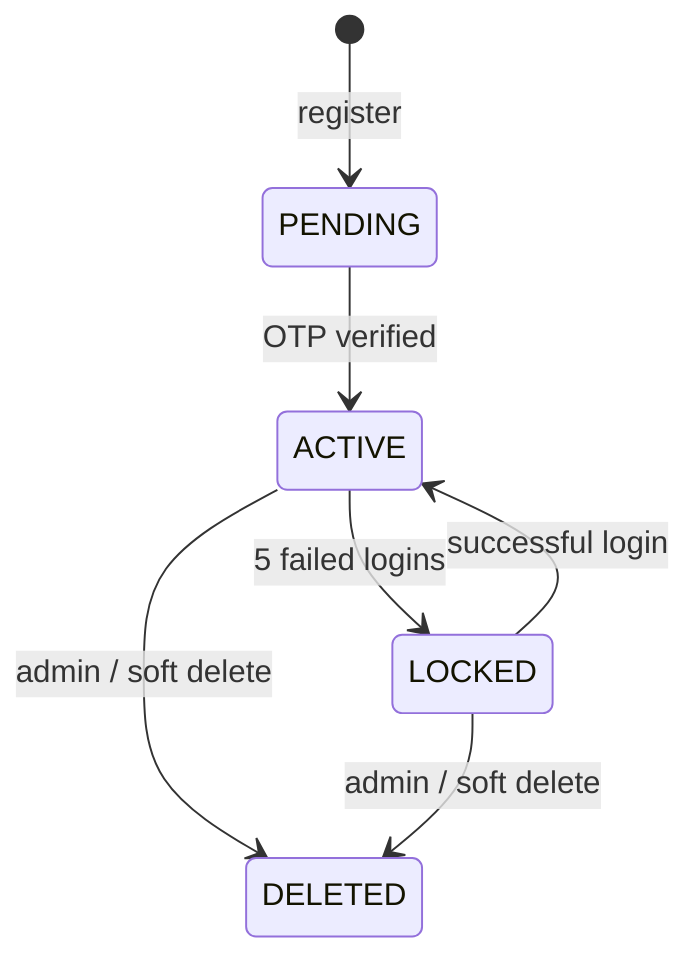

<!-- ═══════════════════════════════════════════════════════════════ -->
<!--                   DRAGON OF NORTH — README                      -->
<!-- ═══════════════════════════════════════════════════════════════ -->


<br>

<p align="center">
  <sub>
    Dragon of North is a production-style backend that handles secure login, OTP verification, and device-aware sessions.
    It is designed to stop common auth failures like abuse spikes, token misuse, and refresh races before they become incidents.
    The system has been load tested with 10,000+ requests to prove stability under real traffic patterns.
  </sub>
</p>

<!-- ─── IMPACT STRIP ─────────────────────────────────────────────── -->

<div align="center">
  <b>JWT + RSA-2048 &nbsp;·&nbsp; Redis Rate Limiting &nbsp;·&nbsp; Device-Aware Sessions &nbsp;·&nbsp; OTP via AWS &nbsp;·&nbsp; Continuous Deployment via GitHub Actions</b>
</div>

<br>

<!-- ─── TYPING ANIMATION ──────────────────────────────────────────── -->

<p align="center">
  
</p>

<br>

<!-- ─── CTA BUTTONS ───────────────────────────────────────────────── -->

<p align="center">
  <a href="https://app.verloren.dev">
    
  </a>
  &nbsp;&nbsp;
  <a href="https://api.verloren.dev/swagger-ui/index.html">
    
  </a>
</p>

<!-- ─── TECH BADGES ───────────────────────────────────────────────── -->

<p align="center">
  
  
  
  
  
  
  
  
</p>

<!-- ─── STAT PILLS ────────────────────────────────────────────────── -->

<p align="center">
  
  
  
  
</p>


<br>

<!-- ═══════════════════════════════════════════════════════════════ -->
<!--                        TL;DR                                    -->
<!-- ═══════════════════════════════════════════════════════════════ -->

<h2 align="center">⚡ &nbsp; TL;DR</h2>

<p align="center"><i>Most auth systems stop at "it works." This one keeps going.</i></p>

<br>

<div align="center">
<table>
<tr>
<td align="left" width="50%">

🔐 &nbsp; **Full token lifecycle**
RSA-signed JWTs · rotating refresh tokens · SHA-256 hash-at-rest

</td>
<td align="left" width="50%">

📱 &nbsp; **Device-aware sessions**
Every session tied to a device, IP, and user-agent

</td>
</tr>
<tr>
<td align="left">

🚦 &nbsp; **Distributed rate limiting**
Redis + Bucket4j · per-endpoint · per-user/IP

</td>
<td align="left">

📧 &nbsp; **Multi-channel OTP**
BCrypt-hashed · purpose-scoped · AWS SES + SNS

</td>
</tr>
<tr>
<td align="left">

🔄 &nbsp; **Continuous deployment**
GitHub Actions auto-deploy pipeline on every push

</td>
<td align="left">

🧪 &nbsp; **Load tested**
12 k6 scenarios · auth storms · refresh races · session chaos

</td>
</tr>
</table>
</div>

<br>

<p align="center"><b>⚡ Proven under load: 10,000+ requests · 40 users · 0 crashes · p95 ~630ms</b></p>

<br>

<p align="center"><sub>↓ &nbsp; keep scrolling — it gets better &nbsp; ↓</sub></p>

<br>


<br>

<!-- ═══════════════════════════════════════════════════════════════ -->
<!--                    WHY THIS PROJECT EXISTS                      -->
<!-- ═══════════════════════════════════════════════════════════════ -->

<div align="center">
<table>
<tr>
<td align="center">
<br>

**🧠 &nbsp; Why This Project Exists**

Most auth demos prove a happy-path login once.
Real systems must withstand abuse attempts, token misuse, and concurrent refresh races without failing users.
This project focuses on those failure paths first.

<br>
</td>
</tr>
</table>
</div>

<br>

<!-- ─── FEATURE CARDS (4-column) ─────────────────────────────────── -->

<div align="center">
<table>
<tr>
<td align="center" width="25%">
<br>

**🚫 Abuse Resistance**

Built to absorb OTP spam,
credential stuffing, and
request bursts safely.

<br>
</td>
<td align="center" width="25%">
<br>

**🔐 Account Safety**

Prevents token replay and
contains compromise at
device/session level.

<br>
</td>
<td align="center" width="25%">
<br>

**⚙️ Operational Reliability**

Designed for deployable,
observable behavior under
real traffic conditions.

<br>
</td>
<td align="center" width="25%">
<br>

**📊 Recruiter-Relevant Proof**

Load-tested, CI/CD-backed,
and repeatedly deployed in
production.

<br>
</td>
</tr>
</table>
</div>

<br>

<!-- ═══════════════════════════════════════════════════════════════ -->
<!--                      FEATURES BY PURPOSE                        -->
<!-- ═══════════════════════════════════════════════════════════════ -->

<h2 align="center">🚀 &nbsp; What's Inside</h2>

<p align="center"><i>Grouped by outcomes, so impact is easy to scan.</i></p>

<br>

<div align="center">
<table>
<tr>
<th align="left" width="24%">Category</th>
<th align="left" width="34%">Purpose</th>
<th align="left" width="42%">What delivers it</th>
</tr>

<tr>
<td><b>🔐 Security &amp; Authentication</b></td>
<td>Protect account access and prevent token misuse.</td>
<td>RSA-2048 JWT signing, rotating refresh tokens, SHA-256 hash-at-rest, BCrypt password hashing, and Google OAuth2 provider-link validation.</td>
</tr>

<tr>
<td><b>🚦 Abuse Prevention</b></td>
<td>Absorb spam, brute-force, and burst traffic without taking the service down.</td>
<td>Redis + Bucket4j endpoint limits, dynamic user/IP keying, OTP cooldowns, attempt caps, and fail-open rate limiting for availability.</td>
</tr>

<tr>
<td><b>📱 Session Management</b></td>
<td>Contain compromise to the right scope and support real multi-device behavior.</td>
<td>Device-bound sessions (device ID + IP + user-agent), selective/global revocation, strict refresh rotation, and `@Version` optimistic locking.</td>
</tr>

<tr>
<td><b>📧 OTP System</b></td>
<td>Verify users safely across channels with anti-reuse controls.</td>
<td>Purpose-scoped OTPs, BCrypt-stored OTP values, request throttling, verification state tracking, and delivery through AWS SES/SNS.</td>
</tr>
</table>
</div>

<br>


<br>

<!-- ═══════════════════════════════════════════════════════════════ -->
<!--                    CALLOUT — DIFFERENTIATOR                     -->
<!-- ═══════════════════════════════════════════════════════════════ -->

<div align="center">
<table>
<tr>
<td align="center">
<br>

**🧠 &nbsp; What makes this different?**

Most junior backend projects are CRUD apps with JWT bolted on at the end.
This system was designed around failure modes — the attacks, races, and abuse patterns that real auth infrastructure has
to survive.

<br>
</td>
</tr>
</table>
</div>

<br>

<!-- ═══════════════════════════════════════════════════════════════ -->
<!--                     ENGINEERING FOCUS                           -->
<!-- ═══════════════════════════════════════════════════════════════ -->

<div align="center">
<table>
<tr>
<td align="left">
<br>

**🛠️ &nbsp; Engineering Focus**

- Security behavior under real-world attack conditions
- Scalability through stateless access-token validation
- Strong session control with strict token lifecycle rules
- Extensible design via resolver-based service architecture

<br>
</td>
</tr>
</table>
</div>

<br>

<!-- ═══════════════════════════════════════════════════════════════ -->
<!--                  PROBLEMS → SOLUTIONS                           -->
<!-- ═══════════════════════════════════════════════════════════════ -->

<h2 align="center">🚨 &nbsp; Real Problems. Real Solutions.</h2>

<p align="center"><i>The threats most auth guides don't mention.</i></p>

<p align="center"><sub>These are real attack scenarios this system is designed to handle.</sub></p>

<br>

<div align="center">
<table>
<tr>
<th align="center" width="44%">Problem</th>
<th align="center" width="12%"></th>
<th align="center" width="44%">Solution</th>
</tr>

<tr>
<td valign="top"><br>🚨 &nbsp; OTP spam &amp; enumeration abuse<br><br></td>
<td align="center" valign="middle">→</td>
<td valign="top"><br>✅ &nbsp; BCrypt hash + 60s cooldown + 10/hr cap + 15min block window<br><br></td>
</tr>

<tr>
<td valign="top"><br>🚨 &nbsp; Refresh token theft + replay<br><br></td>
<td align="center" valign="middle">→</td>
<td valign="top"><br>✅ &nbsp; Token rotation + SHA-256 hash-at-rest + single-use enforcement<br><br></td>
</tr>

<tr>
<td valign="top"><br>🚨 &nbsp; Compromised device / stolen session<br><br></td>
<td align="center" valign="middle">→</td>
<td valign="top"><br>✅ &nbsp; Device-scoped revocation — kill one, leave others untouched<br><br></td>
</tr>

<tr>
<td valign="top"><br>🚨 &nbsp; DB dump exposes credentials + tokens<br><br></td>
<td align="center" valign="middle">→</td>
<td valign="top"><br>✅ &nbsp; BCrypt passwords · SHA-256 hashes · RSA asymmetric JWT signing<br><br></td>
</tr>

<tr>
<td valign="top"><br>🚨 &nbsp; Concurrent refresh storms + races<br><br></td>
<td align="center" valign="middle">→</td>
<td valign="top"><br>✅ &nbsp; Optimistic locking (<code>@Version</code>) + strict single-flight sequencing<br><br></td>
</tr>

<tr>
<td valign="top"><br>🚨 &nbsp; OAuth identity mismatch / takeover<br><br></td>
<td align="center" valign="middle">→</td>
<td valign="top"><br>✅ &nbsp; Explicit provider-ID linking rules + mismatch rejection<br><br></td>
</tr>

</table>
</div>

<br>


<br>

<!-- ═══════════════════════════════════════════════════════════════ -->
<!--                   PERFORMANCE & TESTING                         -->
<!-- ═══════════════════════════════════════════════════════════════ -->

<h2 align="center">🧪 &nbsp; Performance &amp; Testing</h2>

<p align="center"><i>Proof that the system holds under realistic load and failure paths.</i></p>

<br>

<div align="center">
<table>
<tr>
<th align="left">Evidence</th>
<th align="left">Result</th>
</tr>
<tr>
<td>k6 load traffic</td>
<td>10,000+ total requests across auth, health, and protected endpoint scenarios</td>
</tr>
<tr>
<td>Peak concurrency</td>
<td>Up to 40 virtual users with staged, production-safe ramp profiles</td>
</tr>
<tr>
<td>p95 latency range</td>
<td>~608 ms to ~720 ms on core auth/health/protected tests</td>
</tr>
<tr>
<td>Crash resilience</td>
<td>0 server crashes observed during documented load runs</td>
</tr>
<tr>
<td>Test depth</td>
<td>55+ test classes + 12 k6 scenarios + integration tests with Testcontainers</td>
</tr>
</table>
</div>

<br>

<div align="center">
<table>
<tr>
<td valign="top" width="50%" style="padding:12px 16px;">

**Automated Test Layers**

- Unit tests cover controllers, services, repositories, JWT logic, and security filters.
- Integration tests run with real PostgreSQL 16 and Redis 7 via Testcontainers.
- Security tests validate rate limiting, token hashing, and filter-chain behavior.
- Load tests model auth storms, refresh races, and multi-device session traffic.

</td>
<td valign="top" width="50%" style="padding:12px 16px;">

**Tooling That Makes Results Credible**

- JUnit 5 + Mockito for deterministic service and component tests.
- Testcontainers for environment-faithful backend validation.
- k6 for sustained concurrency and latency tracking.
- Prometheus/Micrometer metrics for runtime visibility during stress scenarios.

</td>
</tr>
</table>
</div>

<br>

```bash
mvn test
mvn verify -P integration-tests
k6 run load_tests/auth-load-test.js
```

<br>


<br>

<!-- ═══════════════════════════════════════════════════════════════ -->
<!--                       EXAMPLE FLOW                              -->
<!-- ═══════════════════════════════════════════════════════════════ -->

<h2 align="center">🔄 &nbsp; Example User Flow</h2>

<p align="center"><i>Signup → OTP → login → refresh → session control.</i></p>

<br>

<!-- ── MAIN HORIZONTAL FLOW ──────────────────────────────────────── -->

<div align="center">
<table>
<tr>

<td align="center" style="background-color:#E3F2FD;border:1px solid #ccc;border-radius:10px;padding:10px 14px;min-width:90px;">
<b style="color:#1a1a1a;">📲 Client</b>
</td>

<td align="center" style="padding:0 6px;"><b>→</b></td>

<td align="center" style="background-color:#E1F5FE;border:1px solid #ccc;border-radius:10px;padding:10px 14px;min-width:90px;">
<b style="color:#1a1a1a;">🔀 API Gateway</b>
</td>

<td align="center" style="padding:0 6px;"><b>→</b></td>

<td align="center" style="background-color:#F3E5F5;border:1px solid #ccc;border-radius:10px;padding:10px 14px;min-width:110px;">
<b style="color:#1a1a1a;">🚦 Rate Limiter</b><br>
<sub style="color:#333;">Redis · Bucket4j</sub>
</td>

<td align="center" style="padding:0 6px;"><b>→</b></td>

<td align="center" style="background-color:#E8F5E9;border:1px solid #ccc;border-radius:10px;padding:10px 14px;min-width:110px;">
<b style="color:#1a1a1a;">🔐 Auth Service</b><br>
<sub style="color:#333;">Spring Boot</sub>
</td>

</tr>
</table>
</div>

<br>

<!-- ── BRANCHING OUTPUTS ─────────────────────────────────────────── -->

<div align="center">
<table>
<tr>
<td align="center" style="padding:0 12px;"><b>↙</b>&nbsp;&nbsp;&nbsp;&nbsp;&nbsp;&nbsp;&nbsp;&nbsp;&nbsp;&nbsp;&nbsp;&nbsp;<b>↓</b>&nbsp;&nbsp;&nbsp;&nbsp;&nbsp;&nbsp;&nbsp;&nbsp;&nbsp;&nbsp;&nbsp;&nbsp;<b>↘</b></td>
</tr>
</table>
</div>

<div align="center">
<table>
<tr>

<td align="center" style="background-color:#FBE9E7;border:1px solid #ccc;border-radius:10px;padding:10px 14px;min-width:130px;">
<b style="color:#1a1a1a;">🗄️ PostgreSQL 16</b><br>
<sub style="color:#333;">Persist session<br>Store hashed token<br>Flyway V1–V7</sub>
</td>

<td width="24px"></td>

<td align="center" style="background-color:#FFF3E0;border:1px solid #ccc;border-radius:10px;padding:10px 14px;min-width:130px;">
<b style="color:#1a1a1a;">✉️ AWS SES / SNS</b><br>
<sub style="color:#333;">Deliver OTP<br>Email · SMS<br>us-east-1</sub>
</td>

<td width="24px"></td>

<td align="center" style="background-color:#E8F5E9;border:1px solid #ccc;border-radius:10px;padding:10px 14px;min-width:130px;">
<b style="color:#1a1a1a;">🔑 RSA-2048 Signing</b><br>
<sub style="color:#333;">Issue JWT<br>15 min access token<br>SHA-256 refresh hash</sub>
</td>

</tr>
</table>
</div>

<br>

<p align="center">
<sub>Client request passes through rate limiting and authentication before interacting with persistence and external services.</sub>
</p>

<br>

<details>
<summary><b>📋 &nbsp; Step-by-step — Signup → JWT issuance</b></summary>
<br>

```
1.  POST /sign-up          →  rate limit check → persist PENDING user
2.  OTP generated          →  BCrypt hash → store → deliver via SES/SNS
3.  POST /sign-up/complete →  hash + compare → check purpose + expiry
4.  Account activated      →  status: PENDING → ACTIVE
5.  JWT issued             →  RSA-signed access token (15min TTL)
6.  Session persisted      →  refresh token hashed (SHA-256) → device session stored
7.  Response               →  access token + refresh token returned to client
```

</details>

<details>
<summary><b>🔁 &nbsp; Token refresh + replay rejection</b></summary>
<br>

```
LEGITIMATE REFRESH:
  POST /jwt/refresh  →  validate JWT sig  →  lookup device session
  →  compare SHA-256 hash  →  rotate: new pair issued  →  old hash invalidated
  →  200 OK: new access + refresh token

REPLAY ATTEMPT:
  POST /jwt/refresh (old token)  →  hash lookup → NOT FOUND
  →  401 Unauthorized. Full stop.
```

</details>

<details>
<summary><b>🔗 &nbsp; Google OAuth2 flow</b></summary>
<br>

```
POST /oauth/google (ID token from frontend)
  →  validate: signature + issuer + audience
  →  check provider_link table
  →  existing user?  → login + issue JWT
  →  new user?       → create AppUser + link + issue JWT
  →  converge into same session / revocation / audit pipeline
```

</details>

<details>
<summary><b>⚙️ &nbsp; Account lifecycle state machine</b></summary>
<br>



</details>

<br>


<br>

<!-- ═══════════════════════════════════════════════════════════════ -->
<!--               ARCHITECTURE OVERVIEW                             -->
<!-- ═══════════════════════════════════════════════════════════════ -->

<h2 align="center">🏗️ &nbsp; Architecture Overview</h2>

<p align="center"><i>After seeing the proof and flow, here is the system shape that powers it.</i></p>

<!-- ── LAYER DIAGRAM ─────────────────────────────────────────────── -->

<div align="center">

<!-- ROW 0 — Client -->
<table width="76%">
<tr>
<td align="center" style="background-color:#E3F2FD;border:1px solid #ccc;border-radius:10px;padding:12px 0;">
<b style="color:#1a1a1a;">🌐 &nbsp; Client Layer</b><br>
<sub style="color:#333;">React SPA &nbsp;·&nbsp; app.verloren.dev &nbsp;·&nbsp; HTTPS only</sub>
</td>
</tr>
</table>

<br>
<b>↓ &nbsp; HTTPS request</b>
<br><br>

<!-- ROW 1 — Security Filter Chain -->
<table width="76%">
<tr>
<td align="center" style="background-color:#F3E5F5;border:1px solid #ccc;border-radius:10px;padding:12px 0;">
<b style="color:#1a1a1a;">🔒 &nbsp; Security Filter Chain</b><br>
<sub style="color:#333;">JWT Auth Filter &nbsp;·&nbsp; Redis Rate-Limit Filter &nbsp;·&nbsp; Audit Emitter</sub>
</td>
</tr>
</table>

<br>
<b>↓ &nbsp; authenticated request</b>
<br><br>

<!-- ROW 2 — Controllers -->
<table width="76%">
<tr>
<td align="center" width="33%" style="background-color:#E3F2FD;border:1px solid #ccc;border-radius:10px;padding:10px 4px;">
<b style="color:#1a1a1a;">🎮 &nbsp; AuthController</b><br>
<sub style="color:#333;">signup · login · logout<br>OAuth2 · JWT refresh</sub>
</td>
<td width="2%"></td>
<td align="center" width="33%" style="background-color:#E3F2FD;border:1px solid #ccc;border-radius:10px;padding:10px 4px;">
<b style="color:#1a1a1a;">🎮 &nbsp; OtpController</b><br>
<sub style="color:#333;">email OTP · phone OTP<br>request · verify</sub>
</td>
<td width="2%"></td>
<td align="center" width="33%" style="background-color:#E3F2FD;border:1px solid #ccc;border-radius:10px;padding:10px 4px;">
<b style="color:#1a1a1a;">🎮 &nbsp; SessionController</b><br>
<sub style="color:#333;">list sessions · revoke<br>revoke-others</sub>
</td>
</tr>
</table>

<br>
<b>↓ &nbsp; resolved via ServiceResolver / direct injection</b>
<br><br>

<!-- ROW 3 — Services -->
<table width="76%">
<tr>
<td align="center" width="33%" style="background-color:#F3E5F5;border:1px solid #ccc;border-radius:10px;padding:10px 4px;">
<b style="color:#1a1a1a;">⚙️ &nbsp; AuthService</b><br>
<sub style="color:#333;">EmailAuthServiceImpl<br>PhoneAuthServiceImpl<br><i>Factory · Resolver pattern</i></sub>
</td>
<td width="2%"></td>
<td align="center" width="33%" style="background-color:#F3E5F5;border:1px solid #ccc;border-radius:10px;padding:10px 4px;">
<b style="color:#1a1a1a;">⚙️ &nbsp; OtpService</b><br>
<sub style="color:#333;">BCrypt hash · purpose-scoped<br>EmailOtpSender<br>PhoneOtpSender</sub>
</td>
<td width="2%"></td>
<td align="center" width="33%" style="background-color:#F3E5F5;border:1px solid #ccc;border-radius:10px;padding:10px 4px;">
<b style="color:#1a1a1a;">⚙️ &nbsp; TokenService</b><br>
<sub style="color:#333;">RSA-2048 JWT sign<br>SHA-256 refresh hash<br>rotation · revocation</sub>
</td>
</tr>
</table>

<br>
<b>↓ &nbsp; JPA / Spring Data</b>
<br><br>

<!-- ROW 4 — Repositories -->
<table width="76%">
<tr>
<td align="center" width="33%" style="background-color:#E8F5E9;border:1px solid #ccc;border-radius:10px;padding:10px 4px;">
<b style="color:#1a1a1a;">🗂️ &nbsp; UserRepository</b><br>
<sub style="color:#333;">AppUser · ProviderLink<br>UUID PKs · soft delete</sub>
</td>
<td width="2%"></td>
<td align="center" width="33%" style="background-color:#E8F5E9;border:1px solid #ccc;border-radius:10px;padding:10px 4px;">
<b style="color:#1a1a1a;">🗂️ &nbsp; OtpRepository</b><br>
<sub style="color:#333;">OtpRecord · purpose scope<br>TTL · attempt tracking</sub>
</td>
<td width="2%"></td>
<td align="center" width="33%" style="background-color:#E8F5E9;border:1px solid #ccc;border-radius:10px;padding:10px 4px;">
<b style="color:#1a1a1a;">🗂️ &nbsp; SessionRepository</b><br>
<sub style="color:#333;">DeviceSession · hash store<br>@Version optimistic lock</sub>
</td>
</tr>
</table>

<br>
<b>↓ &nbsp; JDBC / Flyway V1–V7</b>
<br><br>

<!-- ROW 5 — Databases -->
<table width="76%">
<tr>
<td align="center" width="48%" style="background-color:#FBE9E7;border:1px solid #ccc;border-radius:10px;padding:12px 0;">
<b style="color:#1a1a1a;">🗄️ &nbsp; PostgreSQL 16</b><br>
<sub style="color:#333;">users · otp_records · device_sessions<br>provider_links · roles · audit_log<br>UUID PKs · Flyway migrations</sub>
</td>
<td width="4%"></td>
<td align="center" width="48%" style="background-color:#FBE9E7;border:1px solid #ccc;border-radius:10px;padding:12px 0;">
<b style="color:#1a1a1a;">⚡ &nbsp; Redis 7</b><br>
<sub style="color:#333;">Bucket4j token buckets<br>per-user / per-IP keys<br>Lettuce connection pool</sub>
</td>
</tr>
</table>

<br>
<b>↑ &nbsp; async delivery (OTP only)</b>
<br><br>

<!-- ROW 6 — External services -->
<table width="76%">
<tr>
<td align="center" width="48%" style="background-color:#FFF3E0;border:1px solid #ccc;border-radius:10px;padding:12px 0;">
<b style="color:#1a1a1a;">✉️ &nbsp; AWS SES</b><br>
<sub style="color:#333;">Email OTP delivery<br>us-east-1 &nbsp;·&nbsp; verified sender</sub>
</td>
<td width="4%"></td>
<td align="center" width="48%" style="background-color:#FFF3E0;border:1px solid #ccc;border-radius:10px;padding:12px 0;">
<b style="color:#1a1a1a;">📱 &nbsp; AWS SNS</b><br>
<sub style="color:#333;">SMS OTP delivery<br>us-east-1 &nbsp;·&nbsp; phone channel</sub>
</td>
</tr>
</table>

</div>

<br>

<!-- ── LAYER LEGEND ──────────────────────────────────────────────── -->

<div align="center">
<table width="76%">
<tr>
<td align="center" width="20%" style="background-color:#E3F2FD;border:1px solid #ccc;border-radius:8px;padding:6px 8px;">
<sub><b style="color:#1a1a1a;">🔵 Controller</b></sub>
</td>
<td width="1%"></td>
<td align="center" width="20%" style="background-color:#F3E5F5;border:1px solid #ccc;border-radius:8px;padding:6px 8px;">
<sub><b style="color:#1a1a1a;">🟣 Service</b></sub>
</td>
<td width="1%"></td>
<td align="center" width="20%" style="background-color:#E8F5E9;border:1px solid #ccc;border-radius:8px;padding:6px 8px;">
<sub><b style="color:#1a1a1a;">🟢 Repository</b></sub>
</td>
<td width="1%"></td>
<td align="center" width="20%" style="background-color:#FBE9E7;border:1px solid #ccc;border-radius:8px;padding:6px 8px;">
<sub><b style="color:#1a1a1a;">🟠 Database</b></sub>
</td>
<td width="1%"></td>
<td align="center" width="20%" style="background-color:#FFF3E0;border:1px solid #ccc;border-radius:8px;padding:6px 8px;">
<sub><b style="color:#1a1a1a;">🟡 External</b></sub>
</td>
</tr>
</table>
</div>

<br>

<!-- ── FLOW EXPLANATION ──────────────────────────────────────────── -->

<div align="center">
<table width="76%">
<tr>
<td style="padding:16px 20px;">

**How a request flows through the system:**

- **Filter Chain first** — every inbound request passes through JWT validation, rate limiting, and audit emission before
  touching any controller. Bad tokens and throttled IPs are rejected here, before any business logic runs.
- **Controllers route, services decide** — controllers are thin. They validate input, resolve the correct service
  implementation via `AuthenticationServiceResolver` (Factory + Resolver pattern), and delegate immediately. No business
  logic lives in a controller.
- **Services own the rules** — `AuthService`, `OtpService`, and `TokenService` contain all state transitions, security
  logic, and external calls. OTP senders (`EmailOtpSender`, `PhoneOtpSender`) are directly injected, keeping
  channel-specific code isolated.
- **Repositories enforce constraints** — `@Version` on `DeviceSession` provides optimistic locking so concurrent refresh
  storms can't race to commit a double-rotation. All sensitive values (passwords, tokens) are hashed before the
  repository layer ever sees them.
- **Dual persistence** — PostgreSQL holds all durable state (users, sessions, OTPs, audit). Redis holds only rate-limit
  buckets — volatile, fast, and fail-open: if Redis goes down, requests pass through rather than taking the service
  offline.

</td>
</tr>
</table>
</div>

<br>

<!-- ── DESIGN DECISIONS ──────────────────────────────────────────── -->

<h3 align="center">🧠 &nbsp; Design Decisions</h3>

<br>

<div align="center">
<table width="76%">
<tr>
<td valign="top" width="50%" style="padding:12px 16px;">

**Factory + Resolver over switch/if chains**

`AuthenticationServiceResolver` builds a `Map<IdentifierType, AuthenticationService>` at startup. Adding email, phone,
or any future channel (passkey, SSO) means adding a new `@Service` — not editing existing logic. The controller stays at
one line: `resolver.resolve(identifier, type)`.

</td>
<td valign="top" width="50%" style="padding:12px 16px;">

**Two-tier token model**

Access tokens are validated as JWTs — stateless, no DB hit, fast path. Refresh tokens require a session-table lookup for
full revocation control. Pure JWT has zero revocation; pure sessions have per-request DB cost. This model takes the fast
path where it's safe and the controlled path where it matters.

</td>
</tr>
<tr>
<td valign="top" style="padding:12px 16px;">

**SHA-256 for refresh tokens, BCrypt for passwords**

BCrypt is deliberately slow — right for user-chosen passwords. Refresh tokens are high-entropy random values, so
BCrypt's cost factor adds latency without a meaningful security gain. SHA-256 is fast, collision-resistant, and
sufficient. Raw values never touch the DB either way.

</td>
<td valign="top" style="padding:12px 16px;">

**Optimistic locking over pessimistic**

`@Version` on `DeviceSession` means concurrent refresh attempts check for conflict at commit time rather than holding a
row lock. First writer wins; concurrent replays fail fast with a 409. Under mobile-style background refresh patterns,
this scales far better than serialized pessimistic locks.

</td>
</tr>
<tr>
<td valign="top" style="padding:12px 16px;">

**OTP purpose-scoping**

An OTP issued for `SIGNUP` cannot be verified at `/login` or `/password-reset`. The `OtpPurpose` enum makes this a
compile-time constraint rather than a runtime check that someone could forget. This closes an entire class of OTP reuse
attacks by design, not by discipline.

</td>
<td valign="top" style="padding:12px 16px;">

**Fail-open rate limiting**

If Redis is unreachable, requests pass through rather than returning 503. For an auth service, a full outage is a worse
outcome than a brief window without rate limiting. The Redis failure is surfaced via Prometheus metrics — the on-call
alarm fires, not the user.

</td>
</tr>
</table>
</div>

<br>


<br>

<!-- ═══════════════════════════════════════════════════════════════ -->
<!--                    SYSTEM DEEP DIVES                            -->
<!-- ═══════════════════════════════════════════════════════════════ -->

<h2 align="center">🧱 &nbsp; System Deep Dives</h2>

<p align="center"><i>Click any section to expand the full technical detail.</i></p>

<br>

<details>
<summary><b>🔐 &nbsp; JWT Security Model</b></summary>
<br>

| Property          | Implementation                                       |
|-------------------|------------------------------------------------------|
| Algorithm         | RSA-2048 asymmetric — private signs, public verifies |
| Access token TTL  | 15 minutes                                           |
| Refresh token TTL | 7 days, single-use, rotated on every use             |
| Transport         | `Authorization: Bearer` OR HTTP-only secure cookies  |
| Type enforcement  | Token type claims prevent cross-endpoint reuse       |
| Session policy    | `STATELESS` — zero server-side session storage       |

</details>

<details>
<summary><b>📧 &nbsp; OTP Engine</b></summary>
<br>

**Purpose scoping** — `SIGNUP` · `LOGIN` · `PASSWORD_RESET` · `TWO_FACTOR_AUTH`

An OTP issued for one purpose **cannot** be verified at a different endpoint. Period.

| Control             | Value      |
|---------------------|------------|
| Length              | 6 digits   |
| TTL                 | 10 minutes |
| Max verify attempts | 3          |
| Resend cooldown     | 60 seconds |
| Max requests / hour | 10         |
| Block window        | 15 minutes |

**Verification states:** `SUCCESS` · `INVALID` · `EXPIRED` · `CONSUMED` · `EXCEEDED` · `WRONG_PURPOSE`

</details>

<details>
<summary><b>🚦 &nbsp; Rate Limiting</b></summary>
<br>

Redis + Bucket4j + Lettuce. Distributed. Per-endpoint. Per-user/IP.

| Endpoint | Capacity    | Refill   |
|----------|-------------|----------|
| Signup   | 3 requests  | / 60 min |
| Login    | 10 requests | / 15 min |
| OTP      | 5 requests  | / 30 min |

- **Dynamic keying** — user ID when authenticated, IP as fallback
- **Headers returned** — `X-RateLimit-Remaining` · `X-RateLimit-Capacity` · `Retry-After`
- **Fail-open** — if Redis is down, requests pass through. Availability > strict limiting.
- **Prometheus metrics** — blocked vs. allowed counts tracked per limit type

</details>

<details>
<summary><b>📱 &nbsp; Session Security</b></summary>
<br>

Every session captures: **device ID · IP address · user-agent** at creation.

| Feature           | Implementation                                                    |
|-------------------|-------------------------------------------------------------------|
| Token rotation    | New token issued on every refresh; old immediately invalidated    |
| Hash-at-rest      | Only SHA-256 hash stored — raw refresh token never touches the DB |
| Revocation scope  | Current device / all other devices / everything                   |
| Replay protection | Rotated tokens rejected; previous hash invalidated                |
| Race protection   | `@Version` optimistic locking — parallel replays rejected         |

</details>

<details>
<summary><b>🏭 &nbsp; Factory + Resolver Pattern</b></summary>
<br>

`AuthenticationServiceResolver` maps `IdentifierType → AuthenticationService` at startup. Controllers resolve the right
implementation in one line.

```java
// Resolver (acts as factory)
public class AuthenticationServiceResolver {
    private final Map<IdentifierType, AuthenticationService> serviceMap;

    public AuthenticationServiceResolver(List<AuthenticationService> services) {
        this.serviceMap = services.stream()
                .collect(Collectors.toMap(AuthenticationService::supports, Function.identity()));
    }

    public AuthenticationService resolve(IdentifierType type) {
        return serviceMap.get(type);
    }
}
```

Adding a new identifier type (passkey, SSO) = add one `@Service`. No controller changes. No switch statements.

OTP senders (`EmailOtpSender`, `PhoneOtpSender`) use direct injection instead — operations differ enough between
channels that the abstraction overhead isn't worth it, and explicit injection makes the API surface clearer.

</details>

<details>
<summary><b>🛡️ &nbsp; Threat Model</b></summary>
<br>

| Threat                  | Mitigation                                     |
|-------------------------|------------------------------------------------|
| Refresh token replay    | Rotation + SHA-256 hash-at-rest + single-use   |
| Credential stuffing     | Redis Bucket4j limits + per-user/IP keying     |
| OTP brute-force         | Attempt limits + cooldown + block windows      |
| Compromised device      | Device-scoped revocation                       |
| Password reset takeover | OTP-gated + global session revocation          |
| Concurrent refresh race | `@Version` optimistic locking                  |
| DB dump                 | BCrypt · SHA-256 · RSA — nothing raw persisted |
| Schema drift            | Flyway V1–V7 startup-enforced                  |
| OAuth mismatch          | Provider-ID linking rules + rejection          |

**Audit log — every security event emits:**

```json
{
  "event": "auth.login",
  "user_id": "550e8400-...",
  "device_id": "device-abc-123",
  "ip": "103.x.x.x",
  "result": "SUCCESS",
  "request_id": "req-xyz-789"
}
```

Events: `auth.signup` · `auth.login` · `auth.logout` · `auth.refresh` · `otp.request` · `otp.verify` ·
`session.revoke` · `oauth.login`

</details>

<br>


<br>

<!-- ═══════════════════════════════════════════════════════════════ -->
<!--                     CI/CD PIPELINE  (new section)               -->
<!-- ═══════════════════════════════════════════════════════════════ -->

<h2 align="center">🚀 &nbsp; CI/CD Pipeline</h2>

<p align="center"><i>Production-oriented delivery: test-gated, containerized, health-verified deployment to AWS EC2.</i></p>

<!-- ── PIPELINE VISUAL ───────────────────────────────────────────── -->

<div align="center">
<table width="86%">

<!-- Stage labels row -->
<tr>
<td align="center" width="16%" style="background-color:#E3F2FD;border:1px solid #1976D2;border-radius:8px;padding:8px 4px;">
<b style="color:#1a1a1a;">1 · Trigger</b><br>
<sub style="color:#333;">push to<br><code>master</code></sub>
</td>
<td align="center" width="4%"><b>→</b></td>
<td align="center" width="16%" style="background-color:#E3F2FD;border:1px solid #1976D2;border-radius:8px;padding:8px 4px;">
<b style="color:#1a1a1a;">2 · Test</b><br>
<sub style="color:#333;"><code>mvn test</code><br>JUnit 5 + Mockito</sub>
</td>
<td align="center" width="4%"><b>→</b></td>
<td align="center" width="16%" style="background-color:#FBE9E7;border:1px solid #D84315;border-radius:8px;padding:8px 4px;">
<b style="color:#1a1a1a;">3 · Build</b><br>
<sub style="color:#333;">Docker image<br>JDK 21 → JRE</sub>
</td>
<td align="center" width="4%"><b>→</b></td>
<td align="center" width="16%" style="background-color:#FFF3E0;border:1px solid #F57C00;border-radius:8px;padding:8px 4px;">
<b style="color:#1a1a1a;">4 · Push</b><br>
<sub style="color:#333;">GHCR<br>versioned tag</sub>
</td>
<td align="center" width="4%"><b>→</b></td>
<td align="center" width="16%" style="background-color:#F3E5F5;border:1px solid #7B1FA2;border-radius:8px;padding:8px 4px;">
<b style="color:#1a1a1a;">5 · Deploy</b><br>
<sub style="color:#333;">SSH → EC2<br>docker pull + restart</sub>
</td>
<td align="center" width="4%"><b>→</b></td>
<td align="center" width="16%" style="background-color:#E8F5E9;border:1px solid #388E3C;border-radius:8px;padding:8px 4px;">
<b style="color:#1a1a1a;">6 · Verify</b><br>
<sub style="color:#333;"><code>/actuator/health</code><br>gate before live</sub>
</td>
</tr>

</table>
</div>

<br>

<!-- ── PIPELINE DETAILS ──────────────────────────────────────────── -->

<div align="center">
<table width="86%">
<tr>
<td valign="top" width="50%" style="padding:12px 16px;">

**Workflow: `ci-cd.yml`**

- **Trigger** — automatically runs on every `push` to `master`
- **Runner** — GitHub-hosted `ubuntu-latest`
- **Build validation** — Java 21 + Maven cache + mandatory `mvn test` gate
- **Release confidence** — failed tests stop deployment before image build/publish

</td>
<td valign="top" width="50%" style="padding:12px 16px;">

**Docker + AWS Deployment Reliability**

- **Containerization** — multi-stage Docker build (JDK 21 build stage, slim JRE runtime)
- **Registry** — versioned image push to GitHub Container Registry (`ghcr.io`)
- **Delivery** — automated SSH deploy to EC2 using `appleboy/ssh-action`
- **Runtime safety** — post-deploy `/actuator/health` checks gate rollout success

</td>
</tr>
</table>
</div>

<br>

<!-- ── SECRETS USED ───────────────────────────────────────────────── -->

<div align="center">
<table width="86%">
<tr>
<th align="left" style="padding:8px 16px;">Secret</th>
<th align="left" style="padding:8px 16px;">Used for</th>
</tr>
<tr>
<td style="padding:6px 16px;"><code>GITHUB_TOKEN</code></td>
<td style="padding:6px 16px;">Auto-provided · GHCR push authentication</td>
</tr>
<tr>
<td style="padding:6px 16px;"><code>EC2_HOST</code></td>
<td style="padding:6px 16px;">AWS EC2 public IP / hostname</td>
</tr>
<tr>
<td style="padding:6px 16px;"><code>EC2_USER</code></td>
<td style="padding:6px 16px;">SSH username on the EC2 instance</td>
</tr>
<tr>
<td style="padding:6px 16px;"><code>EC2_SSH_KEY</code></td>
<td style="padding:6px 16px;">PEM key for SSH authentication</td>
</tr>
<tr>
<td style="padding:6px 16px;"><code>DB_USERNAME / DB_PASSWORD</code></td>
<td style="padding:6px 16px;">Passed as env vars to the running container</td>
</tr>
<tr>
<td style="padding:6px 16px;"><code>AWS_ACCESS_KEY / AWS_SECRET_KEY</code></td>
<td style="padding:6px 16px;">SES + SNS credentials for OTP delivery</td>
</tr>
</table>
</div>

<br>


<br>

<!-- ═══════════════════════════════════════════════════════════════ -->
<!--                     API REFERENCE                               -->
<!-- ═══════════════════════════════════════════════════════════════ -->

<h2 align="center">🔌 &nbsp; API Reference</h2>

<details>
<summary><b>View all endpoints</b></summary>
<br>

Base paths: `/api/v1/auth` · `/api/v1/otp` · `/api/v1/sessions`

> All JSON uses `snake_case`. Exception: `/jwt/refresh` expects `refreshToken` (camelCase).

**Auth**

| Method   | Path                                | Description                     |
|----------|-------------------------------------|---------------------------------|
| `POST`   | `/auth/identifier/sign-up`          | Register new user               |
| `POST`   | `/auth/identifier/sign-up/complete` | Complete signup after OTP       |
| `POST`   | `/auth/identifier/login`            | Login → access + refresh tokens |
| `POST`   | `/auth/jwt/refresh`                 | Rotate refresh token            |
| `POST`   | `/auth/oauth/google`                | Google OAuth2 login             |
| `POST`   | `/auth/oauth/google/signup`         | Google OAuth2 signup            |
| `POST`   | `/auth/logout`                      | Revoke current session          |
| `GET`    | `/auth/sessions`                    | List active sessions            |
| `DELETE` | `/auth/sessions/{id}`               | Revoke specific session         |
| `POST`   | `/auth/sessions/revoke-others`      | Revoke all other sessions       |

**OTP**

| Method | Path                 | Description       |
|--------|----------------------|-------------------|
| `POST` | `/otp/email/request` | Send OTP to email |
| `POST` | `/otp/email/verify`  | Verify email OTP  |
| `POST` | `/otp/phone/request` | Send OTP to phone |
| `POST` | `/otp/phone/verify`  | Verify phone OTP  |

**Response Envelope**

```json
{
  "message": "string or null",
  "apiResponseStatus": "SUCCESS | ERROR",
  "data": {},
  "time": "2025-01-05T16:43:29.12345Z"
}
```

</details>

<br>

<!-- ═══════════════════════════════════════════════════════════════ -->
<!--                     RUN IT LOCALLY                              -->
<!-- ═══════════════════════════════════════════════════════════════ -->

<h2 align="center">⚙️ &nbsp; Run It Locally</h2>

<br>

```bash
# Clone
git clone https://github.com/Vinay2080/dragon-of-north.git && cd dragon-of-north

# Configure
echo "db_username=your_user\ndb_password=your_pass" > .env

# Start everything (PostgreSQL + Redis + Backend)
docker compose up -d

# API Docs → http://localhost:8080/swagger-ui/index.html
```

> `mvn spring-boot:run -Dspring.profiles.active=dev` — seeds `ACTIVE`, `LOCKED`, and `PENDING` test users locally.

<br>

<!-- ═══════════════════════════════════════════════════════════════ -->
<!--                        ROADMAP                                  -->
<!-- ═══════════════════════════════════════════════════════════════ -->

<h2 align="center">🗺️ &nbsp; Roadmap</h2>

<br>

<div align="center">
<table>
<tr>
<td align="center">🔲</td>
<td>Password reset flow — OTP-gated, end-to-end</td>
</tr>
<tr>
<td align="center">🔲</td>
<td>Admin dashboard — session + user lifecycle management</td>
</tr>
<tr>
<td align="center">🔲</td>
<td>TOTP — authenticator app (TOTP/HOTP)</td>
</tr>
<tr>
<td align="center">🔲</td>
<td>OAuth providers — GitHub, Apple</td>
</tr>
<tr>
<td align="center">🔲</td>
<td>OpenTelemetry distributed tracing</td>
</tr>
</table>
</div>

<br>


<br>

<!-- ═══════════════════════════════════════════════════════════════ -->
<!--                        CLOSING                                  -->
<!-- ═══════════════════════════════════════════════════════════════ -->

<div align="center">
<table>
<tr>
<td align="center">
<br>

<h3>Built for real systems, not tutorials.</h3>

Every decision in this project exists because real systems get attacked.
Token rotation, device revocation, rate limits, audit logs — these aren't extras.
They're the baseline. This project treats them that way.

<br>

<a href="https://app.verloren.dev">
  
</a>
&nbsp;&nbsp;
<a href="https://api.verloren.dev/swagger-ui/index.html">
  
</a>
&nbsp;&nbsp;
<a href="https://github.com/Vinay2080">
  
</a>

<br><br>

<sub>B.Tech Computer Science &nbsp;·&nbsp; Bajaj Institute of Technology, Wardha &nbsp;·&nbsp; May 2027</sub>

<br>

</td>
</tr>
</table>
</div>

<br>


