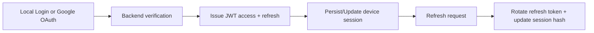

# Dragon of North

Production-grade identity platform built with Spring Boot + React, focused on **secure token lifecycle**, **device-aware
session control**, and **convergence of federated + local authentication** into one internal trust model.

## Architecture at a Glance

**Core decision:** keep access authorization stateless (JWT), but anchor refresh and revocation to persisted device sessions.

- **Local auth:** email/phone + password.
- **Federated auth:** Google OAuth 2.0 Authorization Code flow.
- **Token model:** short-lived access token and rotating refresh token.
- **Session model:** per-device session row with refresh hash-at-rest.
- **Access token TTL:** 15 minutes.
- **Operational posture:** Flyway migrations, structured audit logs, Micrometer metrics, Redis rate limits, Testcontainers integration tests.
- **API session policy:** `SessionCreationPolicy.STATELESS` for horizontal scalability.

### Unified Auth Flow (Local + OAuth)

---

## Engineering Decisions & Tradeoffs

### 1) Hybrid JWT + Session-Table Model

**Why:** JWT-only is fast but weak at server-side revocation. Session-only is controllable but adds DB lookup overhead to every request.

**Chosen model:**
- Access token is validated as JWT (fast path).
- Refresh token requires session-table lookup (control path).

**Tradeoff:**
- Slightly more complexity than pure JWT.
- Much stronger support for logout-all, device revoke, and post-incident containment.

### 2) Refresh Token Rotation and Hash-at-Rest

- Refresh token is rotated on use.
- Only the hashed refresh token is persisted in session storage.
- Replay attempts fail once the previous hash is invalidated.
- Enforced as **single-use** with strict sequencing; parallel refresh replays are rejected once rotation commits.

**Tradeoff:**
- Requires strict refresh sequencing and careful race handling.
- Materially reduces blast radius if DB is exposed.

### 3) Device-Aware Session Management

Each session stores `device_id`, `ip_address`, `user_agent`, `last_used_at`, `expiry_date`, `revoked`.

**Why:** supports user-facing “active sessions” and security controls (revoke current/one/others/all).

### 4) Federated + Local Identity Coexistence

Google identities are stored in a provider-link table and mapped to internal users.

**Why:** keeps an auth source flexible while preserving one internal authorization/session model.

---

## Federated Authentication Architecture

OAuth is treated as an **identity proofing step**, not a parallel session system.

Authorization code exchange happens server-side, and no Google tokens are trusted from the frontend.

- Google ID token is validated on the backend.
- Verification includes signature checks plus issuer/audience/expiration validation.
- OAuth `state` is validated to protect the authorization code flow.
- Verified identity is mapped/linked to a local user, then standard internal JWT/session issuance is applied.

Endpoints:
- `POST /api/v1/auth/oauth/google` (login)
- `POST /api/v1/auth/oauth/google/signup` (signup)

**Outcome:** OAuth and password auth converge into the same session/revocation/audit pipeline.

---

## Failure Scenarios & Mitigations

- **Stolen refresh token replay**  
  Mitigation: rotation + hash-at-rest + session validation.
- **Compromised device/session**  
  Mitigation: device-scoped revocation endpoints and revoke-all fallback.
- **Brute-force / OTP abuse**  
  Mitigation: Redis-backed distributed rate limiting + cooldown/block windows.
- **OAuth identity mismatch or unsafe auto-linking**  
  Mitigation: explicit provider-ID linking rules and mismatch rejection.
- **Password reset account takeover window**  
  Mitigation: OTP-gated reset and global session revocation on reset.
- **Migration drift between environments**  
  Mitigation: Flyway versioned schema with startup migration enforcement.

---

## Threat Model Overview

### Assets
- User credentials and identity bindings.
- Access/refresh tokens.
- Session continuity data.
- Audit evidence.

### Primary Threats
- Credential stuffing.
- Refresh token theft/replay.
- OTP guessing/spam.
- Session fixation/persistence after credential reset.
- Unauthorized account linking in federated flows.

### Controls

- Password hashing and OTP hashing.
- Refresh token rotation and invalidation.
- Session-table revocation semantics.
- Structured audit logs across auth/session/otp events.
- Endpoint-specific distributed rate limits.
- Stable error contract to reduce auth edge-case leakage.

### Security Posture Summary

| Area               | Current posture                                                   |
|--------------------|-------------------------------------------------------------------|
| Credential storage | Passwords/OTPs hashed before persistence                          |
| Token security     | Access JWT + rotating single-use refresh tokens with hash-at-rest |
| Session control    | Device-aware session table with targeted/global revocation        |
| Abuse prevention   | Redis distributed rate limiting per endpoint                      |
| Observability      | Structured audit events + Micrometer counters + Prometheus export |
| Schema integrity   | Flyway versioned migrations with startup enforcement              |

---

## Concrete Runtime Configuration

Current defaults in `application.yaml`:
- signup rate limit: capacity `3`, refill `3/60m`
- login rate limit: capacity `10`, refill `10/15m`
- OTP rate limit: capacity `5`, refill `5/30m`
- Redis port: `6379`
- Actuator exposure: `health,metrics,prometheus`
- Session cleanup: `900000 ms` delay, revoked retention `7 days`
- Flyway: enabled, baseline-on-migrate, clean-disabled

Environment-resolved values include JWT TTLs, OTP windows, DB/Redis credentials, and Google client ID.

---

## Error Contract Stability

- Enum-driven error codes keep client handling stable across refactoring.
- Frontend/backend contracts remain deterministic for auth/session flows.
- Uniform failures reduce auth edge-case leakage while preserving operator diagnostics.

---

## Observability & Operational Maturity

- Structured audit logging across login/refresh/logout/session revoke/signup/otp/password-reset.
- Micrometer counters for success/failure branches in auth/session flows.
- Prometheus metrics via Spring Actuator.
- Flyway migrations (`V1`–`V7`) for deterministic schema evolution.
- Integration tests with Testcontainers for PostgreSQL + Redis-backed flows.

---

- **Schema evolution discipline (Flyway):** versioned SQL migrations (`V1`–`V7`) with startup migration enforcement to prevent environment drift.
- **Automated data hygiene:** scheduled cleanup jobs for expired OTPs, abandoned unverified users, and stale/revoked sessions.
- **Distributed abuse protection:** Redis + Bucket4j-backed rate limiting (works across instances, not only in-memory).
- **Security depth:** rotating refresh tokens, hash-at-rest storage, device-scoped revocation, OTP hashing, and audit trail coverage.
- **Operational readiness:** Micrometer + Prometheus metrics and Testcontainers integration tests for Postgres + Redis parity.

These points are often strong interview differentiators because they map directly to real production incidents: token replay, migration mismatch, data bloat, and distributed brute-force abuse.

---

## Repository Scope

- Backend: Spring Boot security, token/session lifecycle, OAuth integration, OTP, rate limiting.
- Frontend: authentication UX, device/session controls, secure token handling.

This README intentionally emphasizes architecture choices, security posture, and operational readiness.
