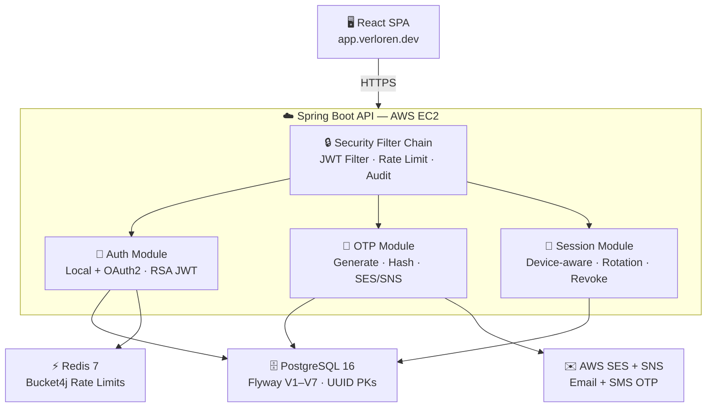
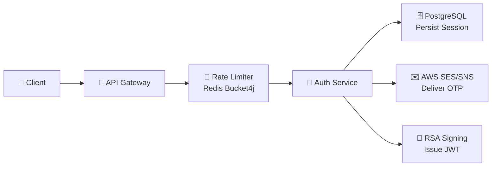
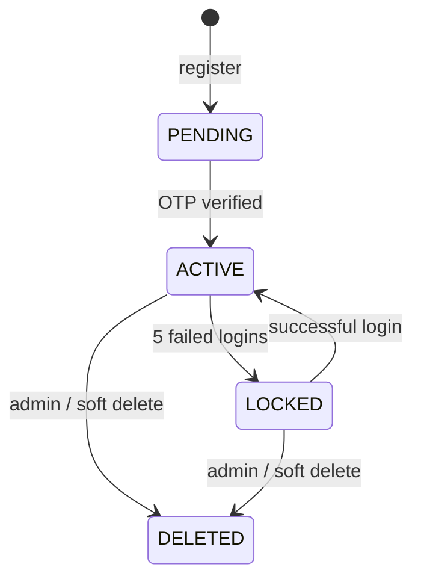
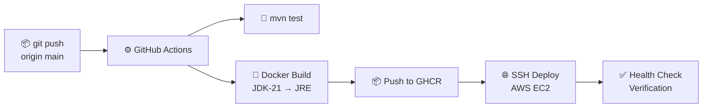

<!-- ═══════════════════════════════════════════════════════════════ -->
<!--                   DRAGON OF NORTH — README                      -->
<!-- ═══════════════════════════════════════════════════════════════ -->


<br>

<!-- ─── IMPACT STRIP ─────────────────────────────────────────────── -->

<div align="center">
  <b>JWT + RSA-2048 &nbsp;·&nbsp; Redis Rate Limiting &nbsp;·&nbsp; Device-Aware Sessions &nbsp;·&nbsp; OTP via AWS &nbsp;·&nbsp; 219+ Production Deployments</b>
</div>

<br>

<!-- ─── TYPING ANIMATION ──────────────────────────────────────────── -->

<p align="center">
  
</p>

<br>

<!-- ─── CTA BUTTONS ───────────────────────────────────────────────── -->

<p align="center">
  <a href="https://app.verloren.dev">
    
  </a>
  &nbsp;&nbsp;
  <a href="https://api.verloren.dev/swagger-ui/index.html">
    
  </a>
</p>

<!-- ─── TECH BADGES ───────────────────────────────────────────────── -->

<p align="center">
  
  
  
  
  
  
  
  
</p>

<!-- ─── STAT PILLS ────────────────────────────────────────────────── -->

<p align="center">
  
  
  
  
</p>


<br>

<!-- ═══════════════════════════════════════════════════════════════ -->
<!--                        TL;DR                                    -->
<!-- ═══════════════════════════════════════════════════════════════ -->

<h2 align="center">⚡ &nbsp; TL;DR</h2>

<p align="center"><i>Most auth systems stop at "it works." This one keeps going.</i></p>

<br>

<div align="center">
<table>
<tr>
<td align="left" width="50%">

🔐 &nbsp; **Full token lifecycle**
RSA-signed JWTs · rotating refresh tokens · SHA-256 hash-at-rest

</td>
<td align="left" width="50%">

📱 &nbsp; **Device-aware sessions**
Every session tied to a device, IP, and user-agent

</td>
</tr>
<tr>
<td align="left">

🚦 &nbsp; **Distributed rate limiting**
Redis + Bucket4j · per-endpoint · per-user/IP

</td>
<td align="left">

📧 &nbsp; **Multi-channel OTP**
BCrypt-hashed · purpose-scoped · AWS SES + SNS

</td>
</tr>
<tr>
<td align="left">

🔄 &nbsp; **219+ production deploys**
GitHub Actions → EC2 · zero-downtime · every push

</td>
<td align="left">

🧪 &nbsp; **Load tested**
12 k6 scenarios · auth storms · refresh races · session chaos

</td>
</tr>
</table>
</div>

<br>

<p align="center"><sub>↓ &nbsp; keep scrolling — it gets better &nbsp; ↓</sub></p>

<br>


<br>

<!-- ═══════════════════════════════════════════════════════════════ -->
<!--                    CALLOUT — DIFFERENTIATOR                     -->
<!-- ═══════════════════════════════════════════════════════════════ -->

<div align="center">
<table>
<tr>
<td align="center">
<br>

**🧠 &nbsp; What makes this different?**

Most junior backend projects are CRUD apps with JWT bolted on at the end.
This system was designed around failure modes — the attacks, races, and abuse patterns that real auth infrastructure has to survive.

<br>
</td>
</tr>
</table>
</div>

<br>

<!-- ─── FEATURE CARDS (4-column) ─────────────────────────────────── -->

<div align="center">
<table>
<tr>
<td align="center" width="25%">
<br>

**🔁 Token Rotation**

Single-use refresh tokens.
Replay = instant 401.

<br>
</td>
<td align="center" width="25%">
<br>

**🔒 Hash-at-Rest**

Raw tokens never touch the DB.
SHA-256 only.

<br>
</td>
<td align="center" width="25%">
<br>

**📱 Device Context**

Every session knows its device.
Revoke one, keep others.

<br>
</td>
<td align="center" width="25%">
<br>

**📊 Observable**

Structured audit log on
every security event.

<br>
</td>
</tr>
</table>
</div>

<br>


<br>

<!-- ═══════════════════════════════════════════════════════════════ -->
<!--                  PROBLEMS → SOLUTIONS                           -->
<!-- ═══════════════════════════════════════════════════════════════ -->

<h2 align="center">🚨 &nbsp; Real Problems. Real Solutions.</h2>

<p align="center"><i>The threats most auth guides don't mention.</i></p>

<br>

<div align="center">
<table>
<tr>
<th align="center" width="44%">Problem</th>
<th align="center" width="12%"></th>
<th align="center" width="44%">Solution</th>
</tr>

<tr>
<td valign="top"><br>🚨 &nbsp; OTP spam &amp; enumeration abuse<br><br></td>
<td align="center" valign="middle">→</td>
<td valign="top"><br>✅ &nbsp; BCrypt hash + 60s cooldown + 10/hr cap + 15min block window<br><br></td>
</tr>

<tr>
<td valign="top"><br>🚨 &nbsp; Refresh token theft + replay<br><br></td>
<td align="center" valign="middle">→</td>
<td valign="top"><br>✅ &nbsp; Token rotation + SHA-256 hash-at-rest + single-use enforcement<br><br></td>
</tr>

<tr>
<td valign="top"><br>🚨 &nbsp; Compromised device / stolen session<br><br></td>
<td align="center" valign="middle">→</td>
<td valign="top"><br>✅ &nbsp; Device-scoped revocation — kill one, leave others untouched<br><br></td>
</tr>

<tr>
<td valign="top"><br>🚨 &nbsp; DB dump exposes credentials + tokens<br><br></td>
<td align="center" valign="middle">→</td>
<td valign="top"><br>✅ &nbsp; BCrypt passwords · SHA-256 hashes · RSA asymmetric JWT signing<br><br></td>
</tr>

<tr>
<td valign="top"><br>🚨 &nbsp; Concurrent refresh storms + races<br><br></td>
<td align="center" valign="middle">→</td>
<td valign="top"><br>✅ &nbsp; Optimistic locking (<code>@Version</code>) + strict single-flight sequencing<br><br></td>
</tr>

<tr>
<td valign="top"><br>🚨 &nbsp; OAuth identity mismatch / takeover<br><br></td>
<td align="center" valign="middle">→</td>
<td valign="top"><br>✅ &nbsp; Explicit provider-ID linking rules + mismatch rejection<br><br></td>
</tr>

</table>
</div>

<br>


<br>

<!-- ═══════════════════════════════════════════════════════════════ -->
<!--                      FEATURE GRID                               -->
<!-- ═══════════════════════════════════════════════════════════════ -->

<h2 align="center">🚀 &nbsp; What's Inside</h2>

<br>

<div align="center">
<table>
<tr>
<td width="50%" valign="top">
<br>

**🔐 JWT / RSA-2048**
Asymmetric signing — private key signs, public key verifies. No shared secrets.

<br>
</td>
<td width="50%" valign="top">
<br>

**🔄 Token Rotation**
Every refresh issues a new pair and invalidates the old. Replay = 401.

<br>
</td>
</tr>
<tr>
<td valign="top">
<br>

**📱 Device Sessions**
Sessions bind to device ID + IP + user-agent. Revoke one or all.

<br>
</td>
<td valign="top">
<br>

**🚦 Redis Rate Limiting**
Bucket4j per endpoint. Signup · Login · OTP each have independent limits.

<br>
</td>
</tr>
<tr>
<td valign="top">
<br>

**📧 OTP Engine**
BCrypt-hashed, purpose-scoped, multi-channel — SES email + SNS SMS.

<br>
</td>
<td valign="top">
<br>

**🔗 Google OAuth2**
Server-side token validation. Converges into the same session pipeline.

<br>
</td>
</tr>
<tr>
<td valign="top">
<br>

**📊 Observability**
Structured audit logs + Micrometer counters + Prometheus export.

<br>
</td>
<td valign="top">
<br>

**🧪 Load Testing**
12 k6 scenarios — concurrent auth, refresh storms, session chaos.

<br>
</td>
</tr>
</table>
</div>

<br>

<p align="center"><sub>↓ &nbsp; architecture below — worth the scroll &nbsp; ↓</sub></p>

<br>


<br>

<!-- ═══════════════════════════════════════════════════════════════ -->
<!--                      ARCHITECTURE                               -->
<!-- ═══════════════════════════════════════════════════════════════ -->

<h2 align="center">🏗️ &nbsp; Architecture</h2>

<p align="center"><i>How requests actually flow through the system.</i></p>

<br>



<br>

<!-- ─── CALLOUT: CORE PHILOSOPHY ──────────────────────────────────── -->

<div align="center">
<table>
<tr>
<td align="center" width="50%">
<br>

**⚡ Access Token**
JWT validation only — stateless, no DB hit, fast path

<br>
</td>
<td align="center" width="50%">
<br>

**🔄 Refresh Token**
Session-table lookup — DB, full revocation control

<br>
</td>
</tr>
</table>
</div>

<p align="center"><i>Fast where it needs to be. Controllable where it has to be.</i></p>

<br>


<br>

<!-- ═══════════════════════════════════════════════════════════════ -->
<!--                       AUTH FLOW                                 -->
<!-- ═══════════════════════════════════════════════════════════════ -->

<h2 align="center">🔄 &nbsp; Auth Flow</h2>

<p align="center"><i>Client → Rate Limiter → Auth Service → DB → AWS.</i></p>

<br>



<br>

<details>
<summary><b>📋 &nbsp; Step-by-step — Signup → JWT issuance</b></summary>
<br>

```
1.  POST /sign-up          →  rate limit check → persist PENDING user
2.  OTP generated          →  BCrypt hash → store → deliver via SES/SNS
3.  POST /sign-up/complete →  hash + compare → check purpose + expiry
4.  Account activated      →  status: PENDING → ACTIVE
5.  JWT issued             →  RSA-signed access token (15min TTL)
6.  Session persisted      →  refresh token hashed (SHA-256) → device session stored
7.  Response               →  access token + refresh token returned to client
```

</details>

<details>
<summary><b>🔁 &nbsp; Token refresh + replay rejection</b></summary>
<br>

```
LEGITIMATE REFRESH:
  POST /jwt/refresh  →  validate JWT sig  →  lookup device session
  →  compare SHA-256 hash  →  rotate: new pair issued  →  old hash invalidated
  →  200 OK: new access + refresh token

REPLAY ATTEMPT:
  POST /jwt/refresh (old token)  →  hash lookup → NOT FOUND
  →  401 Unauthorized. Full stop.
```

</details>

<details>
<summary><b>🔗 &nbsp; Google OAuth2 flow</b></summary>
<br>

```
POST /oauth/google (ID token from frontend)
  →  validate: signature + issuer + audience
  →  check provider_link table
  →  existing user?  → login + issue JWT
  →  new user?       → create AppUser + link + issue JWT
  →  converge into same session / revocation / audit pipeline
```

</details>

<details>
<summary><b>⚙️ &nbsp; Account lifecycle state machine</b></summary>
<br>



</details>

<br>


<br>

<!-- ═══════════════════════════════════════════════════════════════ -->
<!--                    SYSTEM DEEP DIVES                            -->
<!-- ═══════════════════════════════════════════════════════════════ -->

<h2 align="center">🧱 &nbsp; System Deep Dives</h2>

<p align="center"><i>Click any section to expand the full technical detail.</i></p>

<br>

<details>
<summary><b>🔐 &nbsp; JWT Security Model</b></summary>
<br>

| Property | Implementation |
|----------|----------------|
| Algorithm | RSA-2048 asymmetric — private signs, public verifies |
| Access token TTL | 15 minutes |
| Refresh token TTL | 7 days, single-use, rotated on every use |
| Transport | `Authorization: Bearer` OR HTTP-only secure cookies |
| Type enforcement | Token type claims prevent cross-endpoint reuse |
| Session policy | `STATELESS` — zero server-side session storage |

</details>

<details>
<summary><b>📧 &nbsp; OTP Engine</b></summary>
<br>

**Purpose scoping** — `SIGNUP` · `LOGIN` · `PASSWORD_RESET` · `TWO_FACTOR_AUTH`

An OTP issued for one purpose **cannot** be verified at a different endpoint. Period.

| Control | Value |
|---------|-------|
| Length | 6 digits |
| TTL | 10 minutes |
| Max verify attempts | 3 |
| Resend cooldown | 60 seconds |
| Max requests / hour | 10 |
| Block window | 15 minutes |

**Verification states:** `SUCCESS` · `INVALID` · `EXPIRED` · `CONSUMED` · `EXCEEDED` · `WRONG_PURPOSE`

</details>

<details>
<summary><b>🚦 &nbsp; Rate Limiting</b></summary>
<br>

Redis + Bucket4j + Lettuce. Distributed. Per-endpoint. Per-user/IP.

| Endpoint | Capacity | Refill |
|----------|----------|--------|
| Signup | 3 requests | / 60 min |
| Login | 10 requests | / 15 min |
| OTP | 5 requests | / 30 min |

- **Dynamic keying** — user ID when authenticated, IP as fallback
- **Headers returned** — `X-RateLimit-Remaining` · `X-RateLimit-Capacity` · `Retry-After`
- **Fail-open** — if Redis is down, requests pass through. Availability > strict limiting.
- **Prometheus metrics** — blocked vs. allowed counts tracked per limit type

</details>

<details>
<summary><b>📱 &nbsp; Session Security</b></summary>
<br>

Every session captures: **device ID · IP address · user-agent** at creation.

| Feature | Implementation |
|---------|----------------|
| Token rotation | New token issued on every refresh; old immediately invalidated |
| Hash-at-rest | Only SHA-256 hash stored — raw refresh token never touches the DB |
| Revocation scope | Current device / all other devices / everything |
| Replay protection | Rotated tokens rejected; previous hash invalidated |
| Race protection | `@Version` optimistic locking — parallel replays rejected |

</details>

<details>
<summary><b>🧠 &nbsp; Engineering Decisions</b></summary>
<br>

<div align="center">
<table>
<tr>
<td align="center" width="50%">
<br>

**Pure JWT**
Fast — but zero revocation control.
If a token is stolen, it works until expiry.

<br>
</td>
<td align="center" width="50%">
<br>

**Pure Sessions**
Controllable — but DB hit on every request.
Doesn't scale cleanly.

<br>
</td>
</tr>
</table>
</div>

<br>

> **Chosen model:** Access tokens validated as JWT (stateless, no DB). Refresh tokens require session-table lookup (DB, full revocation). Best of both.

**Refresh Token Rotation + Hash-at-Rest**

- RSA signing — no shared secret to steal
- Rotation on use — stolen tokens stale after next legitimate refresh
- SHA-256 hash only — raw value never written to storage
- Single-use — parallel refreshes rejected once rotation commits

**Federated + Local Identity Coexistence**

Google identities stored in `provider_link` table → mapped to internal `AppUser`. Both paths converge into the **same session, revocation, and audit pipeline** post-handshake.

</details>

<details>
<summary><b>🛡️ &nbsp; Threat Model</b></summary>
<br>

| Threat | Mitigation |
|--------|-----------|
| Refresh token replay | Rotation + SHA-256 hash-at-rest + single-use |
| Credential stuffing | Redis Bucket4j limits + per-user/IP keying |
| OTP brute-force | Attempt limits + cooldown + block windows |
| Compromised device | Device-scoped revocation |
| Password reset takeover | OTP-gated + global session revocation |
| Concurrent refresh race | `@Version` optimistic locking |
| DB dump | BCrypt · SHA-256 · RSA — nothing raw persisted |
| Schema drift | Flyway V1–V7 startup-enforced |
| OAuth mismatch | Provider-ID linking rules + rejection |

**Audit log — every security event emits:**

```json
{
  "event":      "auth.login",
  "user_id":    "550e8400-...",
  "device_id":  "device-abc-123",
  "ip":         "103.x.x.x",
  "result":     "SUCCESS",
  "request_id": "req-xyz-789"
}
```

Events: `auth.signup` · `auth.login` · `auth.logout` · `auth.refresh` · `otp.request` · `otp.verify` · `session.revoke` · `oauth.login`

</details>

<br>


<br>

<!-- ═══════════════════════════════════════════════════════════════ -->
<!--                        TESTING                                  -->
<!-- ═══════════════════════════════════════════════════════════════ -->

<h2 align="center">🧪 &nbsp; Testing</h2>

<p align="center"><i>Not shipped without proof.</i></p>

<br>

<div align="center">
<table>
<tr>
<th align="left">Layer</th>
<th align="left">Coverage</th>
</tr>
<tr>
<td>Unit tests</td>
<td>Controllers · Services · Repos · JWT · Security Filters</td>
</tr>
<tr>
<td>Integration tests</td>
<td>Testcontainers — real PostgreSQL 16 + Redis 7</td>
</tr>
<tr>
<td>Security tests</td>
<td>Token hashing · Rate limit behavior · JWT filter chain</td>
</tr>
<tr>
<td>Load tests</td>
<td>12 k6 scenarios — auth flow · session chaos · refresh storms</td>
</tr>
</table>
</div>

<br>

```bash
mvn test                             # unit tests
mvn verify -P integration-tests      # full suite with Testcontainers
k6 run load_tests/auth-load-test.js  # load testing
```

<br>


<br>

<!-- ═══════════════════════════════════════════════════════════════ -->
<!--                     CI/CD PIPELINE                              -->
<!-- ═══════════════════════════════════════════════════════════════ -->

<h2 align="center">🚀 &nbsp; CI/CD Pipeline</h2>

<p align="center"><i>219+ zero-downtime deployments. Health-verified on every push.</i></p>

<br>



<br>


<br>

<!-- ═══════════════════════════════════════════════════════════════ -->
<!--                     API REFERENCE                               -->
<!-- ═══════════════════════════════════════════════════════════════ -->

<h2 align="center">🔌 &nbsp; API Reference</h2>

<details>
<summary><b>View all endpoints</b></summary>
<br>

Base paths: `/api/v1/auth` · `/api/v1/otp` · `/api/v1/sessions`

> All JSON uses `snake_case`. Exception: `/jwt/refresh` expects `refreshToken` (camelCase).

**Auth**

| Method | Path | Description |
|--------|------|-------------|
| `POST` | `/auth/identifier/sign-up` | Register new user |
| `POST` | `/auth/identifier/sign-up/complete` | Complete signup after OTP |
| `POST` | `/auth/identifier/login` | Login → access + refresh tokens |
| `POST` | `/auth/jwt/refresh` | Rotate refresh token |
| `POST` | `/auth/oauth/google` | Google OAuth2 login |
| `POST` | `/auth/oauth/google/signup` | Google OAuth2 signup |
| `POST` | `/auth/logout` | Revoke current session |
| `GET` | `/auth/sessions` | List active sessions |
| `DELETE` | `/auth/sessions/{id}` | Revoke specific session |
| `POST` | `/auth/sessions/revoke-others` | Revoke all other sessions |

**OTP**

| Method | Path | Description |
|--------|------|-------------|
| `POST` | `/otp/email/request` | Send OTP to email |
| `POST` | `/otp/email/verify` | Verify email OTP |
| `POST` | `/otp/phone/request` | Send OTP to phone |
| `POST` | `/otp/phone/verify` | Verify phone OTP |

**Response Envelope**

```json
{
  "message":           "string or null",
  "apiResponseStatus": "SUCCESS | ERROR",
  "data":              {},
  "time":              "2025-01-05T16:43:29.12345Z"
}
```

</details>

<br>

<!-- ═══════════════════════════════════════════════════════════════ -->
<!--                     RUN IT LOCALLY                              -->
<!-- ═══════════════════════════════════════════════════════════════ -->

<h2 align="center">⚙️ &nbsp; Run It Locally</h2>

<br>

```bash
# Clone
git clone https://github.com/Vinay2080/dragon-of-north.git && cd dragon-of-north

# Configure
echo "db_username=your_user\ndb_password=your_pass" > .env

# Start everything (PostgreSQL + Redis + Backend)
docker compose up -d

# API Docs → http://localhost:8080/swagger-ui/index.html
```

> `mvn spring-boot:run -Dspring.profiles.active=dev` — seeds `ACTIVE`, `LOCKED`, and `PENDING` test users locally.

<br>

<!-- ═══════════════════════════════════════════════════════════════ -->
<!--                        ROADMAP                                  -->
<!-- ═══════════════════════════════════════════════════════════════ -->

<h2 align="center">🗺️ &nbsp; Roadmap</h2>

<br>

<div align="center">
<table>
<tr>
<td align="center">🔲</td>
<td>Password reset flow — OTP-gated, end-to-end</td>
</tr>
<tr>
<td align="center">🔲</td>
<td>Admin dashboard — session + user lifecycle management</td>
</tr>
<tr>
<td align="center">🔲</td>
<td>TOTP — authenticator app (TOTP/HOTP)</td>
</tr>
<tr>
<td align="center">🔲</td>
<td>OAuth providers — GitHub, Apple</td>
</tr>
<tr>
<td align="center">🔲</td>
<td>OpenTelemetry distributed tracing</td>
</tr>
</table>
</div>

<br>


<br>

<!-- ═══════════════════════════════════════════════════════════════ -->
<!--                        CLOSING                                  -->
<!-- ═══════════════════════════════════════════════════════════════ -->

<div align="center">
<table>
<tr>
<td align="center">
<br>

<h3>Built for real systems, not tutorials.</h3>

Every decision in this project exists because real systems get attacked.
Token rotation, device revocation, rate limits, audit logs — these aren't extras.
They're the baseline. This project treats them that way.

<br>

<a href="https://app.verloren.dev">
  
</a>
&nbsp;&nbsp;
<a href="https://api.verloren.dev/swagger-ui/index.html">
  
</a>
&nbsp;&nbsp;
<a href="https://github.com/Vinay2080">
  
</a>

<br><br>

<sub>B.Tech Computer Science &nbsp;·&nbsp; Bajaj Institute of Technology, Wardha &nbsp;·&nbsp; May 2027</sub>

<br>

</td>
</tr>
</table>
</div>

<br>


