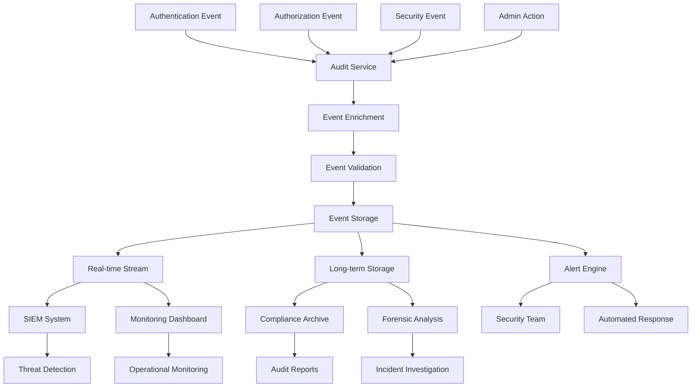
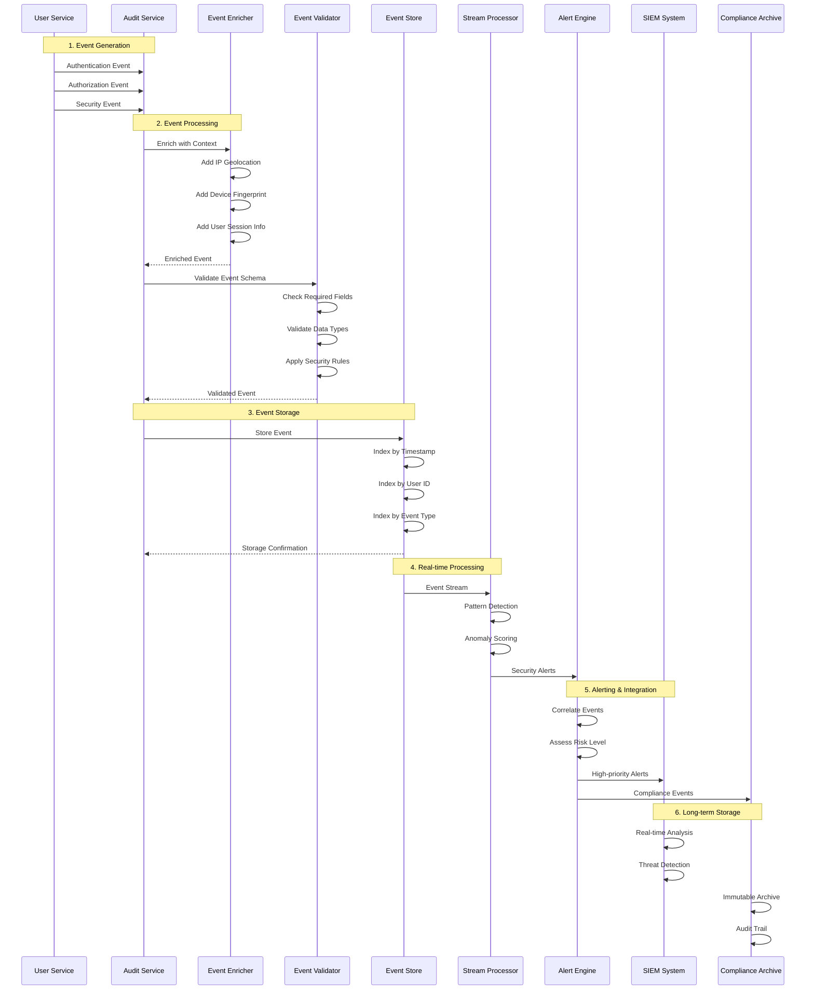

# Security Audit Logging Flow

## Problem Statement

**No reliable trail for incident response and forensics.**

Without comprehensive audit logging, security incidents cannot be properly investigated, compliance requirements cannot
be met, and emerging threats cannot be detected in real-time.

## Technical Solution

**Structured auth-event logs reveal anomalies and support investigations.**

Centralized, structured logging of all authentication and authorization events provides the foundation for security
monitoring, incident response, and regulatory compliance.

## Audit Logging Architecture



## Event Flow Diagram



## Event Schema Structure

### Core Event Fields

```json
{
  "eventId": "uuid-v4",
  "timestamp": "2023-12-11T10:30:45.123Z",
  "eventType": "AUTHENTICATION_SUCCESS|AUTHENTICATION_FAILURE|AUTHORIZATION_GRANTED|AUTHORIZATION_DENIED|SECURITY_VIOLATION",
  "severity": "INFO|WARNING|ERROR|CRITICAL",
  "category": "AUTHENTICATION|AUTHORIZATION|SECURITY|ADMIN",
  "actor": {
    "userId": "uuid",
    "username": "user@example.com",
    "roles": [
      "USER",
      "ADMIN"
    ],
    "sessionId": "session-uuid"
  },
  "resource": {
    "type": "API_ENDPOINT|DATA_RESOURCE|SYSTEM_COMPONENT",
    "id": "/api/users/profile",
    "method": "GET|POST|PUT|DELETE",
    "accessLevel": "READ|WRITE|ADMIN"
  },
  "context": {
    "ipAddress": "192.168.1.100",
    "userAgent": "Mozilla/5.0...",
    "deviceId": "device-fingerprint",
    "geolocation": {
      "country": "US",
      "city": "San Francisco",
      "coordinates": [
        37.7749,
        -122.4194
      ]
    },
    "requestId": "req-uuid",
    "traceId": "trace-uuid"
  },
  "outcome": {
    "success": true,
    "reason": "VALID_CREDENTIALS",
    "errorCode": null,
    "details": "User authenticated successfully"
  },
  "security": {
    "riskScore": 0.1,
    "anomalies": [],
    "threatIndicators": [],
    "mitigations": [
      "MFA_REQUIRED"
    ]
  }
}
```

### Event Type Examples

#### Authentication Success

```json
{
  "eventType": "AUTHENTICATION_SUCCESS",
  "actor": {
    "userId": "550e8400-e29b-41d4-a716-446655440000",
    "username": "user@example.com",
    "authMethod": "PASSWORD|OAUTH2|MFA|OTP"
  },
  "outcome": {
    "success": true,
    "reason": "VALID_CREDENTIALS",
    "sessionDuration": 3600
  }
}
```

#### Security Violation

```json
{
  "eventType": "SECURITY_VIOLATION",
  "severity": "HIGH",
  "category": "SECURITY",
  "actor": {
    "userId": null,
    "ipAddress": "192.168.1.100"
  },
  "resource": {
    "type": "API_ENDPOINT",
    "id": "/api/admin/users"
  },
  "outcome": {
    "success": false,
    "reason": "UNAUTHORIZED_ACCESS_ATTEMPT",
    "details": "Attempted access to admin endpoint without privileges"
  },
  "security": {
    "riskScore": 0.8,
    "anomalies": [
      "UNEXPECTED_IP_ADDRESS",
      "PRIVILEGE_ESCALATION_ATTEMPT"
    ],
    "threatIndicators": [
      "BRUTE_FORCE_PATTERN"
    ]
  }
}
```

## Implementation Details

### Audit Service Implementation

```java

@Service
public class AuditService {

    private final EventPublisher eventPublisher;
    private final EventEnricher eventEnricher;
    private final EventValidator eventValidator;

    public void logAuthenticationEvent(AuthenticationResult result, HttpServletRequest request) {
        AuditEvent event = AuditEvent.builder()
                .eventType(result.isSuccess() ? "AUTHENTICATION_SUCCESS" : "AUTHENTICATION_FAILURE")
                .severity(result.isSuccess() ? INFO : WARNING)
                .actor(buildActor(result.getUser()))
                .context(buildContext(request))
                .outcome(buildOutcome(result))
                .timestamp(Instant.now())
                .eventId(UUID.randomUUID().toString())
                .build();

        processEvent(event);
    }

    public void logAuthorizationEvent(AuthorizationDecision decision, HttpServletRequest request) {
        AuditEvent event = AuditEvent.builder()
                .eventType(decision.isGranted() ? "AUTHORIZATION_GRANTED" : "AUTHORIZATION_DENIED")
                .severity(decision.isGranted() ? INFO : WARNING)
                .actor(buildActor(decision.getUser()))
                .resource(buildResource(request))
                .context(buildContext(request))
                .outcome(buildOutcome(decision))
                .timestamp(Instant.now())
                .eventId(UUID.randomUUID().toString())
                .build();

        processEvent(event);
    }

    private void processEvent(AuditEvent event) {
        try {
            // Enrich event with additional context
            AuditEvent enrichedEvent = eventEnricher.enrich(event);

            // Validate event schema and rules
            eventValidator.validate(enrichedEvent);

            // Store and publish event
            eventPublisher.publish(enrichedEvent);

        } catch (Exception e) {
            // Log audit failure but don't block the operation
            log.error("Failed to process audit event", e);
        }
    }
}
```

### Event Enrichment Service

```java

@Component
public class EventEnricher {

    private final GeoLocationService geoLocationService;
    private final DeviceFingerprintService deviceFingerprintService;
    private final UserService userService;

    public AuditEvent enrich(AuditEvent event) {
        return event.toBuilder()
                .context(enrichContext(event.getContext()))
                .security(enrichSecurity(event))
                .build();
    }

    private EventContext enrichContext(EventContext context) {
        return context.toBuilder()
                .geolocation(geoLocationService.getLocation(context.getIpAddress()))
                .deviceId(deviceFingerprintService.getFingerprint(context.getUserAgent()))
                .build();
    }

    private EventSecurity enrichSecurity(AuditEvent event) {
        User user = userService.getUser(event.getActor().getUserId());

        return EventSecurity.builder()
                .riskScore(calculateRiskScore(event, user))
                .anomalies(detectAnomalies(event, user))
                .threatIndicators(identifyThreatIndicators(event))
                .build();
    }

    private double calculateRiskScore(AuditEvent event, User user) {
        double score = 0.0;

        // Geographic anomaly
        if (isNewLocation(event.getContext().getGeolocation(), user)) {
            score += 0.3;
        }

        // Device anomaly
        if (isNewDevice(event.getContext().getDeviceId(), user)) {
            score += 0.2;
        }

        // Time-based anomaly
        if (isUnusualTime(event.getTimestamp(), user)) {
            score += 0.1;
        }

        // Failed authentication attempts
        if (event.getEventType().equals("AUTHENTICATION_FAILURE")) {
            score += 0.4;
        }

        return Math.min(score, 1.0);
    }
}
```

## Real-time Monitoring & Alerting

### Alert Rules Configuration

```yaml
alert-rules:
  brute-force-attack:
    description: Multiple failed auth attempts from same IP
    condition: "count(event_type = 'AUTHENTICATION_FAILURE' AND ip_address = '${ip}') > 10"
    time-window: 5m
    severity: HIGH
    actions: [ block_ip, notify_security_team ]

  impossible-travel:
    description: Login from geographically impossible location
    condition: "geographic_velocity > 1000 km/h"
    time-window: 1h
    severity: MEDIUM
    actions: [ require_mfa, notify_user ]

  privilege-escalation:
    description: User accessing unusual admin functions
    condition: "event_type = 'AUTHORIZATION_DENIED' AND resource_type = 'ADMIN_ENDPOINT'"
    time-window: 1h
    severity: MEDIUM
    actions: [ log_incident, monitor_user ]

  account-takeover:
    description: Multiple suspicious indicators
    condition: "risk_score > 0.8 AND (new_device = true OR new_location = true)"
    time-window: 5m
    severity: CRITICAL
    actions: [ lock_account, notify_user, notify_security_team ]
```

### Stream Processing Implementation

```java

@Component
public class SecurityEventProcessor {

    @KafkaListener(topics = "security-events")
    public void processSecurityEvent(AuditEvent event) {
        // Detect patterns and anomalies
        List<SecurityAlert> alerts = detectSecurityIssues(event);

        // Process alerts
        alerts.forEach(this::handleAlert);
    }

    private List<SecurityAlert> detectSecurityIssues(AuditEvent event) {
        List<SecurityAlert> alerts = new ArrayList<>();

        // Brute force detection
        if (isBruteForceAttack(event)) {
            alerts.add(createBruteForceAlert(event));
        }

        // Impossible travel detection
        if (isImpossibleTravel(event)) {
            alerts.add(createImpossibleTravelAlert(event));
        }

        // Anomaly detection
        if (event.getSecurity().getRiskScore() > 0.8) {
            alerts.add(createHighRiskAlert(event));
        }

        return alerts;
    }

    private boolean isBruteForceAttack(AuditEvent event) {
        if (!event.getEventType().equals("AUTHENTICATION_FAILURE")) {
            return false;
        }

        // Check for multiple failures from same IP
        long recentFailures = eventRepository.countRecentFailures(
                event.getContext().getIpAddress(),
                Duration.ofMinutes(5)
        );

        return recentFailures > 10;
    }
}
```

## Compliance & Retention

### Retention Policies

```yaml
retention-policies:
  authentication-events:
    hot-storage: 90d
    warm-storage: 1y
    cold-storage: 7y
    archive: permanent

  security-violations:
    hot-storage: 1y
    warm-storage: 7y
    cold-storage: permanent
    archive: permanent

  admin-actions:
    hot-storage: 1y
    warm-storage: permanent
    cold-storage: permanent
    archive: permanent
```

### Compliance Reporting

```java

@Service
public class ComplianceReportService {

    public ComplianceReport generateSoc2Report(LocalDate startDate, LocalDate endDate) {
        return ComplianceReport.builder()
                .period(startDate, endDate)
                .authenticationEvents(generateAuthReport(startDate, endDate))
                .accessControlEvents(generateAccessReport(startDate, endDate))
                .securityIncidents(generateIncidentReport(startDate, endDate))
                .adminActions(generateAdminReport(startDate, endDate))
                .build();
    }

    private AuthenticationMetrics generateAuthReport(LocalDate start, LocalDate end) {
        return AuthenticationMetrics.builder()
                .totalLogins(countEvents("AUTHENTICATION_SUCCESS", start, end))
                .failedLogins(countEvents("AUTHENTICATION_FAILURE", start, end))
                .uniqueUsers(countUniqueUsers(start, end))
                .mfaUsageRate(calculateMfaUsageRate(start, end))
                .oauth2UsageRate(calculateOAuth2UsageRate(start, end))
                .build();
    }
}
```

## Security Benefits

### Incident Response

1. **Root Cause Analysis**: Complete event timeline
2. **Impact Assessment**: Affected users and resources
3. **Forensic Evidence**: Immutable audit trail
4. **Compliance Reporting**: Automated report generation

### Threat Detection

1. **Real-time Alerts**: Immediate notification of suspicious activity
2. **Pattern Recognition**: ML-based anomaly detection
3. **Risk Scoring**: Quantified threat assessment
4. **Automated Response**: Pre-configured mitigation actions

### Compliance Support

1. **Regulatory Requirements**: SOX, HIPAA, GDPR, PCI DSS
2. **Audit Readiness**: Always-available audit trail
3. **Data Protection**: Immutable storage with encryption
4. **Access Controls**: Role-based log access

---

*Related
Features: [JWT-Based Authentication](jwt-auth-flow.md), [Redis Rate Limiting](./rate-limiting.md), [Role-Based Access Control](./rbac-flow.md)*
