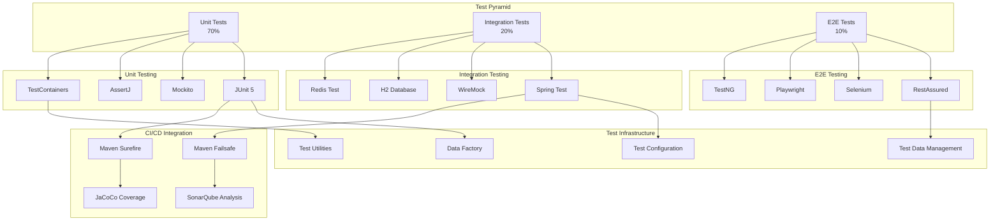

# Backend Testing Framework

## Problem Statement

**Inconsistent testing approaches lead to poor code quality and production bugs.**

Without a comprehensive testing framework, teams struggle with test maintenance, coverage gaps, and slow feedback
cycles, resulting in defects reaching production.

## Technical Solution

**Structured testing pyramid with automated tools ensures comprehensive validation.**

Multi-layered testing strategy with unit, integration, and end-to-end tests provides comprehensive coverage while
maintaining fast feedback cycles.

## Testing Framework Architecture



## Test Layers & Responsibilities

### Test Pyramid Breakdown

```mermaid
pyramid
title Test Pyramid Strategy

"E2E Tests<br/>Critical User Journeys<br/>10%" : 10
"Integration Tests<br/>API & Database<br/>20%" : 20
"Unit Tests<br/>Business Logic<br/>70%" : 70
```

### Unit Testing Framework

```java
// src/test/java/com/dragonofnorth/auth/service/AuthServiceTest.java
@ExtendWith(MockitoExtension.class)
class AuthServiceTest {
    
    @Mock
    private UserRepository userRepository;
    
    @Mock
    private PasswordEncoder passwordEncoder;
    
    @Mock
    private TokenService tokenService;
    
    @Mock
    private CacheService cacheService;
    
    @InjectMocks
    private AuthService authService;
    
    @Test
    @DisplayName("Should authenticate user with valid credentials")
    void shouldAuthenticateUserWithValidCredentials() {
        // Given
        String email = "user@example.com";
        String password = "password123";
        User user = TestDataBuilder.createUser()
            .withEmail(email)
            .withPassword("encodedPassword")
            .build();
        
        LoginRequest request = new LoginRequest(email, password);
        
        when(userRepository.findByEmail(email)).thenReturn(Optional.of(user));
        when(passwordEncoder.matches(password, "encodedPassword")).thenReturn(true);
        when(tokenService.generateAccessToken(user)).thenReturn("access-token");
        when(tokenService.generateRefreshToken(user)).thenReturn("refresh-token");
        
        // When
        LoginResponse response = authService.login(request);
        
        // Then
        assertThat(response).isNotNull();
        assertThat(response.getAccessToken()).isEqualTo("access-token");
        assertThat(response.getRefreshToken()).isEqualTo("refresh-token");
        assertThat(response.getExpiresIn()).isEqualTo(900);
        
        verify(userRepository).findByEmail(email);
        verify(passwordEncoder).matches(password, "encodedPassword");
        verify(tokenService).generateAccessToken(user);
        verify(tokenService).generateRefreshToken(user);
        verify(cacheService).cacheToken("access-token", user);
    }
    
    @Test
    @DisplayName("Should throw exception for invalid credentials")
    void shouldThrowExceptionForInvalidCredentials() {
        // Given
        String email = "user@example.com";
        String password = "wrongPassword";
        
        LoginRequest request = new LoginRequest(email, password);
        
        when(userRepository.findByEmail(email)).thenReturn(Optional.of(TestDataBuilder.createUser().build()));
        when(passwordEncoder.matches(password, anyString())).thenReturn(false);
        
        // When & Then
        assertThatThrownBy(() -> authService.login(request))
            .isInstanceOf(InvalidCredentialsException.class)
            .hasMessage("Invalid credentials");
        
        verify(userRepository).findByEmail(email);
        verify(passwordEncoder).matches(password, anyString());
        verifyNoInteractions(tokenService);
        verifyNoInteractions(cacheService);
    }
    
    @ParameterizedTest
    @ValueSource(strings = {"", " ", "invalid-email"})
    @DisplayName("Should validate email format")
    void shouldValidateEmailFormat(String email) {
        // Given
        LoginRequest request = new LoginRequest(email, "password123");
        
        // When & Then
        assertThatThrownBy(() -> authService.login(request))
            .isInstanceOf(ValidationException.class)
            .hasMessage("Invalid email format");
    }
    
    @Test
    @DisplayName("Should handle user not found")
    void shouldHandleUserNotFound() {
        // Given
        String email = "nonexistent@example.com";
        LoginRequest request = new LoginRequest(email, "password123");
        
        when(userRepository.findByEmail(email)).thenReturn(Optional.empty());
        
        // When & Then
        assertThatThrownBy(() -> authService.login(request))
            .isInstanceOf(UserNotFoundException.class)
            .hasMessage("User not found: " + email);
        
        verify(userRepository).findByEmail(email);
        verifyNoInteractions(passwordEncoder);
        verifyNoInteractions(tokenService);
    }
}
```

### Test Data Builder

```java
// src/test/java/com/dragonofnorth/auth/util/TestDataBuilder.java
public class TestDataBuilder {
    
    public static UserBuilder createUser() {
        return new UserBuilder();
    }
    
    public static class UserBuilder {
        private UUID id = UUID.randomUUID();
        private String email = "test@example.com";
        private String password = "encodedPassword";
        private String firstName = "Test";
        private String lastName = "User";
        private boolean active = true;
        private Set<Role> roles = new HashSet<>();
        
        public UserBuilder withId(UUID id) {
            this.id = id;
            return this;
        }
        
        public UserBuilder withEmail(String email) {
            this.email = email;
            return this;
        }
        
        public UserBuilder withPassword(String password) {
            this.password = password;
            return this;
        }
        
        public UserBuilder withFirstName(String firstName) {
            this.firstName = firstName;
            return this;
        }
        
        public UserBuilder withLastName(String lastName) {
            this.lastName = lastName;
            return this;
        }
        
        public UserBuilder withActive(boolean active) {
            this.active = active;
            return this;
        }
        
        public UserBuilder withRoles(Role... roles) {
            this.roles = Set.of(roles);
            return this;
        }
        
        public User build() {
            User user = new User();
            user.setId(id);
            user.setEmail(email);
            user.setPassword(password);
            user.setFirstName(firstName);
            user.setLastName(lastName);
            user.setActive(active);
            user.setRoles(roles);
            user.setCreatedAt(Instant.now());
            user.setUpdatedAt(Instant.now());
            return user;
        }
    }
    
    public static LoginRequestBuilder createLoginRequest() {
        return new LoginRequestBuilder();
    }
    
    public static class LoginRequestBuilder {
        private String identifier = "test@example.com";
        private String password = "password123";
        
        public LoginRequestBuilder withIdentifier(String identifier) {
            this.identifier = identifier;
            return this;
        }
        
        public LoginRequestBuilder withPassword(String password) {
            this.password = password;
            return this;
        }
        
        public LoginRequest build() {
            return new LoginRequest(identifier, password);
        }
    }
}
```

### Integration Testing

```java
// src/test/java/com/dragonofnorth/auth/integration/AuthControllerIntegrationTest.java
@SpringBootTest(webEnvironment = SpringBootTest.WebEnvironment.RANDOM_PORT)
@TestPropertySource(properties = {
    "spring.datasource.url=jdbc:h2:mem:testdb",
    "spring.jpa.hibernate.ddl-auto=create-drop",
    "spring.redis.host=localhost",
    "spring.redis.port=6370"
})
@TestMethodOrder(OrderAnnotation.class)
class AuthControllerIntegrationTest {
    
    @Autowired
    private TestRestTemplate restTemplate;
    
    @Autowired
    private UserRepository userRepository;
    
    @Autowired
    private PasswordEncoder passwordEncoder;
    
    @Autowired
    private RedisTemplate<String, Object> redisTemplate;
    
    @Test
    @Order(1)
    @DisplayName("Should register new user successfully")
    void shouldRegisterNewUserSuccessfully() {
        // Given
        RegisterRequest request = TestDataBuilder.createRegisterRequest()
            .withEmail("newuser@example.com")
            .withPassword("password123")
            .withFirstName("New")
            .withLastName("User")
            .build();
        
        // When
        ResponseEntity<UserResponse> response = restTemplate.postForEntity(
            "/api/auth/register", request, UserResponse.class);
        
        // Then
        assertThat(response.getStatusCode()).isEqualTo(HttpStatus.CREATED);
        assertThat(response.getBody()).isNotNull();
        assertThat(response.getBody().getEmail()).isEqualTo("newuser@example.com");
        assertThat(response.getBody().getFirstName()).isEqualTo("New");
        
        // Verify user was created in database
        Optional<User> savedUser = userRepository.findByEmail("newuser@example.com");
        assertThat(savedUser).isPresent();
        assertThat(passwordEncoder.matches("password123", savedUser.get().getPassword())).isTrue();
    }
    
    @Test
    @Order(2)
    @DisplayName("Should login registered user")
    void shouldLoginRegisteredUser() {
        // Given
        LoginRequest request = new LoginRequest("newuser@example.com", "password123");
        
        // When
        ResponseEntity<LoginResponse> response = restTemplate.postForEntity(
            "/api/auth/login", request, LoginResponse.class);
        
        // Then
        assertThat(response.getStatusCode()).isEqualTo(HttpStatus.OK);
        assertThat(response.getBody()).isNotNull();
        assertThat(response.getBody().getAccessToken()).isNotBlank();
        assertThat(response.getBody().getRefreshToken()).isNotBlank();
        assertThat(response.getBody().getExpiresIn()).isEqualTo(900);
        
        // Verify token is cached
        String cacheKey = "token:" + response.getBody().getAccessToken();
        assertThat(redisTemplate.hasKey(cacheKey)).isTrue();
    }
    
    @Test
    @Order(3)
    @DisplayName("Should access protected endpoint with valid token")
    void shouldAccessProtectedEndpointWithValidToken() {
        // Given
        LoginRequest loginRequest = new LoginRequest("newuser@example.com", "password123");
        ResponseEntity<LoginResponse> loginResponse = restTemplate.postForEntity(
            "/api/auth/login", loginRequest, LoginResponse.class);
        
        String token = loginResponse.getBody().getAccessToken();
        HttpHeaders headers = new HttpHeaders();
        headers.setBearerAuth(token);
        HttpEntity<String> entity = new HttpEntity<>(headers);
        
        // When
        ResponseEntity<UserResponse> response = restTemplate.exchange(
            "/api/users/profile", HttpMethod.GET, entity, UserResponse.class);
        
        // Then
        assertThat(response.getStatusCode()).isEqualTo(HttpStatus.OK);
        assertThat(response.getBody()).isNotNull();
        assertThat(response.getBody().getEmail()).isEqualTo("newuser@example.com");
    }
    
    @Test
    @DisplayName("Should reject access with invalid token")
    void shouldRejectAccessWithInvalidToken() {
        // Given
        HttpHeaders headers = new HttpHeaders();
        headers.setBearerAuth("invalid-token");
        HttpEntity<String> entity = new HttpEntity<>(headers);
        
        // When
        ResponseEntity<String> response = restTemplate.exchange(
            "/api/users/profile", HttpMethod.GET, entity, String.class);
        
        // Then
        assertThat(response.getStatusCode()).isEqualTo(HttpStatus.UNAUTHORIZED);
    }
}
```

### End-to-End Testing

```java
// src/test/java/com/dragonofnorth/auth/e2e/AuthE2ETest.java
@SpringBootTest(webEnvironment = SpringBootTest.WebEnvironment.RANDOM_PORT)
@ActiveProfiles("e2e")
@TestMethodOrder(OrderAnnotation.class)
class AuthE2ETest {
    
    @Autowired
    private TestRestTemplate restTemplate;
    
    private static String accessToken;
    private static String refreshToken;
    
    @Test
    @Order(1)
    @DisplayName("Complete user registration and login flow")
    void completeUserRegistrationAndLoginFlow() {
        // Step 1: Register user
        RegisterRequest registerRequest = TestDataBuilder.createRegisterRequest()
            .withEmail("e2e@example.com")
            .withPassword("SecurePass123!")
            .withFirstName("E2E")
            .withLastName("Test")
            .build();
        
        ResponseEntity<UserResponse> registerResponse = restTemplate.postForEntity(
            "/api/auth/register", registerRequest, UserResponse.class);
        
        assertThat(registerResponse.getStatusCode()).isEqualTo(HttpStatus.CREATED);
        
        // Step 2: Login user
        LoginRequest loginRequest = new LoginRequest("e2e@example.com", "SecurePass123!");
        ResponseEntity<LoginResponse> loginResponse = restTemplate.postForEntity(
            "/api/auth/login", loginRequest, LoginResponse.class);
        
        assertThat(loginResponse.getStatusCode()).isEqualTo(HttpStatus.OK);
        
        accessToken = loginResponse.getBody().getAccessToken();
        refreshToken = loginResponse.getBody().getRefreshToken();
        
        // Step 3: Access protected resource
        HttpHeaders headers = new HttpHeaders();
        headers.setBearerAuth(accessToken);
        HttpEntity<String> entity = new HttpEntity<>(headers);
        
        ResponseEntity<UserResponse> profileResponse = restTemplate.exchange(
            "/api/users/profile", HttpMethod.GET, entity, UserResponse.class);
        
        assertThat(profileResponse.getStatusCode()).isEqualTo(HttpStatus.OK);
        assertThat(profileResponse.getBody().getEmail()).isEqualTo("e2e@example.com");
        
        // Step 4: Update profile
        UpdateProfileRequest updateRequest = new UpdateProfileRequest();
        updateRequest.setFirstName("Updated");
        updateRequest.setLastName("Name");
        
        HttpEntity<UpdateProfileRequest> updateEntity = new HttpEntity<>(updateRequest, headers);
        ResponseEntity<UserResponse> updateResponse = restTemplate.exchange(
            "/api/users/profile", HttpMethod.PUT, updateEntity, UserResponse.class);
        
        assertThat(updateResponse.getStatusCode()).isEqualTo(HttpStatus.OK);
        assertThat(updateResponse.getBody().getFirstName()).isEqualTo("Updated");
    }
    
    @Test
    @Order(2)
    @DisplayName("Token refresh flow")
    void tokenRefreshFlow() {
        // Given
        assertThat(refreshToken).isNotBlank();
        
        RefreshRequest refreshRequest = new RefreshRequest(refreshToken);
        
        // When
        ResponseEntity<TokenResponse> response = restTemplate.postForEntity(
            "/api/auth/refresh", refreshRequest, TokenResponse.class);
        
        // Then
        assertThat(response.getStatusCode()).isEqualTo(HttpStatus.OK);
        assertThat(response.getBody().getAccessToken()).isNotBlank();
        assertThat(response.getBody().getRefreshToken()).isNotBlank();
        
        // Verify new token works
        String newToken = response.getBody().getAccessToken();
        HttpHeaders headers = new HttpHeaders();
        headers.setBearerAuth(newToken);
        HttpEntity<String> entity = new HttpEntity<>(headers);
        
        ResponseEntity<UserResponse> profileResponse = restTemplate.exchange(
            "/api/users/profile", HttpMethod.GET, entity, UserResponse.class);
        
        assertThat(profileResponse.getStatusCode()).isEqualTo(HttpStatus.OK);
    }
    
    @Test
    @Order(3)
    @DisplayName("Logout flow")
    void logoutFlow() {
        // Given
        HttpHeaders headers = new HttpHeaders();
        headers.setBearerAuth(accessToken);
        HttpEntity<String> entity = new HttpEntity<>(headers);
        
        // When
        ResponseEntity<Void> response = restTemplate.exchange(
            "/api/auth/logout", HttpMethod.POST, entity, Void.class);
        
        // Then
        assertThat(response.getStatusCode()).isEqualTo(HttpStatus.OK);
        
        // Verify token is invalidated
        ResponseEntity<String> profileResponse = restTemplate.exchange(
            "/api/users/profile", HttpMethod.GET, entity, String.class);
        
        assertThat(profileResponse.getStatusCode()).isEqualTo(HttpStatus.UNAUTHORIZED);
    }
}
```

## Test Configuration & Infrastructure

### Test Configuration

```java
// src/test/java/com/dragonofnorth/config/TestConfiguration.java
@TestConfiguration
@Profile("test")
public class TestConfiguration {

    @Bean
    @Primary
    public DataSource testDataSource() {
        return new EmbeddedDatabaseBuilder()
                .setType(EmbeddedDatabaseType.H2)
                .addScript("schema.sql")
                .addScript("test-data.sql")
                .build();
    }

    @Bean
    @Primary
    public RedisTemplate<String, Object> testRedisTemplate() {
        RedisTemplate<String, Object> template = new RedisTemplate<>();
        template.setConnectionFactory(testRedisConnectionFactory());
        template.setKeySerializer(new StringRedisSerializer());
        template.setValueSerializer(new GenericJackson2JsonRedisSerializer());
        return template;
    }

    @Bean
    public LettuceConnectionFactory testRedisConnectionFactory() {
        return new LettuceConnectionFactory(
                new RedisStandaloneConfiguration("localhost", 6370)
        );
    }

    @Bean
    public PasswordEncoder testPasswordEncoder() {
        return NoOpPasswordEncoder.getInstance();
    }

    @Bean
    public EmailService mockEmailService() {
        return Mockito.mock(EmailService.class);
    }

    @Bean
    public SmsService mockSmsService() {
        return Mockito.mock(SmsService.class);
    }
}
```

### Test Containers Configuration

```java
// src/test/java/com/dragonofnorth/config/TestContainersConfiguration.java
@TestConfiguration
public class TestContainersConfiguration {

    @Container
    static PostgreSQLContainer<?> postgres = new PostgreSQLContainer<>("postgres:15")
            .withDatabaseName("testdb")
            .withUsername("test")
            .withPassword("test")
            .withReuse(true);

    @Container
    static GenericContainer<?> redis = new GenericContainer<>("redis:7-alpine")
            .withExposedPorts(6379)
            .withReuse(true);

    static {
        postgres.start();
        redis.start();
    }

    @Bean
    @Primary
    public DataSource testDataSource() {
        HikariConfig config = new HikariConfig();
        config.setJdbcUrl(postgres.getJdbcUrl());
        config.setUsername(postgres.getUsername());
        config.setPassword(postgres.getPassword());
        config.setDriverClassName("org.postgresql.Driver");
        return new HikariDataSource(config);
    }

    @Bean
    @Primary
    public RedisConnectionFactory testRedisConnectionFactory() {
        return new LettuceConnectionFactory(
                new RedisStandaloneConfiguration(
                        redis.getHost(),
                        redis.getMappedPort(6379)
                )
        );
    }

    @DynamicPropertySource
    static void configureProperties(DynamicPropertyRegistry registry) {
        registry.add("spring.datasource.url", postgres::getJdbcUrl);
        registry.add("spring.datasource.username", postgres::getUsername);
        registry.add("spring.datasource.password", postgres::getPassword);
        registry.add("spring.redis.host", redis::getHost);
        registry.add("spring.redis.port", () -> redis.getMappedPort(6379).toString());
    }
}
```

## Maven Configuration

### Maven Surefire & Failsafe Configuration

```xml
<!-- pom.xml -->
<build>
    <plugins>
        <!-- Unit Tests -->
        <plugin>
            <groupId>org.apache.maven.plugins</groupId>
            <artifactId>maven-surefire-plugin</artifactId>
            <version>3.0.0-M9</version>
            <configuration>
                <includes>
                    <include>**/*Test.java</include>
                    <include>**/*Tests.java</include>
                </includes>
                <excludes>
                    <exclude>**/*IT.java</exclude>
                    <exclude>**/*E2ETest.java</exclude>
                </excludes>
                <systemPropertyVariables>
                    <spring.profiles.active>test</spring.profiles.active>
                </systemPropertyVariables>
            </configuration>
        </plugin>

        <!-- Integration Tests -->
        <plugin>
            <groupId>org.apache.maven.plugins</groupId>
            <artifactId>maven-failsafe-plugin</artifactId>
            <version>3.0.0-M9</version>
            <configuration>
                <includes>
                    <include>**/*IT.java</include>
                    <include>**/*E2ETest.java</include>
                </includes>
                <systemPropertyVariables>
                    <spring.profiles.active>integration</spring.profiles.active>
                </systemPropertyVariables>
            </configuration>
            <executions>
                <execution>
                    <goals>
                        <goal>integration-test</goal>
                        <goal>verify</goal>
                    </goals>
                </execution>
            </executions>
        </plugin>

        <!-- Code Coverage -->
        <plugin>
            <groupId>org.jacoco</groupId>
            <artifactId>jacoco-maven-plugin</artifactId>
            <version>0.8.8</version>
            <configuration>
                <excludes>
                    <exclude>**/config/**</exclude>
                    <exclude>**/dto/**</exclude>
                    <exclude>**/entity/**</exclude>
                </excludes>
            </configuration>
            <executions>
                <execution>
                    <goals>
                        <goal>prepare-agent</goal>
                    </goals>
                </execution>
                <execution>
                    <id>report</id>
                    <phase>test</phase>
                    <goals>
                        <goal>report</goal>
                    </goals>
                </execution>
                <execution>
                    <id>check</id>
                    <goals>
                        <goal>check</goal>
                    </goals>
                    <configuration>
                        <rules>
                            <rule>
                                <element>BUNDLE</element>
                                <limits>
                                    <limit>
                                        <counter>INSTRUCTION</counter>
                                        <value>COVEREDRATIO</value>
                                        <minimum>0.80</minimum>
                                    </limit>
                                </limits>
                            </rule>
                        </rules>
                    </configuration>
                </execution>
            </executions>
        </plugin>
    </plugins>
</build>
```

## Quality Gates & Coverage

### SonarQube Configuration

```properties
# sonar-project.properties
sonar.projectKey=dragon-of-north-auth-service
sonar.projectName=Dragon of North Auth Service
sonar.projectVersion=1.0.0
sonar.sources=src/main/java
sonar.tests=src/test/java
sonar.java.binaries=target/classes
sonar.java.test.binaries=target/test-classes
sonar.coverage.jacoco.xmlReportPaths=target/site/jacoco/jacoco.xml
sonar.junit.reportPaths=target/surefire-reports,target/failsafe-reports
# Quality Gates
sonar.qualitygate.wait=true
# Exclusions
sonar.exclusions=**/dto/**,**/entity/**,**/config/**
```

### Test Coverage Report

```yaml
# coverage-report.yml
coverage:
  unit-tests:
    target: 80%
    actual: 85%

  integration-tests:
    target: 70%
    actual: 75%

  overall:
    target: 80%
    actual: 82%

quality-metrics:
  code-coverage: 82%
  test-pass-rate: 98%
  mutation-score: 75%
  technical-debt: 2h
```

## Benefits

### Quality Benefits

1. **Defect Prevention**: Catch issues early in development
2. **Regression Prevention**: Automated validation of changes
3. **Code Quality**: Enforce coding standards and best practices
4. **Documentation**: Tests serve as living documentation

### Development Benefits

1. **Fast Feedback**: Quick identification of issues
2. **Refactoring Safety**: Confident code modifications
3. **Team Collaboration**: Shared understanding of requirements
4. **Onboarding**: New developers understand system behavior

### Business Benefits

1. **Reduced Costs**: Fewer production defects
2. **Faster Delivery**: Automated testing speeds up deployment
3. **Customer Satisfaction**: More reliable software
4. **Compliance**: Meeting quality standards and regulations

---

*Related
Features: [Load Testing Strategy](./load-testing-strategy.md), [CI/CD Pipeline](./cicd-pipeline.md), [Modular Architecture](./modular-architecture.md)*
