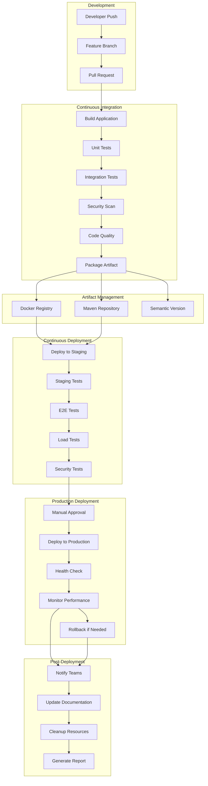
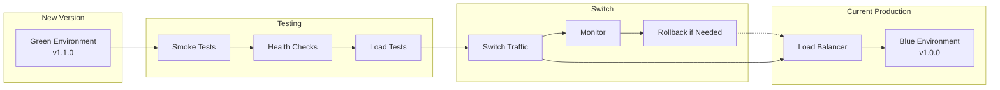

# CI/CD Pipeline Architecture

## Problem Statement

**Manual deployment processes are slow, error-prone, and inconsistent.**

Without automated CI/CD pipelines, deployments become bottlenecks, human errors introduce failures, and teams struggle
with release consistency and rollback capabilities.

## Technical Solution

**Automated pipeline ensures consistent, fast, and reliable software delivery.**

Comprehensive CI/CD pipeline with automated testing, security scanning, and deployment strategies enables rapid, safe,
and consistent releases.

## CI/CD Pipeline Flow



## GitHub Actions Pipeline

### Main CI/CD Workflow

```yaml
# .github/workflows/ci-cd.yml
name: CI/CD Pipeline

on:
  push:
    branches: [ main, develop ]
  pull_request:
    branches: [ main, develop ]
  release:
    types: [ published ]

env:
  REGISTRY: ghcr.io
  IMAGE_NAME: dragonofnorth/auth-service

jobs:
  # Build and Test
  build-and-test:
    runs-on: ubuntu-latest

    services:
      postgres:
        image: postgres:15
        env:
          POSTGRES_PASSWORD: postgres
          POSTGRES_DB: dragon_of_north_test
        options: >-
          --health-cmd pg_isready
          --health-interval 10s
          --health-timeout 5s
          --health-retries 5
        ports:
          - 5432:5432

      redis:
        image: redis:7
        options: >-
          --health-cmd "redis-cli ping"
          --health-interval 10s
          --health-timeout 5s
          --health-retries 5
        ports:
          - 6379:6379

    steps:
      - name: Checkout code
        uses: actions/checkout@v4
        with:
          fetch-depth: 0

      - name: Set up JDK 17
        uses: actions/setup-java@v3
        with:
          java-version: '17'
          distribution: 'temurin'

      - name: Cache Maven dependencies
        uses: actions/cache@v3
        with:
          path: ~/.m2
          key: ${{ runner.os }}-m2-${{ hashFiles('**/pom.xml') }}
          restore-keys: ${{ runner.os }}-m2

      - name: Run unit tests
        run: mvn clean test

      - name: Run integration tests
        run: mvn clean verify -P integration

      - name: Generate test report
        uses: dorny/test-reporter@v1
        if: success() || failure()
        with:
          name: Maven Tests
          path: target/surefire-reports/*.xml
          reporter: java-junit

      - name: Upload coverage to Codecov
        uses: codecov/codecov-action@v3
        with:
          file: target/site/jacoco/jacoco.xml
          flags: unittests
          name: codecov-umbrella

      - name: SonarQube Scan
        uses: sonarsource/sonarqube-scan-action@master
        env:
          GITHUB_TOKEN: ${{ secrets.GITHUB_TOKEN }}
          SONAR_HOST_URL: ${{ secrets.SONAR_HOST_URL }}
          SONAR_TOKEN: ${{ secrets.SONAR_TOKEN }}

      - name: Build application
        run: mvn clean package -DskipTests

      - name: Upload build artifacts
        uses: actions/upload-artifact@v3
        with:
          name: build-artifacts
          path: target/*.jar

  # Security Scanning
  security-scan:
    runs-on: ubuntu-latest
    needs: build-and-test

    steps:
      - name: Checkout code
        uses: actions/checkout@v4

      - name: Run Trivy vulnerability scanner
        uses: aquasecurity/trivy-action@master
        with:
          scan-type: 'fs'
          scan-ref: '.'
          format: 'sarif'
          output: 'trivy-results.sarif'

      - name: Upload Trivy scan results to GitHub Security tab
        uses: github/codeql-action/upload-sarif@v2
        with:
          sarif_file: 'trivy-results.sarif'

      - name: OWASP Dependency Check
        uses: dependency-check/Dependency-Check_Action@main
        with:
          project: 'dragon-of-north'
          path: '.'
          format: 'HTML'

      - name: Upload OWASP results
        uses: actions/upload-artifact@v3
        with:
          name: owasp-reports
          path: reports/

  # Docker Build and Push
  docker-build:
    runs-on: ubuntu-latest
    needs: [ build-and-test, security-scan ]
    if: github.event_name != 'pull_request'

    outputs:
      image-tag: ${{ steps.meta.outputs.tags }}
      image-digest: ${{ steps.build.outputs.digest }}

    steps:
      - name: Checkout code
        uses: actions/checkout@v4

      - name: Set up Docker Buildx
        uses: docker/setup-buildx-action@v2

      - name: Log in to Container Registry
        uses: docker/login-action@v2
        with:
          registry: ${{ env.REGISTRY }}
          username: ${{ github.actor }}
          password: ${{ secrets.GITHUB_TOKEN }}

      - name: Extract metadata
        id: meta
        uses: docker/metadata-action@v4
        with:
          images: ${{ env.REGISTRY }}/${{ env.IMAGE_NAME }}
          tags: |
            type=ref,event=branch
            type=ref,event=pr
            type=semver,pattern={{version}}
            type=semver,pattern={{major}}.{{minor}}
            type=sha

      - name: Download build artifacts
        uses: actions/download-artifact@v3
        with:
          name: build-artifacts
          path: target/

      - name: Build and push Docker image
        id: build
        uses: docker/build-push-action@v4
        with:
          context: .
          platforms: linux/amd64,linux/arm64
          push: true
          tags: ${{ steps.meta.outputs.tags }}
          labels: ${{ steps.meta.outputs.labels }}
          cache-from: type=gha
          cache-to: type=gha,mode=max
          provenance: true

  # Deploy to Staging
  deploy-staging:
    runs-on: ubuntu-latest
    needs: docker-build
    if: github.ref == 'refs/heads/develop'
    environment: staging

    steps:
      - name: Checkout code
        uses: actions/checkout@v4

      - name: Configure AWS credentials
        uses: aws-actions/configure-aws-credentials@v2
        with:
          aws-access-key-id: ${{ secrets.AWS_ACCESS_KEY_ID }}
          aws-secret-access-key: ${{ secrets.AWS_SECRET_ACCESS_KEY }}
          aws-region: us-west-2

      - name: Update kubeconfig
        run: aws eks update-kubeconfig --name dragon-of-north-staging

      - name: Deploy to staging
        run: |
          helm upgrade --install auth-service ./helm/auth-service \
            --namespace staging \
            --create-namespace \
            --set image.tag=${{ needs.docker-build.outputs.image-tag }} \
            --set environment=staging \
            --set ingress.host=staging-api.dragonofnorth.com \
            --wait --timeout=10m

      - name: Run health checks
        run: |
          kubectl wait --for=condition=ready pod -l app=auth-service -n staging --timeout=300s
          kubectl get pods -n staging
          kubectl logs -l app=auth-service -n staging --tail=100

      - name: Run integration tests on staging
        run: |
          mvn test -P staging -Dtest.url=https://staging-api.dragonofnorth.com

  # Load Testing on Staging
  load-test-staging:
    runs-on: ubuntu-latest
    needs: deploy-staging
    if: github.ref == 'refs/heads/develop'

    steps:
      - name: Checkout code
        uses: actions/checkout@v4

      - name: Set up K6
        run: |
          sudo gpg -k
          sudo gpg --no-default-keyring --keyring /usr/share/keyrings/k6-archive-keyring.gpg --keyserver hkp://keyserver.ubuntu.com:80 --recv-keys C5AD17C747E3415A3642D57D77C6C491D6AC1D69
          echo "deb [signed-by=/usr/share/keyrings/k6-archive-keyring.gpg] https://dl.k6.io/deb stable main" | sudo tee /etc/apt/sources.list.d/k6.list
          sudo apt-get update
          sudo apt-get install k6

      - name: Run load tests
        run: |
          k6 run --out json=load-test-results.json \
            --out cloud \
            load-tests/auth-load-test.js \
            -e STAGING_URL=https://staging-api.dragonofnorth.com

      - name: Upload load test results
        uses: actions/upload-artifact@v3
        with:
          name: load-test-results
          path: load-test-results.json

  # Deploy to Production
  deploy-production:
    runs-on: ubuntu-latest
    needs: [ docker-build, load-test-staging ]
    if: github.event_name == 'release'
    environment: production

    steps:
      - name: Checkout code
        uses: actions/checkout@v4

      - name: Configure AWS credentials
        uses: aws-actions/configure-aws-credentials@v2
        with:
          aws-access-key-id: ${{ secrets.AWS_ACCESS_KEY_ID }}
          aws-secret-access-key: ${{ secrets.AWS_SECRET_ACCESS_KEY }}
          aws-region: us-west-2

      - name: Update kubeconfig
        run: aws eks update-kubeconfig --name dragon-of-north-production

      - name: Deploy to production
        run: |
          helm upgrade --install auth-service ./helm/auth-service \
            --namespace production \
            --create-namespace \
            --set image.tag=${{ needs.docker-build.outputs.image-tag }} \
            --set environment=production \
            --set ingress.host=api.dragonofnorth.com \
            --set replicaCount=3 \
            --wait --timeout=15m

      - name: Run production health checks
        run: |
          kubectl wait --for=condition=ready pod -l app=auth-service -n production --timeout=600s
          kubectl get pods -n production
          kubectl logs -l app=auth-service -n production --tail=100

      - name: Verify production deployment
        run: |
          curl -f https://api.dragonofnorth.com/health || exit 1
          curl -f https://api.dragonofnorth.com/actuator/info || exit 1

  # Rollback if needed
  rollback-production:
    runs-on: ubuntu-latest
    needs: deploy-production
    if: failure() && github.event_name == 'release'
    environment: production

    steps:
      - name: Checkout code
        uses: actions/checkout@v4

      - name: Configure AWS credentials
        uses: aws-actions/configure-aws-credentials@v2
        with:
          aws-access-key-id: ${{ secrets.AWS_ACCESS_KEY_ID }}
          aws-secret-access-key: ${{ secrets.AWS_SECRET_ACCESS_KEY }}
          aws-region: us-west-2

      - name: Update kubeconfig
        run: aws eks update-kubeconfig --name dragon-of-north-production

      - name: Rollback deployment
        run: |
          helm rollback auth-service --namespace production || true
          kubectl rollout undo deployment/auth-service -n production || true

      - name: Notify team of rollback
        uses: 8398a7/action-slack@v3
        with:
          status: custom
          custom_payload: |
            {
              text: "🚨 Production deployment rolled back!",
              attachments: [{
                color: 'danger',
                fields: [{
                  title: 'Repository',
                  value: '${{ github.repository }}',
                  short: true
                }, {
                  title: 'Branch',
                  value: '${{ github.ref }}',
                  short: true
                }, {
                  title: 'Commit',
                  value: '${{ github.sha }}',
                  short: true
                }]
              }]
            }
        env:
          SLACK_WEBHOOK_URL: ${{ secrets.SLACK_WEBHOOK_URL }}
```

## Helm Charts

### Auth Service Helm Chart

```yaml
# helm/auth-service/Chart.yaml
apiVersion: v2
name: auth-service
description: Dragon of North Authentication Service
type: application
version: 1.0.0
appVersion: "1.0.0"

dependencies:
  - name: postgresql
    version: 12.x.x
    repository: https://charts.bitnami.com/bitnami
    condition: postgresql.enabled
  - name: redis
    version: 17.x.x
    repository: https://charts.bitnami.com/bitnami
    condition: redis.enabled
```

### Helm Values

```yaml
# helm/auth-service/values.yaml
replicaCount: 1

image:
  repository: ghcr.io/dragonofnorth/auth-service
  pullPolicy: IfNotPresent
  tag: "latest"

service:
  type: ClusterIP
  port: 8080

ingress:
  enabled: true
  className: "nginx"
  annotations:
    cert-manager.io/cluster-issuer: "letsencrypt-prod"
    nginx.ingress.kubernetes.io/rate-limit: "100"
  hosts:
    - host: api.dragonofnorth.com
      paths:
        - path: /
          pathType: Prefix
  tls:
    - secretName: auth-service-tls
      hosts:
        - api.dragonofnorth.com

resources:
  limits:
    cpu: 1000m
    memory: 1Gi
  requests:
    cpu: 500m
    memory: 512Mi

autoscaling:
  enabled: true
  minReplicas: 2
  maxReplicas: 10
  targetCPUUtilizationPercentage: 70
  targetMemoryUtilizationPercentage: 80

postgresql:
  enabled: true
  auth:
    postgresPassword: "postgres"
    database: "dragon_of_north"
  primary:
    persistence:
      enabled: true
      size: 20Gi

redis:
  enabled: true
  auth:
    enabled: false
  master:
    persistence:
      enabled: true
      size: 8Gi

monitoring:
  enabled: true
  serviceMonitor:
    enabled: true
    interval: 30s

security:
  podSecurityContext:
    runAsNonRoot: true
    runAsUser: 1000
    fsGroup: 1000
  containerSecurityContext:
    allowPrivilegeEscalation: false
    readOnlyRootFilesystem: true
    capabilities:
      drop:
        - ALL

environment: production

config:
  spring:
    profiles:
      active: "{{ .Values.environment }}"
  datasource:
    url: "jdbc:postgresql://{{ .Release.Name }}-postgresql:5432/{{ .Values.postgresql.auth.database }}"
    username: "{{ .Values.postgresql.auth.postgresUsername }}"
    password: "{{ .Values.postgresql.auth.postgresPassword }}"
  redis:
    host: "{{ .Release.Name }}-redis-master"
    port: 6379
```

## Deployment Strategies

### Blue-Green Deployment



### Canary Deployment Strategy

```yaml
# canary-deployment.yaml
apiVersion: argoproj.io/v1alpha1
kind: Rollout
metadata:
  name: auth-service
spec:
  replicas: 5
  strategy:
    canary:
      steps:
        - setWeight: 20
        - pause: { duration: 10m }
        - setWeight: 40
        - pause: { duration: 10m }
        - setWeight: 60
        - pause: { duration: 10m }
        - setWeight: 80
        - pause: { duration: 10m }
      canaryService: auth-service-canary
      stableService: auth-service-stable
      trafficRouting:
        istio:
          virtualService:
            name: auth-service-vsvc
            routes:
              - primary
      analysis:
        templates:
          - templateName: success-rate
        args:
          - name: service-name
            value: auth-service-canary
        startingStep: 2
        interval: 5m
```

## Monitoring & Observability

### Prometheus Monitoring

```yaml
# prometheus-config.yml
global:
  scrape_interval: 15s

scrape_configs:
  - job_name: 'auth-service'
    kubernetes_sd_configs:
      - role: pod
        namespaces:
          names:
            - production
    relabel_configs:
      - source_labels: [ __meta_kubernetes_pod_annotation_prometheus_io_scrape ]
        action: keep
        regex: true
      - source_labels: [ __meta_kubernetes_pod_annotation_prometheus_io_path ]
        action: replace
        target_label: __metrics_path__
        regex: (.+)
      - source_labels: [ __address__, __meta_kubernetes_pod_annotation_prometheus_io_port ]
        action: replace
        regex: ([^:]+)(?::\d+)?;(\d+)
        replacement: $1:$2
        target_label: __address__
```

### Grafana Dashboard

```yaml
# grafana-dashboard.json
{
  "dashboard": {
    "title": "Auth Service CI/CD Pipeline",
    "panels": [
      {
        "title": "Deployment Status",
        "type": "stat",
        "targets": [
          {
            "expr": "kube_deployment_status_replicas_available{deployment=\"auth-service\"}",
            "legendFormat": "Available Replicas"
          }
        ]
      },
      {
        "title": "Build Success Rate",
        "type": "stat",
        "targets": [
          {
            "expr": "github_actions_build_success_rate",
            "legendFormat": "Success Rate %"
          }
        ]
      },
      {
        "title": "Deployment Frequency",
        "type": "graph",
        "targets": [
          {
            "expr": "increase(kube_deployment_status_replicas_updated{deployment=\"auth-service\"}[1h])",
            "legendFormat": "Deployments per hour"
          }
        ]
      }
    ]
  }
}
```

## Benefits

### Development Benefits

1. **Fast Feedback**: Immediate test results and quality checks
2. **Automation**: Reduced manual intervention and errors
3. **Consistency**: Standardized build and deployment process
4. **Visibility**: Clear pipeline status and metrics

### Operational Benefits

1. **Reliability**: Automated testing and validation
2. **Speed**: Rapid deployment capabilities
3. **Safety**: Rollback and recovery mechanisms
4. **Scalability**: Multi-environment deployment support

### Business Benefits

1. **Time to Market**: Faster feature delivery
2. **Quality**: Higher code quality and reliability
3. **Cost Efficiency**: Reduced manual overhead
4. **Risk Management**: Controlled release process

---

*Related
Features: [Load Testing Strategy](./load-testing-strategy.md), [Backend Testing Framework](./backend-testing-framework.md), [Modular Architecture](./modular-architecture.md)*
