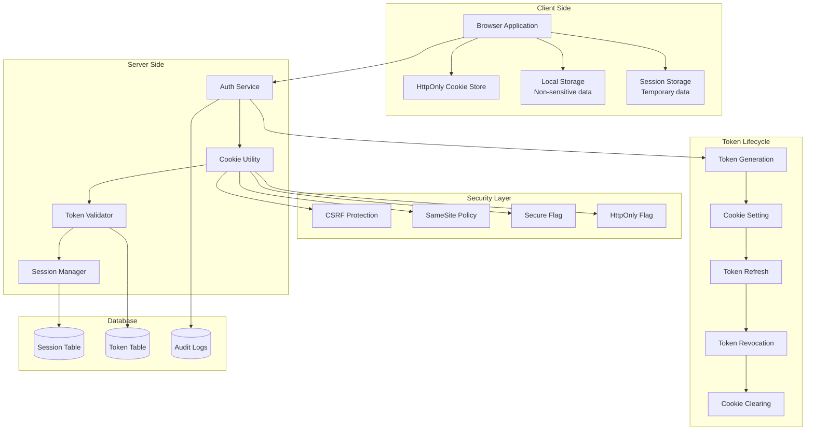
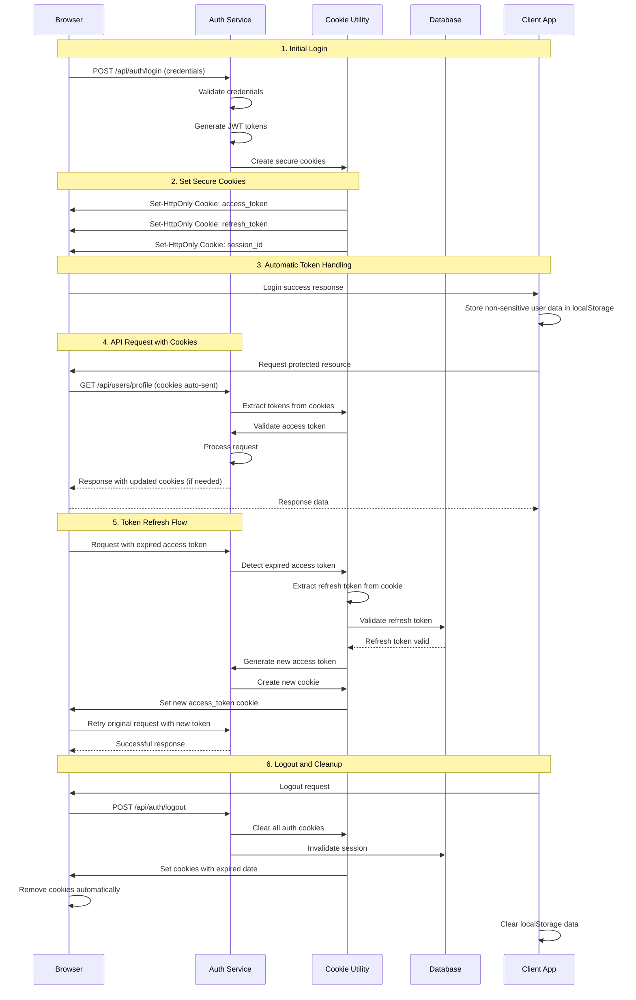

# Cookie-Based Token Management

## Problem Statement

**Header-based token storage exposes tokens to JavaScript and XSS attacks.**

Storing JWT tokens in HTTP headers or localStorage makes them vulnerable to cross-site scripting (XSS) attacks and
requires manual token management in client-side code.

## Technical Solution

**HttpOnly cookies provide secure, automatic token management with XSS protection.**

Cookie-based token storage leverages browser security features to automatically handle token transmission while
protecting against client-side script access.

## Cookie Token Management Architecture



## Cookie Token Flow Sequence



## Implementation Details

### Cookie Utility Service

```java
// service/CookieService.java
@Service
public class CookieService {
    
    private static final String ACCESS_TOKEN_COOKIE = "access_token";
    private static final String REFRESH_TOKEN_COOKIE = "refresh_token";
    private static final String SESSION_ID_COOKIE = "session_id";
    private static final String CSRF_TOKEN_COOKIE = "csrf_token";
    
    private final int accessTokenMaxAge;
    private final int refreshTokenMaxAge;
    private final boolean secureFlag;
    private final String sameSitePolicy;
    
    public CookieService(@Value("${auth.cookie.access-token.max-age:900}") int accessTokenMaxAge,
                        @Value("${auth.cookie.refresh-token.max-age:2592000}") int refreshTokenMaxAge,
                        @Value("${auth.cookie.secure:true}") boolean secureFlag,
                        @Value("${auth.cookie.same-site:Strict}") String sameSitePolicy) {
        this.accessTokenMaxAge = accessTokenMaxAge;
        this.refreshTokenMaxAge = refreshTokenMaxAge;
        this.secureFlag = secureFlag;
        this.sameSitePolicy = sameSitePolicy;
    }
    
    public void setAuthCookies(HttpServletResponse response, TokenPair tokenPair, String sessionId) {
        // Set access token cookie
        Cookie accessTokenCookie = createSecureCookie(ACCESS_TOKEN_COOKIE, tokenPair.getAccessToken(), accessTokenMaxAge);
        response.addCookie(accessTokenCookie);
        
        // Set refresh token cookie
        Cookie refreshTokenCookie = createSecureCookie(REFRESH_TOKEN_COOKIE, tokenPair.getRefreshToken(), refreshTokenMaxAge);
        response.addCookie(refreshTokenCookie);
        
        // Set session ID cookie
        Cookie sessionIdCookie = createSecureCookie(SESSION_ID_COOKIE, sessionId, refreshTokenMaxAge);
        response.addCookie(sessionIdCookie);
        
        // Set CSRF token for state-changing operations
        String csrfToken = generateCSRFToken();
        Cookie csrfCookie = createSecureCookie(CSRF_TOKEN_COOKIE, csrfToken, refreshTokenMaxAge);
        response.addCookie(csrfCookie);
    }
    
    public void clearAuthCookies(HttpServletResponse response) {
        clearCookie(response, ACCESS_TOKEN_COOKIE);
        clearCookie(response, REFRESH_TOKEN_COOKIE);
        clearCookie(response, SESSION_ID_COOKIE);
        clearCookie(response, CSRF_TOKEN_COOKIE);
    }
    
    public String extractAccessToken(HttpServletRequest request) {
        return extractCookieValue(request, ACCESS_TOKEN_COOKIE);
    }
    
    public String extractRefreshToken(HttpServletRequest request) {
        return extractCookieValue(request, REFRESH_TOKEN_COOKIE);
    }
    
    public String extractSessionId(HttpServletRequest request) {
        return extractCookieValue(request, SESSION_ID_COOKIE);
    }
    
    public String extractCSRFToken(HttpServletRequest request) {
        return extractCookieValue(request, CSRF_TOKEN_COOKIE);
    }
    
    private Cookie createSecureCookie(String name, String value, int maxAge) {
        Cookie cookie = new Cookie(name, value);
        cookie.setHttpOnly(true);
        cookie.setSecure(secureFlag);
        cookie.setPath("/");
        cookie.setMaxAge(maxAge);
        
        // Set SameSite attribute
        if (sameSitePolicy.equals("None") && secureFlag) {
            cookie.setComment("SameSite=None");
        } else if (sameSitePolicy.equals("Strict")) {
            cookie.setComment("SameSite=Strict");
        } else if (sameSitePolicy.equals("Lax")) {
            cookie.setComment("SameSite=Lax");
        }
        
        return cookie;
    }
    
    private void clearCookie(HttpServletResponse response, String cookieName) {
        Cookie cookie = new Cookie(cookieName, "");
        cookie.setHttpOnly(true);
        cookie.setSecure(secureFlag);
        cookie.setPath("/");
        cookie.setMaxAge(0);
        response.addCookie(cookie);
    }
    
    private String extractCookieValue(HttpServletRequest request, String cookieName) {
        Cookie[] cookies = request.getCookies();
        if (cookies != null) {
            for (Cookie cookie : cookies) {
                if (cookieName.equals(cookie.getName())) {
                    return cookie.getValue();
                }
            }
        }
        return null;
    }
    
    private String generateCSRFToken() {
        return UUID.randomUUID().toString();
    }
}
```

### Authentication Controller with Cookie Support

```java
// controller/AuthController.java
@RestController
@RequestMapping("/api/auth")
public class AuthController {
    
    private final AuthService authService;
    private final CookieService cookieService;
    private final SessionService sessionService;
    
    @PostMapping("/login")
    public ResponseEntity<LoginResponse> login(@RequestBody LoginRequest request,
                                             HttpServletRequest httpRequest,
                                             HttpServletResponse httpResponse) {
        
        // Authenticate user
        LoginResponse loginResponse = authService.login(request);
        
        // Create session
        String sessionId = sessionService.createSession(loginResponse.getUser(), httpRequest);
        
        // Set secure cookies
        cookieService.setAuthCookies(httpResponse, loginResponse.getTokenPair(), sessionId);
        
        // Return response without tokens (they're in cookies)
        LoginResponse response = LoginResponse.builder()
            .user(loginResponse.getUser())
            .expiresIn(loginResponse.getExpiresIn())
            .message("Login successful")
            .build();
        
        return ResponseEntity.ok(response);
    }
    
    @PostMapping("/refresh")
    public ResponseEntity<TokenResponse> refresh(HttpServletRequest request,
                                               HttpServletResponse response) {
        
        // Extract refresh token from cookie
        String refreshToken = cookieService.extractRefreshToken(request);
        if (refreshToken == null) {
            return ResponseEntity.status(HttpStatus.UNAUTHORIZED).build();
        }
        
        // Refresh tokens
        TokenPair newTokenPair = authService.refreshToken(refreshToken);
        
        // Update session
        String sessionId = cookieService.extractSessionId(request);
        sessionService.updateSession(sessionId, newTokenPair);
        
        // Set new access token cookie
        Cookie accessTokenCookie = cookieService.createSecureCookie(
            "access_token", 
            newTokenPair.getAccessToken(), 
            900
        );
        response.addCookie(accessTokenCookie);
        
        return ResponseEntity.ok(TokenResponse.builder()
            .accessToken(newTokenPair.getAccessToken())
            .expiresIn(newTokenPair.getExpiresIn())
            .message("Token refreshed successfully")
            .build());
    }
    
    @PostMapping("/logout")
    public ResponseEntity<Void> logout(HttpServletRequest request,
                                     HttpServletResponse response) {
        
        // Extract session ID
        String sessionId = cookieService.extractSessionId(request);
        if (sessionId != null) {
            // Invalidate session
            sessionService.invalidateSession(sessionId);
        }
        
        // Extract and invalidate refresh token
        String refreshToken = cookieService.extractRefreshToken(request);
        if (refreshToken != null) {
            authService.revokeRefreshToken(refreshToken);
        }
        
        // Clear all auth cookies
        cookieService.clearAuthCookies(response);
        
        return ResponseEntity.ok().build();
    }
}
```

### Token Extraction Filter

```java
// filter/CookieTokenFilter.java
@Component
public class CookieTokenFilter implements Filter {
    
    private final CookieService cookieService;
    private final JwtTokenValidator tokenValidator;
    
    @Override
    public void doFilter(ServletRequest request, ServletResponse response, FilterChain chain)
            throws IOException, ServletException {
        
        HttpServletRequest httpRequest = (HttpServletRequest) request;
        HttpServletResponse httpResponse = (HttpServletResponse) response;
        
        // Try to extract token from cookie
        String accessToken = cookieService.extractAccessToken(httpRequest);
        
        if (accessToken != null) {
            try {
                // Validate token
                UserPrincipal userPrincipal = tokenValidator.validateToken(accessToken);
                
                // Set authentication context
                SecurityContextHolder.getContext().setAuthentication(
                    new UsernamePasswordAuthenticationToken(
                        userPrincipal, 
                        null, 
                        userPrincipal.getAuthorities()
                    )
                );
                
                // Add user info to request attributes
                httpRequest.setAttribute("user", userPrincipal);
                httpRequest.setAttribute("sessionId", cookieService.extractSessionId(httpRequest));
                
            } catch (JwtException e) {
                // Token is invalid or expired
                logger.warn("Invalid token in cookie: {}", e.getMessage());
                
                // Check if we can refresh the token
                String refreshToken = cookieService.extractRefreshToken(httpRequest);
                if (refreshToken != null) {
                    // Trigger token refresh
                    httpResponse.setHeader("X-Token-Refresh-Required", "true");
                }
            }
        }
        
        chain.doFilter(request, response);
    }
}
```

### CSRF Protection

```java
// filter/CSRFProtectionFilter.java
@Component
public class CSRFProtectionFilter implements Filter {
    
    private final CookieService cookieService;
    
    @Override
    public void doFilter(ServletRequest request, ServletResponse response, FilterChain chain)
            throws IOException, ServletException {
        
        HttpServletRequest httpRequest = (HttpServletRequest) request;
        HttpServletResponse httpResponse = (HttpServletResponse) response;
        
        // Skip CSRF for GET, HEAD, OPTIONS
        String method = httpRequest.getMethod();
        if (method.equals("GET") || method.equals("HEAD") || method.equals("OPTIONS")) {
            chain.doFilter(request, response);
            return;
        }
        
        // Extract CSRF token from cookie
        String cookieCSRFToken = cookieService.extractCSRFToken(httpRequest);
        
        // Extract CSRF token from header or form data
        String requestCSRFToken = httpRequest.getHeader("X-CSRF-Token");
        if (requestCSRFToken == null) {
            requestCSRFToken = httpRequest.getParameter("_csrf");
        }
        
        // Validate CSRF token
        if (cookieCSRFToken == null || !cookieCSRFToken.equals(requestCSRFToken)) {
            httpResponse.sendError(HttpStatus.FORBIDDEN.value(), "Invalid CSRF token");
            return;
        }
        
        chain.doFilter(request, response);
    }
}
```

## Security Configuration

### Spring Security Configuration

```java
// config/SecurityConfig.java
@Configuration
@EnableWebSecurity
public class SecurityConfig {
    
    private final CookieTokenFilter cookieTokenFilter;
    private final CSRFProtectionFilter csrfProtectionFilter;
    
    @Bean
    public SecurityFilterChain filterChain(HttpSecurity http) throws Exception {
        http
            .csrf(csrf -> csrf
                .csrfTokenRepository(CookieCsrfTokenRepository.withHttpOnlyFalse())
                .ignoringRequestMatchers("/api/auth/login", "/api/auth/refresh")
            )
            .sessionManagement(session -> session
                .sessionCreationPolicy(SessionCreationPolicy.STATELESS)
            )
            .authorizeHttpRequests(auth -> auth
                .requestMatchers("/api/auth/login", "/api/auth/register").permitAll()
                .requestMatchers("/api/public/**").permitAll()
                .requestMatchers("/health", "/actuator/health").permitAll()
                .anyRequest().authenticated()
            )
            .addFilterBefore(cookieTokenFilter, UsernamePasswordAuthenticationFilter.class)
            .addFilterAfter(csrfProtectionFilter, UsernamePasswordAuthenticationFilter.class)
            .headers(headers -> headers
                .frameOptions(HeadersConfigurer.FrameOptionsConfig::deny)
                .contentTypeOptions(HeadersConfigurer.ContentTypeOptionsConfig::and())
                .httpStrictTransportSecurity(hstsConfig -> hstsConfig
                    .includeSubDomains(true)
                    .maxAgeInSeconds(31536000)
                )
            );
        
        return http.build();
    }
}
```

### Cookie Configuration Properties

```yaml
# application.yml
auth:
  cookie:
    access-token:
      max-age: 900  # 15 minutes
    refresh-token:
      max-age: 2592000  # 30 days
    secure: true  # Only send over HTTPS
    same-site: Strict  # CSRF protection
    domain: dragonofnorth.com  # Restrict to domain
    path: /  # Available to entire site
    
  csrf:
    enabled: true
    token-repository: cookie
    header-name: X-CSRF-Token
    parameter-name: _csrf
    
  session:
    timeout: 1800  # 30 minutes
    tracking-enabled: true
    concurrent-sessions: 5
```

## Client-Side Implementation

### JavaScript Cookie Handling

```javascript
// src/js/auth.js
class AuthManager {
    constructor() {
        this.baseURL = process.env.REACT_APP_API_URL;
    }
    
    async login(credentials) {
        try {
            const response = await fetch(`${this.baseURL}/api/auth/login`, {
                method: 'POST',
                headers: {
                    'Content-Type': 'application/json',
                },
                body: JSON.stringify(credentials),
                credentials: 'include', // Important: include cookies
            });
            
            if (response.ok) {
                const data = await response.json();
                // Store non-sensitive user data in localStorage
                localStorage.setItem('user', JSON.stringify(data.user));
                return data;
            } else {
                throw new Error('Login failed');
            }
        } catch (error) {
            console.error('Login error:', error);
            throw error;
        }
    }
    
    async logout() {
        try {
            await fetch(`${this.baseURL}/api/auth/logout`, {
                method: 'POST',
                credentials: 'include',
            });
            
            // Clear local storage
            localStorage.removeItem('user');
            localStorage.removeItem('preferences');
            
            // Redirect to login
            window.location.href = '/login';
        } catch (error) {
            console.error('Logout error:', error);
            // Still clear local data even if server call fails
            localStorage.clear();
            window.location.href = '/login';
        }
    }
    
    async refreshTokens() {
        try {
            const response = await fetch(`${this.baseURL}/api/auth/refresh`, {
                method: 'POST',
                credentials: 'include',
            });
            
            if (response.ok) {
                return await response.json();
            } else {
                // Refresh failed, redirect to login
                this.logout();
                throw new Error('Token refresh failed');
            }
        } catch (error) {
            console.error('Token refresh error:', error);
            this.logout();
            throw error;
        }
    }
    
    isAuthenticated() {
        // Check if user data exists in localStorage
        const user = localStorage.getItem('user');
        return user !== null;
    }
    
    getCurrentUser() {
        const user = localStorage.getItem('user');
        return user ? JSON.parse(user) : null;
    }
    
    async apiCall(url, options = {}) {
        const defaultOptions = {
            credentials: 'include', // Always include cookies
            headers: {
                'Content-Type': 'application/json',
                ...options.headers,
            },
        };
        
        const response = await fetch(`${this.baseURL}${url}`, {
            ...defaultOptions,
            ...options,
        });
        
        // Handle token refresh
        if (response.status === 401 && !url.includes('/auth/')) {
            await this.refreshTokens();
            // Retry the original request
            return fetch(`${this.baseURL}${url}`, {
                ...defaultOptions,
                ...options,
            });
        }
        
        return response;
    }
}

export default new AuthManager();
```

## Benefits

### Security Benefits

1. **XSS Protection**: HttpOnly cookies prevent JavaScript access to tokens
2. **CSRF Protection**: SameSite policy and CSRF tokens prevent cross-site attacks
3. **Automatic Transmission**: No manual token management in client code
4. **Secure Flag**: Tokens only sent over HTTPS connections

### Development Benefits

1. **Simplified Client Code**: No manual token handling required
2. **Automatic Token Refresh**: Server handles token lifecycle
3. **Consistent Security**: Centralized token management
4. **Reduced Bugs**: No client-side token storage issues

### Operational Benefits

1. **Better User Experience**: Automatic token handling
2. **Session Management**: Integrated session tracking
3. **Compliance**: Meets security best practices
4. **Scalability**: Stateless authentication with session tracking

---

*Related
Features: [Multi-Device Session Management](./multi-device-session-management.md), [Refresh Token Rotation](./refresh-token-rotation.md), [Security Audit Logging](./audit-logging.md)*
