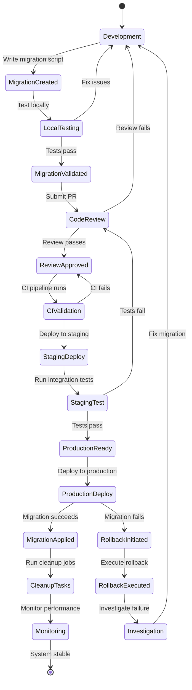
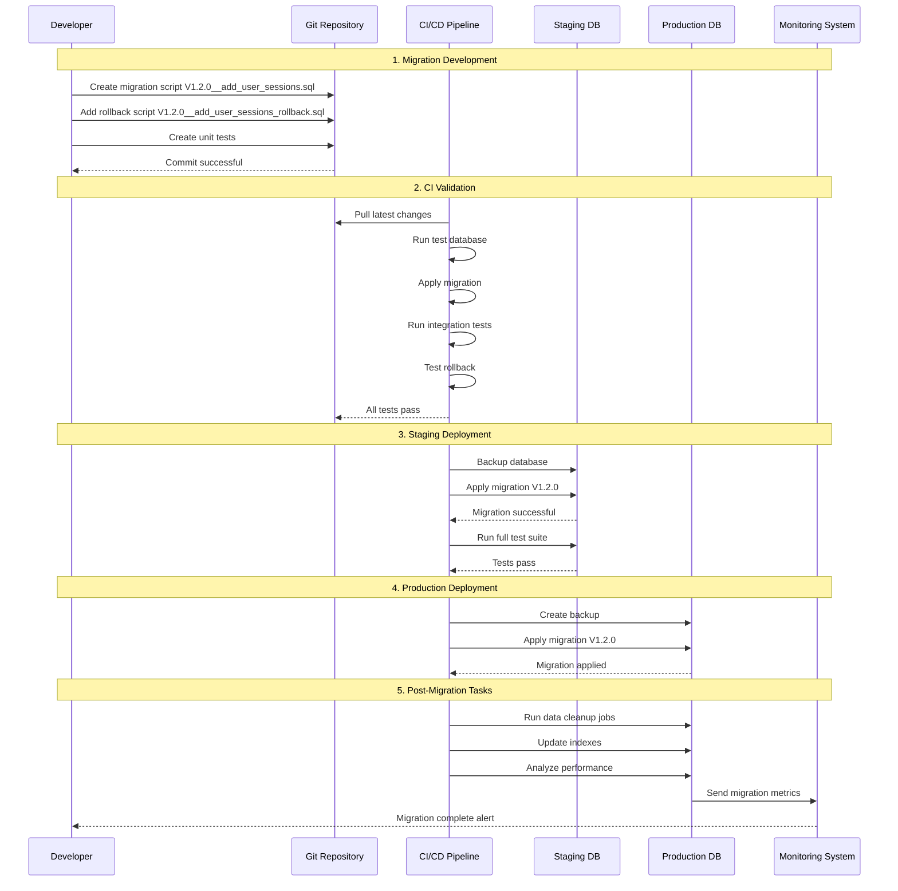

# Database Migration & Cleanup Tasks

## Problem Statement

**Manual schema updates cause drift and deployment risk.**

Without automated database migrations, schema changes become error-prone, inconsistent across environments, and
difficult to roll back, leading to deployment failures and data corruption.

## Technical Solution

**Versioned migrations provide deterministic, rollback-safe schema changes.**

Automated migration system with version control, rollback capabilities, and cleanup tasks ensures consistent database
state across all environments.

## Migration Lifecycle Diagram



## Migration Process Flow



## Migration Framework Implementation

### Flyway Configuration

```yaml
# application.yml
spring:
  flyway:
    enabled: true
    locations:
      - classpath:db/migration
      - classpath:db/migration/cleanup
    baseline-on-migrate: true
    baseline-version: 1.0.0
    validate-on-migrate: true
    clean-disabled: true
    out-of-order: false

  datasource:
    url: jdbc:postgresql://localhost:5432/dragon_of_north
    username: ${DB_USERNAME}
    password: ${DB_PASSWORD}
    hikari:
      maximum-pool-size: 20
      minimum-idle: 5
      connection-timeout: 30000
      idle-timeout: 600000
      max-lifetime: 1800000
```

### Migration Scripts Structure

```
src/main/resources/db/migration/
├── V1.0.0__create_initial_schema.sql
├── V1.0.1__create_users_table.sql
├── V1.0.2__create_roles_table.sql
├── V1.0.3__create_user_roles_table.sql
├── V1.1.0__create_refresh_tokens_table.sql
├── V1.1.1__add_indexes_to_tokens.sql
├── V1.2.0__add_user_sessions_table.sql
├── V1.2.0__add_user_sessions_rollback.sql
└── cleanup/
    ├── C1.0.0__cleanup_old_sessions.sql
    ├── C1.1.0__cleanup_expired_tokens.sql
    └── C1.2.0__cleanup_orphaned_records.sql
```

### Sample Migration Script

```sql
-- V1.2.0__add_user_sessions_table.sql
-- Description: Add user sessions table for device-aware session management

-- Create sessions table
CREATE TABLE user_sessions
(
    id UUID PRIMARY KEY DEFAULT gen_random_uuid(),
    user_id UUID NOT NULL REFERENCES users(id) ON DELETE CASCADE,
    session_token_hash VARCHAR(255) UNIQUE NOT NULL,
    device_fingerprint VARCHAR(128)        NOT NULL,
    user_agent         TEXT,
    ip_address INET NOT NULL,
    location_info JSONB,
    is_active          BOOLEAN DEFAULT true,
    created_at         TIMESTAMP WITH TIME ZONE DEFAULT NOW(),
    last_accessed_at   TIMESTAMP WITH TIME ZONE DEFAULT NOW(),
    expires_at         TIMESTAMP WITH TIME ZONE NOT NULL,
    revoked_at         TIMESTAMP WITH TIME ZONE,
    revoked_reason     VARCHAR(32)
);

-- Create indexes for performance
CREATE INDEX idx_user_sessions_user_id ON user_sessions (user_id);
CREATE INDEX idx_user_sessions_device_fingerprint ON user_sessions (device_fingerprint);
CREATE INDEX idx_user_sessions_expires_at ON user_sessions (expires_at);
CREATE INDEX idx_user_sessions_active ON user_sessions (user_id, is_active) WHERE is_active = true;
CREATE INDEX idx_user_sessions_ip_address ON user_sessions (ip_address);

-- Add RLS (Row Level Security) policies
ALTER TABLE user_sessions ENABLE ROW LEVEL SECURITY;

-- Policy: Users can only see their own sessions
CREATE
POLICY user_sessions_user_policy ON user_sessions
    FOR ALL
    TO application_user
    USING (user_id = current_setting('app.current_user_id')::UUID);

-- Policy: Admin can see all sessions
CREATE
POLICY user_sessions_admin_policy ON user_sessions
    FOR ALL
    TO admin_user
    USING (true);

-- Add comments for documentation
COMMENT ON TABLE user_sessions IS 'User session tracking for device-aware authentication';
COMMENT ON COLUMN user_sessions.session_token_hash IS 'Hashed session token for security';
COMMENT ON COLUMN user_sessions.device_fingerprint IS 'Unique device identifier';
COMMENT ON COLUMN user_sessions.location_info IS 'Geographic and device metadata';
```

### Rollback Script

```sql
-- V1.2.0__add_user_sessions_rollback.sql
-- Description: Rollback user sessions table

-- Drop indexes first
DROP INDEX IF EXISTS idx_user_sessions_user_id;
DROP INDEX IF EXISTS idx_user_sessions_device_fingerprint;
DROP INDEX IF EXISTS idx_user_sessions_expires_at;
DROP INDEX IF EXISTS idx_user_sessions_active;
DROP INDEX IF EXISTS idx_user_sessions_ip_address;

-- Drop RLS policies
DROP
POLICY IF EXISTS user_sessions_user_policy ON user_sessions;
DROP
POLICY IF EXISTS user_sessions_admin_policy ON user_sessions;

-- Drop table
DROP TABLE IF EXISTS user_sessions;
```

## Cleanup Tasks Framework

### Scheduled Cleanup Jobs

```java

@Component
public class DatabaseCleanupScheduler {

    private static final Logger logger = LoggerFactory.getLogger(DatabaseCleanupScheduler.class);

    @Scheduled(cron = "0 0 2 * * ?") // Every day at 2 AM
    public void cleanupExpiredSessions() {
        logger.info("Starting expired sessions cleanup");

        int deletedCount = jdbcTemplate.update(
                "DELETE FROM user_sessions WHERE expires_at < NOW() OR (revoked_at IS NOT NULL AND revoked_at < NOW() - INTERVAL '7 days')"
        );

        logger.info("Cleaned up {} expired sessions", deletedCount);
        metricsService.incrementCounter("db.cleanup.expired_sessions", deletedCount);
    }

    @Scheduled(cron = "0 30 2 * * ?") // Every day at 2:30 AM
    public void cleanupExpiredTokens() {
        logger.info("Starting expired tokens cleanup");

        int deletedCount = jdbcTemplate.update(
                "DELETE FROM refresh_tokens WHERE expires_at < NOW() OR (revoked_at IS NOT NULL AND revoked_at < NOW() - INTERVAL '30 days')"
        );

        logger.info("Cleaned up {} expired tokens", deletedCount);
        metricsService.incrementCounter("db.cleanup.expired_tokens", deletedCount);
    }

    @Scheduled(cron = "0 0 3 * * SUN") // Every Sunday at 3 AM
    public void cleanupAuditLogs() {
        logger.info("Starting audit logs cleanup");

        // Keep audit logs for 1 year, but archive critical security events
        int deletedCount = jdbcTemplate.update(
                "DELETE FROM audit_logs WHERE created_at < NOW() - INTERVAL '1 year' AND severity NOT IN ('CRITICAL', 'HIGH')"
        );

        logger.info("Cleaned up {} old audit logs", deletedCount);
        metricsService.incrementCounter("db.cleanup.audit_logs", deletedCount);
    }

    @Scheduled(cron = "0 30 3 1 * ?") // 1st of every month at 3:30 AM
    public void cleanupOrphanedRecords() {
        logger.info("Starting orphaned records cleanup");

        // Clean up orphaned user roles
        int orphanedRoles = jdbcTemplate.update(
                "DELETE FROM user_roles WHERE user_id NOT IN (SELECT id FROM users) OR role_id NOT IN (SELECT id FROM roles)"
        );

        // Clean up orphaned OAuth provider links
        int orphanedOAuth = jdbcTemplate.update(
                "DELETE FROM oauth_providers WHERE user_id NOT IN (SELECT id FROM users)"
        );

        logger.info("Cleaned up {} orphaned user roles and {} orphaned OAuth links", orphanedRoles, orphanedOAuth);
        metricsService.incrementCounter("db.cleanup.orphaned_records", orphanedRoles + orphanedOAuth);
    }

    @Scheduled(cron = "0 0 4 * * ?") // Every day at 4 AM
    public void updateTableStatistics() {
        logger.info("Updating table statistics");

        List<String> tables = Arrays.asList(
                "users", "roles", "user_roles", "refresh_tokens",
                "user_sessions", "oauth_providers", "audit_logs"
        );

        tables.forEach(table -> {
            try {
                jdbcTemplate.execute(String.format("ANALYZE %s", table));
                logger.debug("Updated statistics for table: {}", table);
            } catch (Exception e) {
                logger.error("Failed to update statistics for table: {}", table, e);
            }
        });

        logger.info("Table statistics update completed");
    }
}
```

### Cleanup Task Configuration

```yaml
cleanup:
  tasks:
    expired-sessions:
      enabled: true
      schedule: "0 0 2 * * ?"
      retention-days: 7
      batch-size: 1000

    expired-tokens:
      enabled: true
      schedule: "0 30 2 * * ?"
      retention-days: 30
      batch-size: 1000

    audit-logs:
      enabled: true
      schedule: "0 0 3 * * SUN"
      retention-days: 365
      exclude-severities: [ "CRITICAL", "HIGH" ]
      batch-size: 5000

    orphaned-records:
      enabled: true
      schedule: "0 30 3 1 * ?"
      batch-size: 100

    statistics:
      enabled: true
      schedule: "0 0 4 * * ?"
      tables: [ "users", "roles", "user_roles", "refresh_tokens", "user_sessions", "oauth_providers", "audit_logs" ]
```

## Migration Safety Measures

### Pre-Migration Validation

```java

@Component
public class MigrationValidator {

    public void validateMigration(String migrationVersion) {
        // Check database connection
        validateDatabaseConnection();

        // Check available disk space
        validateDiskSpace();

        // Check table locks
        validateTableLocks();

        // Check backup availability
        validateBackupAvailability();

        // Check migration dependencies
        validateDependencies(migrationVersion);

        // Performance impact assessment
        assessPerformanceImpact(migrationVersion);
    }

    private void validateDatabaseConnection() {
        try {
            jdbcTemplate.queryForObject("SELECT 1", Integer.class);
        } catch (Exception e) {
            throw new MigrationException("Database connection validation failed", e);
        }
    }

    private void validateDiskSpace() {
        // Check if enough space for migration and backup
        long requiredSpace = estimateRequiredSpace();
        long availableSpace = getAvailableDiskSpace();

        if (availableSpace < requiredSpace * 2) {
            throw new MigrationException("Insufficient disk space for migration");
        }
    }

    private void validateTableLocks() {
        List<String> lockedTables = jdbcTemplate.queryForList(
                "SELECT relation::text FROM pg_locks l JOIN pg_class t ON l.relation = t.oid WHERE NOT l.granted",
                String.class
        );

        if (!lockedTables.isEmpty()) {
            throw new MigrationException("Tables are locked: " + String.join(", ", lockedTables));
        }
    }
}
```

### Migration Monitoring

```java

@Component
public class MigrationMonitor {

    private final MeterRegistry meterRegistry;

    public void recordMigrationExecution(String migrationVersion, MigrationResult result) {
        Timer.Sample sample = Timer.start(meterRegistry);

        try {
            // Record migration execution time
            sample.stop(Timer.builder("db.migration.duration")
                    .tag("version", migrationVersion)
                    .tag("status", result.getStatus())
                    .register(meterRegistry));

            // Record migration success/failure
            meterRegistry.counter("db.migration.count",
                    "version", migrationVersion,
                    "status", result.getStatus()
            ).increment();

            // Record affected rows
            if (result.getAffectedRows() > 0) {
                meterRegistry.gauge("db.migration.affected_rows", result.getAffectedRows());
            }

            // Alert on failure
            if (result.getStatus().equals("FAILED")) {
                alertService.sendAlert(
                        AlertLevel.HIGH,
                        "Database migration failed",
                        "Migration " + migrationVersion + " failed: " + result.getErrorMessage()
                );
            }

        } finally {
            sample.stop();
        }
    }
}
```

## Rollback Strategy

### Automated Rollback Procedure

```java

@Service
public class MigrationRollbackService {

    @Transactional
    public void rollbackMigration(String targetVersion) {
        logger.warn("Initiating rollback to version: {}", targetVersion);

        // Get migrations to rollback
        List<MigrationInfo> migrationsToRollback = getMigrationsAfterVersion(targetVersion);

        // Validate rollback possibility
        validateRollbackPossibility(migrationsToRollback);

        // Create backup before rollback
        createRollbackBackup();

        // Execute rollbacks in reverse order
        for (MigrationInfo migration : reverse(migrationsToRollback)) {
            executeRollback(migration);
        }

        // Update schema version
        updateSchemaVersion(targetVersion);

        logger.info("Rollback to version {} completed successfully", targetVersion);
    }

    private void executeRollback(MigrationInfo migration) {
        try {
            logger.info("Rolling back migration: {}", migration.getVersion());

            // Execute rollback script
            String rollbackScript = loadRollbackScript(migration);
            jdbcTemplate.execute(rollbackScript);

            // Record rollback in schema history
            recordRollback(migration);

            logger.info("Rollback completed for migration: {}", migration.getVersion());

        } catch (Exception e) {
            logger.error("Rollback failed for migration: {}", migration.getVersion(), e);
            throw new RollbackException("Rollback failed for migration: " + migration.getVersion(), e);
        }
    }
}
```

## Performance Optimization

### Migration Performance Tips

```yaml
migration-performance:
  best-practices:
    - "Use transactions for atomic operations"
    - "Add indexes after data migration"
    - "Use batch processing for large datasets"
    - "Disable triggers during bulk operations"
    - "Use COPY for large data imports"
    - "Analyze tables after schema changes"
    - "Monitor memory usage during migrations"

  batch-operations:
    batch-size: 1000
    commit-frequency: 10000
    memory-limit: "1GB"

  index-strategy:
    create-after-data: true
    concurrent-indexes: true
    fill-factor: 90
```

## Benefits

### Operational Benefits

1. **Consistency**: Same schema across all environments
2. **Safety**: Rollback capabilities prevent data loss
3. **Automation**: Reduced manual intervention
4. **Traceability**: Complete audit trail of changes

### Development Benefits

1. **Speed**: Automated deployment process
2. **Reliability**: Tested migration procedures
3. **Collaboration**: Version-controlled schema changes
4. **Quality**: Automated validation and testing

### Risk Mitigation

1. **Data Loss**: Backup and rollback procedures
2. **Downtime**: Optimized migration strategies
3. **Corruption**: Validation and integrity checks
4. **Performance**: Impact assessment and monitoring

---

*Related
Features: [Modular Architecture](./modular-architecture.md), [CI/CD Pipeline](./cicd-pipeline.md), [Database Indexing](../security-features-overview.md#database-indexing)*
