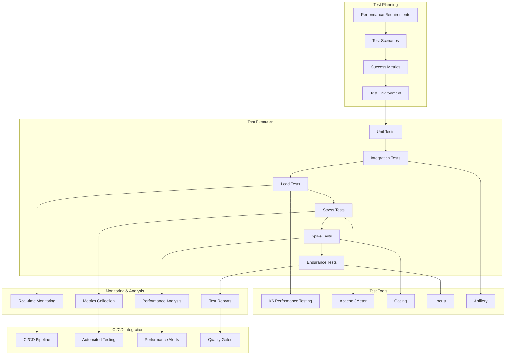
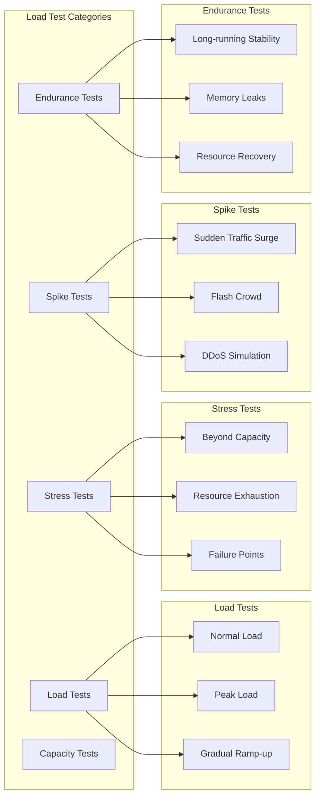

# Load Testing Strategy

## Problem Statement

**Performance issues discovered in production cause user impact and revenue loss.**

Without comprehensive load testing, systems may fail under real-world traffic, leading to poor user experience, system
outages, and business impact.

## Technical Solution

**Systematic performance testing validates system behavior under expected and peak loads.**

Comprehensive load testing strategy covering multiple scenarios, tools, and continuous integration ensures system
reliability and performance at scale.

## Load Testing Framework



## Test Types & Scenarios

### Load Test Types



### Authentication Load Test Scenarios

```javascript
// load-tests/auth-load-test.js
import http from 'k6/http';
import {check, sleep} from 'k6';
import {Rate} from 'k6/metrics';

// Custom metrics
const errorRate = new Rate('errors');

// Test configuration
export const options = {
    stages: [
        {duration: '2m', target: 100},  // Ramp up to 100 users
        {duration: '5m', target: 100},  // Stay at 100 users
        {duration: '2m', target: 200},  // Ramp up to 200 users
        {duration: '5m', target: 200},  // Stay at 200 users
        {duration: '2m', target: 0},   // Ramp down
    ],
    thresholds: {
        http_req_duration: ['p(95)<500'], // 95% of requests under 500ms
        http_req_failed: ['rate<0.01'],   // Less than 1% failures
        errors: ['rate<0.01'],            // Less than 1% errors
    },
};

const BASE_URL = 'http://localhost:8080';

// Test data
const users = [
    {username: 'user1@example.com', password: 'password123'},
    {username: 'user2@example.com', password: 'password123'},
    {username: 'user3@example.com', password: 'password123'},
];

export function setup() {
    // Setup test data
    console.log('Setting up load test environment');
    return {users};
}

export default function (data) {
    // Select random user
    const user = users[Math.floor(Math.random() * users.length)];

    // Login scenario
    const loginResponse = http.post(`${BASE_URL}/api/auth/login`, JSON.stringify({
        identifier: user.username,
        password: user.password,
    }), {
        headers: {
            'Content-Type': 'application/json',
        },
    });

    const loginSuccess = check(loginResponse, {
        'login status is 200': (r) => r.status === 200,
        'login response time < 500ms': (r) => r.status === 200 && r.timings.duration < 500,
        'login has access token': (r) => r.status === 200 && r.json('accessToken') !== undefined,
    });

    errorRate.add(!loginSuccess);

    if (loginSuccess) {
        const accessToken = loginResponse.json('accessToken');

        // Protected API call
        const profileResponse = http.get(`${BASE_URL}/api/users/profile`, {
            headers: {
                'Authorization': `Bearer ${accessToken}`,
            },
        });

        const profileSuccess = check(profileResponse, {
            'profile status is 200': (r) => r.status === 200,
            'profile response time < 300ms': (r) => r.status === 200 && r.timings.duration < 300,
            'profile has user data': (r) => r.status === 200 && r.json('email') !== undefined,
        });

        errorRate.add(!profileSuccess);

        // Token refresh scenario
        const refreshToken = loginResponse.json('refreshToken');
        const refreshResponse = http.post(`${BASE_URL}/api/auth/refresh`, JSON.stringify({
            refreshToken: refreshToken,
        }), {
            headers: {
                'Content-Type': 'application/json',
            },
        });

        const refreshSuccess = check(refreshResponse, {
            'refresh status is 200': (r) => r.status === 200,
            'refresh response time < 300ms': (r) => r.status === 200 && r.timings.duration < 300,
            'refresh has new access token': (r) => r.status === 200 && r.json('accessToken') !== undefined,
        });

        errorRate.add(!refreshSuccess);
    }

    sleep(1); // Wait between iterations
}

export function teardown(data) {
    console.log('Load test completed');
}
```

### Stress Test Scenario

```javascript
// load-tests/auth-stress-test.js
import http from 'k6/http';
import {check, sleep} from 'k6';
import {Rate} from 'k6/metrics';

const errorRate = new Rate('errors');

export const options = {
    stages: [
        {duration: '1m', target: 100},   // Warm up
        {duration: '2m', target: 500},   // Ramp to stress level
        {duration: '5m', target: 1000},  // Push to limit
        {duration: '2m', target: 1500},  // Beyond capacity
        {duration: '5m', target: 1500},   // Sustain stress
        {duration: '2m', target: 0},     // Recovery
    ],
    thresholds: {
        http_req_duration: ['p(95)<2000'], // More lenient under stress
        http_req_failed: ['rate<0.05'],     // Allow higher failure rate
    },
};

export default function () {
    const credentials = {
        identifier: `user${Math.floor(Math.random() * 10000)}@example.com`,
        password: 'password123',
    };

    const response = http.post('http://localhost:8080/api/auth/login', JSON.stringify(credentials), {
        headers: {'Content-Type': 'application/json'},
    });

    check(response, {
        'status is 200 or 401': (r) => r.status === 200 || r.status === 401,
        'response time < 5s': (r) => r.timings.duration < 5000,
    });

    errorRate.add(response.status !== 200);
}
```

## Performance Monitoring

### Real-time Metrics Dashboard

```yaml
# grafana-dashboard-performance.yml
dashboard:
  title: "Load Testing Performance Dashboard"

  panels:
    - title: "Request Rate"
      type: graph
      targets:
        - expr: "rate(http_requests_total[5m])"
          legendFormat: "{{endpoint}}"

    - title: "Response Time"
      type: graph
      targets:
        - expr: "histogram_quantile(0.95, rate(http_request_duration_seconds_bucket[5m]))"
          legendFormat: "95th percentile"
        - expr: "histogram_quantile(0.50, rate(http_request_duration_seconds_bucket[5m]))"
          legendFormat: "50th percentile"

    - title: "Error Rate"
      type: singlestat
      targets:
        - expr: "rate(http_requests_total{status=~\"5..\"}[5m]) / rate(http_requests_total[5m])"
          legendFormat: "Error Rate"

    - title: "Active Users"
      type: graph
      targets:
        - expr: "active_users_total"
          legendFormat: "Active Users"

    - title: "CPU Usage"
      type: graph
      targets:
        - expr: "rate(cpu_usage_percent[5m])"
          legendFormat: "CPU %"

    - title: "Memory Usage"
      type: graph
      targets:
        - expr: "memory_usage_bytes / memory_limit_bytes * 100"
          legendFormat: "Memory %"

    - title: "Database Connections"
      type: graph
      targets:
        - expr: "hikaricp_connections_active"
          legendFormat: "Active Connections"
        - expr: "hikaricp_connections_idle"
          legendFormat: "Idle Connections"

    - title: "Cache Hit Rate"
      type: singlestat
      targets:
        - expr: "redis_cache_hits / (redis_cache_hits + redis_cache_misses) * 100"
          legendFormat: "Cache Hit Rate %"
```

### Application Performance Monitoring

```java
// PerformanceMonitoringConfig.java
@Configuration
public class PerformanceMonitoringConfig {

    @Bean
    public MeterRegistryCustomizer<MeterRegistry> metricsCommonTags() {
        return registry -> registry.config().commonTags(
                "application", "dragon-of-north",
                "version", "1.0.0"
        );
    }

    @Bean
    public TimedAspect timedAspect(MeterRegistry registry) {
        return new TimedAspect(registry);
    }

    @Bean
    public CountedAspect countedAspect(MeterRegistry registry) {
        return new CountedAspect(registry);
    }
}

// AuthController.java with monitoring
@RestController
@RequestMapping("/api/auth")
public class AuthController {

    @PostMapping("/login")
    @Timed(name = "auth.login.duration", description = "Login request duration")
    @Counted(name = "auth.login.requests", description = "Login request count")
    public ResponseEntity<LoginResponse> login(@RequestBody LoginRequest request) {
        // Login logic
    }

    @PostMapping("/refresh")
    @Timed(name = "auth.refresh.duration", description = "Token refresh duration")
    @Counted(name = "auth.refresh.requests", description = "Token refresh count")
    public ResponseEntity<TokenResponse> refresh(@RequestBody RefreshRequest request) {
        // Refresh logic
    }
}
```

## Test Environment Setup

### Docker Compose Test Environment

```yaml
# docker-compose.load-test.yml
version: '3.8'

services:
  # Application under test
  auth-service:
    image: dragonofnorth/auth-service:latest
    environment:
      - SPRING_PROFILES_ACTIVE=load-test
      - DB_HOST=postgres-test
      - REDIS_HOST=redis-test
      - JAVA_OPTS=-Xmx512m -Xms256m
    ports:
      - "8080:8080"
    depends_on:
      - postgres-test
      - redis-test
    deploy:
      resources:
        limits:
          cpus: '1.0'
          memory: 512M
        reservations:
          cpus: '0.5'
          memory: 256M

  # Test database
  postgres-test:
    image: postgres:15
    environment:
      - POSTGRES_DB=dragon_of_north_test
      - POSTGRES_USER=test_user
      - POSTGRES_PASSWORD=test_pass
    ports:
      - "5433:5432"
    volumes:
      - ./test-data/init.sql:/docker-entrypoint-initdb.d/init.sql
    deploy:
      resources:
        limits:
          cpus: '0.5'
          memory: 256M

  # Test cache
  redis-test:
    image: redis:7-alpine
    ports:
      - "6380:6379"
    command: redis-server --maxmemory 256mb --maxmemory-policy allkeys-lru
    deploy:
      resources:
        limits:
          cpus: '0.3'
          memory: 256M

  # Monitoring
  prometheus:
    image: prom/prometheus:latest
    ports:
      - "9090:9090"
    volumes:
      - ./monitoring/prometheus.yml:/etc/prometheus/prometheus.yml
    command:
      - '--config.file=/etc/prometheus/prometheus.yml'
      - '--storage.tsdb.retention.time=1h'
      - '--storage.tsdb.path=/prometheus'

  grafana:
    image: grafana/grafana:latest
    ports:
      - "3001:3000"
    environment:
      - GF_SECURITY_ADMIN_PASSWORD=admin
    volumes:
      - ./monitoring/grafana:/etc/grafana/provisioning

  # Load testing tools
  k6:
    image: loadimpact/k6:latest
    volumes:
      - ./load-tests:/scripts
    command: [ "run", "--out", "json=results.json", "/scripts/auth-load-test.js" ]
    depends_on:
      - auth-service
```

## CI/CD Integration

### GitHub Actions Load Test Pipeline

```yaml
# .github/workflows/load-test.yml
name: Load Testing

on:
  push:
    branches: [ main, develop ]
  pull_request:
    branches: [ main ]
  schedule:
    - cron: '0 2 * * *'  # Daily at 2 AM

jobs:
  load-test:
    runs-on: ubuntu-latest

    services:
      postgres:
        image: postgres:15
        env:
          POSTGRES_PASSWORD: postgres
          POSTGRES_DB: dragon_of_north_test
        options: >-
          --health-cmd pg_isready
          --health-interval 10s
          --health-timeout 5s
          --health-retries 5
        ports:
          - 5432:5432

      redis:
        image: redis:7
        options: >-
          --health-cmd "redis-cli ping"
          --health-interval 10s
          --health-timeout 5s
          --health-retries 5
        ports:
          - 6379:6379

    steps:
      - name: Checkout code
        uses: actions/checkout@v3

      - name: Set up JDK 17
        uses: actions/setup-java@v3
        with:
          java-version: '17'
          distribution: 'temurin'

      - name: Cache Maven dependencies
        uses: actions/cache@v3
        with:
          path: ~/.m2
          key: ${{ runner.os }}-m2-${{ hashFiles('**/pom.xml') }}
          restore-keys: ${{ runner.os }}-m2

      - name: Run application
        run: |
          mvn spring-boot:run &
          sleep 30  # Wait for application to start

      - name: Set up K6
        run: |
          sudo gpg -k
          sudo gpg --no-default-keyring --keyring /usr/share/keyrings/k6-archive-keyring.gpg --keyserver hkp://keyserver.ubuntu.com:80 --recv-keys C5AD17C747E3415A3642D57D77C6C491D6AC1D69
          echo "deb [signed-by=/usr/share/keyrings/k6-archive-keyring.gpg] https://dl.k6.io/deb stable main" | sudo tee /etc/apt/sources.list.d/k6.list
          sudo apt-get update
          sudo apt-get install k6

      - name: Run load tests
        run: |
          k6 run --out json=load-test-results.json load-tests/auth-load-test.js

      - name: Run stress tests
        run: |
          k6 run --out json=stress-test-results.json load-tests/auth-stress-test.js

      - name: Upload test results
        uses: actions/upload-artifact@v3
        with:
          name: load-test-results
          path: |
            load-test-results.json
            stress-test-results.json

      - name: Generate performance report
        run: |
          python scripts/generate-performance-report.py

      - name: Upload performance report
        uses: actions/upload-artifact@v3
        with:
          name: performance-report
          path: performance-report.html

      - name: Check performance thresholds
        run: |
          python scripts/check-performance-thresholds.py

      - name: Comment PR with results
        if: github.event_name == 'pull_request'
        uses: actions/github-script@v6
        with:
          script: |
            const fs = require('fs');
            const report = fs.readFileSync('performance-report.md', 'utf8');
            github.rest.issues.createComment({
              issue_number: context.issue.number,
              owner: context.repo.owner,
              repo: context.repo.repo,
              body: report
            });
```

## Performance Analysis

### Test Results Analysis Script

```python
# scripts/analyze-performance.py
import json
import pandas as pd
import matplotlib.pyplot as plt
from datetime import datetime

def analyze_k6_results(results_file):
    with open(results_file, 'r') as f:
        data = [json.loads(line) for line in f]
    
    df = pd.DataFrame(data)
    
    # Filter for HTTP requests
    http_data = df[df['type'] == 'http']
    
    # Calculate metrics
    metrics = {
        'total_requests': len(http_data),
        'successful_requests': len(http_data[http_data['status'] == 200]),
        'failed_requests': len(http_data[http_data['status'] != 200]),
        'avg_response_time': http_data['duration'].mean(),
        'p95_response_time': http_data['duration'].quantile(0.95),
        'p99_response_time': http_data['duration'].quantile(0.99),
        'requests_per_second': len(http_data) / (http_data['timestamp'].max() - http_data['timestamp'].min()),
    }
    
    return metrics, http_data

def generate_performance_report(metrics, http_data):
    report = f"""
# Load Test Performance Report

## Summary Metrics
- **Total Requests**: {metrics['total_requests']:,}
- **Successful Requests**: {metrics['successful_requests']:,}
- **Failed Requests**: {metrics['failed_requests']:,}
- **Success Rate**: {(metrics['successful_requests'] / metrics['total_requests'] * 100):.2f}%
- **Average Response Time**: {metrics['avg_response_time']:.2f}ms
- **95th Percentile**: {metrics['p95_response_time']:.2f}ms
- **99th Percentile**: {metrics['p99_response_time']:.2f}ms
- **Requests per Second**: {metrics['requests_per_second']:.2f}

## Performance Analysis
"""
    
    # Add analysis based on thresholds
    if metrics['p95_response_time'] > 500:
        report += "⚠️ **Warning**: 95th percentile response time exceeds 500ms threshold\n"
    
    if metrics['successful_requests'] / metrics['total_requests'] < 0.99:
        report += "❌ **Critical**: Success rate below 99%\n"
    
    if metrics['requests_per_second'] < 100:
        report += "⚠️ **Warning**: Throughput below 100 RPS\n"
    
    return report

if __name__ == "__main__":
    metrics, data = analyze_k6_results('load-test-results.json')
    report = generate_performance_report(metrics, data)
    print(report)
    
    with open('performance-report.md', 'w') as f:
        f.write(report)
```

## Benefits

### Performance Benefits

1. **Proactive Detection**: Find issues before users
2. **Capacity Planning**: Understand system limits
3. **Optimization**: Identify performance bottlenecks
4. **Reliability**: Ensure consistent performance

### Business Benefits

1. **User Experience**: Maintain responsive application
2. **Revenue Protection**: Prevent performance-related losses
3. **Scalability**: Confident growth planning
4. **Competitive Advantage**: Better performance than competitors

### Development Benefits

1. **Quality Gates**: Automated performance validation
2. **Continuous Monitoring**: Track performance over time
3. **Team Awareness**: Performance visibility for all teams
4. **Documentation**: Performance baselines and trends

---

*Related
Features: [Modular Architecture](./modular-architecture.md), [CI/CD Pipeline](./cicd-pipeline.md), [Backend Testing Framework](./backend-testing-framework.md)*
