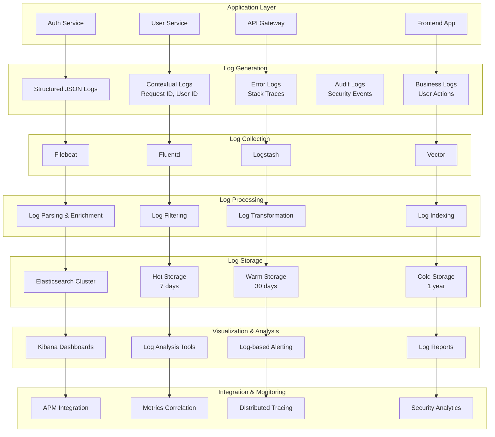

# Logging Architecture

## Problem Statement

**Inconsistent logging practices make debugging and troubleshooting difficult.**

Without a structured logging approach, teams struggle with log format inconsistencies, missing context, and inefficient
log aggregation, leading to prolonged incident resolution times.

## Technical Solution

**Structured logging with centralized aggregation provides comprehensive observability.**

Comprehensive logging architecture using structured JSON logs, centralized aggregation, and intelligent correlation
enables effective debugging and operational insights.

## Logging Architecture Flow



## Structured Logging Implementation

### Logback Configuration

```xml
<!-- logback-spring.xml -->
<?xml version="1.0" encoding="UTF-8"?>
<configuration>
    <springProfile name="!local">
        <appender name="JSON_CONSOLE" class="ch.qos.logback.core.ConsoleAppender">
            <encoder class="net.logstash.logback.encoder.LoggingEventCompositeJsonEncoder">
                <providers>
                    <timestamp/>
                    <logLevel/>
                    <loggerName/>
                    <message/>
                    <mdc/>
                    <arguments/>
                    <stackTrace/>
                    <pattern>
                        <pattern>
                            {
                                "service": "auth-service",
                                "version": "${spring.application.version:-1.0.0}",
                                "environment": "${spring.profiles.active:-default}",
                                "traceId": "%X{traceId:-}",
                                "spanId": "%X{spanId:-}",
                                "userId": "%X{userId:-}",
                                "requestId": "%X{requestId:-}"
                            }
                        </pattern>
                    </pattern>
                </providers>
            </encoder>
        </appender>
        
        <appender name="FILE" class="ch.qos.logback.core.rolling.RollingFileAppender">
            <file>logs/auth-service.log</file>
            <rollingPolicy class="ch.qos.logback.core.rolling.TimeBasedRollingPolicy">
                <fileNamePattern>logs/auth-service.%d{yyyy-MM-dd}.%i.log</fileNamePattern>
                <maxFileSize>100MB</maxFileSize>
                <maxHistory>30</maxHistory>
                <totalSizeCap>3GB</totalSizeCap>
            </rollingPolicy>
            <encoder class="net.logstash.logback.encoder.LoggingEventCompositeJsonEncoder">
                <providers>
                    <timestamp/>
                    <logLevel/>
                    <loggerName/>
                    <message/>
                    <mdc/>
                    <arguments/>
                    <stackTrace/>
                </providers>
            </encoder>
        </appender>
    </springProfile>
    
    <springProfile name="local">
        <appender name="CONSOLE" class="ch.qos.logback.core.ConsoleAppender">
            <encoder>
                <pattern>%d{yyyy-MM-dd HH:mm:ss.SSS} [%thread] %-5level %logger{36} - %msg%n</pattern>
            </encoder>
        </appender>
    </springProfile>
    
    <logger name="com.dragonofnorth" level="INFO"/>
    <logger name="org.springframework.security" level="DEBUG"/>
    <logger name="org.springframework.web" level="DEBUG"/>
    
    <root level="INFO">
        <springProfile name="!local">
            <appender-ref ref="JSON_CONSOLE"/>
            <appender-ref ref="FILE"/>
        </springProfile>
        <springProfile name="local">
            <appender-ref ref="CONSOLE"/>
        </springProfile>
    </root>
</configuration>
```

### Structured Logging Service

```java
// service/LoggingService.java
@Service
public class LoggingService {
    
    private static final Logger logger = LoggerFactory.getLogger(LoggingService.class);
    
    public void logAuthenticationEvent(String eventType, String userId, String details) {
        MDC.put("eventType", eventType);
        MDC.put("userId", userId);
        MDC.put("category", "AUTHENTICATION");
        
        try {
            logger.info("Authentication event: {} - {}", eventType, details);
        } finally {
            MDC.clear();
        }
    }
    
    public void logSecurityEvent(String eventType, String severity, Map<String, Object> context) {
        MDC.put("eventType", eventType);
        MDC.put("severity", severity);
        MDC.put("category", "SECURITY");
        MDC.put("context", context);
        
        try {
            if ("HIGH".equals(severity) || "CRITICAL".equals(severity)) {
                logger.error("Security event: {} - {}", eventType, context);
            } else {
                logger.warn("Security event: {} - {}", eventType, context);
            }
        } finally {
            MDC.clear();
        }
    }
    
    public void logBusinessEvent(String eventType, String userId, Object payload) {
        MDC.put("eventType", eventType);
        MDC.put("userId", userId);
        MDC.put("category", "BUSINESS");
        MDC.put("payload", payload);
        
        try {
            logger.info("Business event: {} - User: {}", eventType, userId);
        } finally {
            MDC.clear();
        }
    }
    
    public void logPerformanceMetric(String operation, Duration duration, Map<String, Object> metadata) {
        MDC.put("eventType", "PERFORMANCE_METRIC");
        MDC.put("operation", operation);
        MDC.put("duration", duration.toMillis());
        MDC.put("category", "PERFORMANCE");
        MDC.put("metadata", metadata);
        
        try {
            logger.info("Performance metric: {} - {}ms", operation, duration.toMillis());
        } finally {
            MDC.clear();
        }
    }
    
    public void logError(String operation, Exception error, Map<String, Object> context) {
        MDC.put("eventType", "ERROR");
        MDC.put("operation", operation);
        MDC.put("errorType", error.getClass().getSimpleName());
        MDC.put("errorMessage", error.getMessage());
        MDC.put("category", "ERROR");
        MDC.put("context", context);
        
        try {
            logger.error("Error in operation: {}", operation, error);
        } finally {
            MDC.clear();
        }
    }
}
```

### Request Context Filter

```java
// filter/LoggingFilter.java
@Component
public class LoggingFilter implements Filter {
    
    private static final Logger logger = LoggerFactory.getLogger(LoggingFilter.class);
    
    @Override
    public void doFilter(ServletRequest request, ServletResponse response, FilterChain chain)
            throws IOException, ServletException {
        
        HttpServletRequest httpRequest = (HttpServletRequest) request;
        HttpServletResponse httpResponse = (HttpServletResponse) response;
        
        String requestId = UUID.randomUUID().toString();
        String traceId = httpRequest.getHeader("X-Trace-Id");
        
        MDC.put("requestId", requestId);
        MDC.put("traceId", traceId != null ? traceId : UUID.randomUUID().toString());
        MDC.put("method", httpRequest.getMethod());
        MDC.put("path", httpRequest.getRequestURI());
        MDC.put("userAgent", httpRequest.getHeader("User-Agent"));
        MDC.put("remoteAddr", getClientIP(httpRequest));
        
        long startTime = System.currentTimeMillis();
        
        try {
            logger.info("Request started: {} {}", httpRequest.getMethod(), httpRequest.getRequestURI());
            
            chain.doFilter(request, response);
            
            long duration = System.currentTimeMillis() - startTime;
            MDC.put("duration", duration);
            MDC.put("status", httpResponse.getStatus());
            
            if (httpResponse.getStatus() >= 400) {
                logger.warn("Request completed with error: {} {} - {}ms", 
                    httpRequest.getMethod(), httpRequest.getRequestURI(), duration);
            } else {
                logger.info("Request completed: {} {} - {}ms", 
                    httpRequest.getMethod(), httpRequest.getRequestURI(), duration);
            }
            
        } catch (Exception e) {
            long duration = System.currentTimeMillis() - startTime;
            MDC.put("duration", duration);
            MDC.put("status", httpResponse.getStatus());
            
            logger.error("Request failed: {} {} - {}ms", 
                httpRequest.getMethod(), httpRequest.getRequestURI(), duration, e);
            throw e;
        } finally {
            MDC.clear();
        }
    }
    
    private String getClientIP(HttpServletRequest request) {
        String xForwardedFor = request.getHeader("X-Forwarded-For");
        if (xForwardedFor != null && !xForwardedFor.isEmpty()) {
            return xForwardedFor.split(",")[0].trim();
        }
        
        String xRealIP = request.getHeader("X-Real-IP");
        if (xRealIP != null && !xRealIP.isEmpty()) {
            return xRealIP;
        }
        
        return request.getRemoteAddr();
    }
}
```

## Log Aggregation Configuration

### Filebeat Configuration

```yaml
# filebeat.yml
filebeat.inputs:
  - type: log
    enabled: true
    paths:
      - /var/log/auth-service/*.log
    fields:
      service: auth-service
      environment: production
    fields_under_root: true
    multiline.pattern: '^\d{4}-\d{2}-\d{2}'
    multiline.negate: true
    multiline.match: after
    
  - type: log
    enabled: true
    paths:
      - /var/log/user-service/*.log
    fields:
      service: user-service
      environment: production
    fields_under_root: true

output.logstash:
  hosts: ["logstash:5044"]
  
processors:
  - add_host_metadata:
      when.not.contains.tags: forwarded
  - add_docker_metadata: ~
  - add_kubernetes_metadata: ~
  
logging.level: info
logging.to_files: true
logging.files:
  path: /var/log/filebeat
  name: filebeat
  keepfiles: 7
  permissions: 0644
```

### Logstash Configuration

```ruby
# logstash.conf
input {
  beats {
    port => 5044
  }
}

filter {
  # Parse JSON logs
  json {
    source => "message"
    target => "parsed"
  }
  
  # Add timestamp if not present
  if ![timestamp] {
    mutate {
      add_field => { "timestamp" => "%{@timestamp}" }
    }
  }
  
  # Parse timestamp
  date {
    match => [ "timestamp", "ISO8601" ]
    target => "@timestamp"
  }
  
  # Add geoip information
  if [remoteAddr] {
    geoip {
      source => "remoteAddr"
      target => "geoip"
    }
  }
  
  # Parse user agent
  if [userAgent] {
    useragent {
      source => "userAgent"
      target => "user_agent"
    }
  }
  
  # Add environment-specific fields
  mutate {
    add_field => { "cluster" => "dragon-of-north" }
    add_field => { "datacenter" => "us-west-2" }
  }
  
  # Drop debug logs in production
  if [level] == "DEBUG" and [environment] == "production" {
    drop {}
  }
  
  # Index by service and date
  mutate {
    add_field => { "[@metadata][index]" => "%{service}-%{+YYYY.MM.dd}" }
  }
}

output {
  elasticsearch {
    hosts => ["elasticsearch:9200"]
    index => "%{[@metadata][index]}"
    template_name => "dragon-of-north"
    template_pattern => "dragon-of-north-*"
    template => {
      "index_patterns" => ["dragon-of-north-*"],
      "settings" => {
        "number_of_shards" => 1,
        "number_of_replicas" => 1,
        "index.refresh_interval" => "5s"
      },
      "mappings" => {
        "properties" => {
          "@timestamp" => { "type" => "date" },
          "level" => { "type" => "keyword" },
          "service" => { "type" => "keyword" },
          "environment" => { "type" => "keyword" },
          "userId" => { "type" => "keyword" },
          "requestId" => { "type" => "keyword" },
          "traceId" => { "type" => "keyword" },
          "duration" => { "type" => "long" },
          "status" => { "type" => "integer" },
          "geoip" => {
            "location" => { "type" => "geo_point" }
          }
        }
      }
    }
  }
  
  # Debug output
  if [environment] == "development" {
    stdout {
      codec => rubydebug
    }
  }
}
```

## Log Analysis & Alerting

### Kibana Dashboard Configuration

```json
{
  "dashboard": {
    "title": "Dragon of North - Log Analysis Dashboard",
    "panels": [
      {
        "title": "Log Volume by Service",
        "type": "histogram",
        "query": "service:auth-service OR service:user-service",
        "timeField": "@timestamp",
        "interval": "1h"
      },
      {
        "title": "Error Rate",
        "type": "metric",
        "query": "level:ERROR",
        "metric": "Count"
      },
      {
        "title": "Top Error Messages",
        "type": "table",
        "query": "level:ERROR",
        "columns": ["message", "service", "timestamp"]
      },
      {
        "title": "Authentication Events",
        "type": "table",
        "query": "category:AUTHENTICATION",
        "columns": ["eventType", "userId", "timestamp"]
      },
      {
        "title": "Security Events",
        "type": "table",
        "query": "category:SECURITY",
        "columns": ["eventType", "severity", "timestamp", "context"]
      },
      {
        "title": "Response Time Distribution",
        "type": "histogram",
        "query": "duration:*",
        "timeField": "@timestamp",
        "interval": "auto"
      },
      {
        "title": "Geographic Distribution",
        "type": "map",
        "query": "geoip.location:*",
        "mapType": "coordinate"
      },
      {
        "title": "User Activity",
        "type": "table",
        "query": "userId:*",
        "columns": ["userId", "eventType", "timestamp"]
      }
    ]
  }
}
```

### Log-based Alerting

```yaml
# elastalert.yml
rules:
  - name: High Error Rate
    type: frequency
    index: dragon-of-north-*
    num_events: 10
    timeframe:
      minutes: 5
    filter:
      - term:
          level: "ERROR"
    alert:
      - slack
      - email
    slack:
      slack_webhook_url: "YOUR_SLACK_WEBHOOK"
      slack_channel: "#alerts"
      slack_username: "ElastAlert"
    email:
      - "ops-team@dragonofnorth.com"
    template_args:
      rule_name: "High Error Rate"
      error_count: "10 errors in 5 minutes"

  - name: Security Event Alert
    type: any
    index: dragon-of-north-*
    filter:
      - term:
          category: "SECURITY"
      - term:
          severity: "HIGH"
    alert:
      - slack
      - pagerduty
    slack:
      slack_webhook_url: "YOUR_SLACK_WEBHOOK"
      slack_channel: "#security-alerts"
    pagerduty:
      pagerduty_service_key: "YOUR_SERVICE_KEY"
      pagerduty_severity: "critical"

  - name: Authentication Failure Spike
    type: spike
    index: dragon-of-north-*
    spike_height: 3
    spike_type: "up"
    timeframe:
      minutes: 5
    filter:
      - term:
          eventType: "LOGIN_FAILURE"
    alert:
      - slack
    slack:
      slack_webhook_url: "YOUR_SLACK_WEBHOOK"
      slack_channel: "#security-alerts"
```

## Log Retention & Archiving

### Index Lifecycle Management

```json
{
  "policy": {
    "phases": {
      "hot": {
        "actions": {
          "rollover": {
            "max_size": "10GB",
            "max_age": "7d"
          }
        }
      },
      "warm": {
        "min_age": "7d",
        "actions": {
          "allocate": {
            "number_of_replicas": 0
          }
        }
      },
      "cold": {
        "min_age": "30d",
        "actions": {
          "allocate": {
            "number_of_replicas": 0
          }
        }
      },
      "delete": {
        "min_age": "365d"
      }
    }
  }
}
```

## Benefits

### Operational Benefits

1. **Faster Troubleshooting**: Structured logs with context enable quick issue identification
2. **Proactive Monitoring**: Log-based alerting catches issues before they escalate
3. **Audit Compliance**: Comprehensive audit trail for security and compliance
4. **Performance Insights**: Log analysis reveals performance patterns and bottlenecks

### Development Benefits

1. **Debugging Support**: Rich context and correlation across services
2. **Quality Assurance**: Log patterns help identify code quality issues
3. **Documentation**: Logs serve as living documentation of system behavior
4. **Testing**: Log verification in automated tests

### Business Benefits

1. **User Experience**: Faster issue resolution improves user satisfaction
2. **Security Monitoring**: Comprehensive security event tracking
3. **Compliance**: Meet regulatory requirements for audit trails
4. **Cost Optimization**: Efficient log storage and retention strategies

---

*Related
Features: [Prometheus Monitoring](./prometheus-monitoring.md), [Security Audit Logging](./audit-logging.md), [CI/CD Pipeline](./cicd-pipeline.md)*
