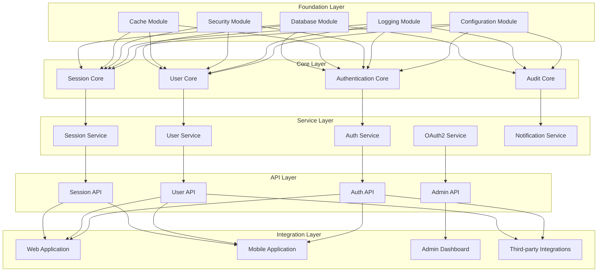
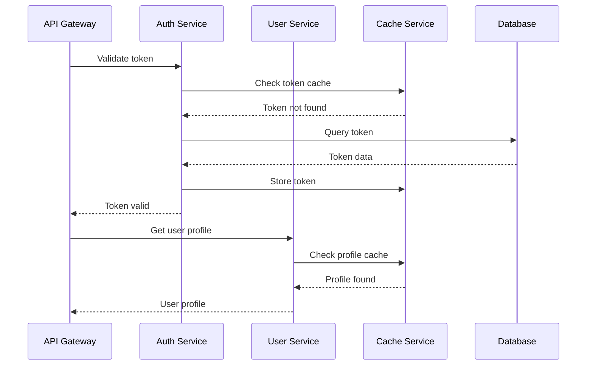
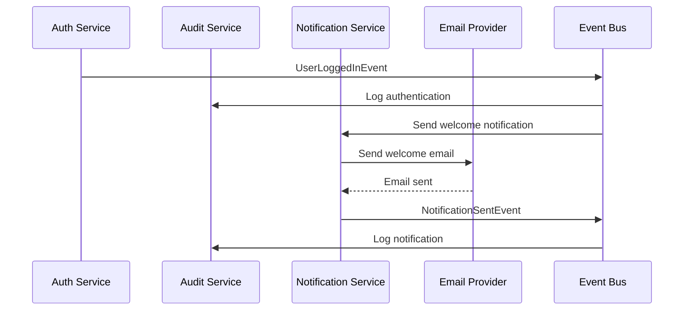

# Modular Architecture Overview

## Problem Statement

**Monolithic architecture creates tight coupling and deployment bottlenecks.**

Traditional monolithic applications suffer from slow development cycles, difficult scaling, technology lock-in, and
single points of failure, making it challenging to maintain and evolve the system.

## Technical Solution

**Modular design enables independent development, deployment, and scaling of components.**

A well-structured modular architecture separates concerns into distinct modules with clear interfaces, enabling teams to
work independently and scale components as needed.

## System Architecture Diagram

```mermaid
flowchart TB
    subgraph "Frontend Layer"
        Web[Web Application]
        Mobile[Mobile App]
        Admin[Admin Dashboard]
    end

    subgraph "API Gateway Layer"
        Gateway[API Gateway]
        Auth[Authentication Middleware]
        RateLimit[Rate Limiting]
        CORS[CORS Handler]
    end

    subgraph "Core Services"
        AuthService[Authentication Service]
        UserService[User Service]
        SessionService[Session Service]
        OAuthService[OAuth2 Service]
        NotificationService[Notification Service]
    end

    subgraph "Business Services"
        ProfileService[Profile Service]
        PreferenceService[Preference Service]
        AuditService[Audit Service]
        ReportingService[Reporting Service]
    end

    subgraph "Infrastructure Services"
        CacheService[Cache Service]
        LoggingService[Logging Service]
        MonitoringService[Monitoring Service]
        ConfigService[Configuration Service]
    end

    subgraph "Data Layer"
        PostgreSQL[(PostgreSQL)]
        Redis[(Redis)]
        Elasticsearch[(Elasticsearch)]
        S3[(Object Storage)]
    end

    subgraph "External Services"
        EmailProvider[Email Provider]
        SMSProvider[SMS Provider]
        OAuthProviders[OAuth Providers]
    end

    Web --> Gateway
    Mobile --> Gateway
    Admin --> Gateway
    Gateway --> Auth
    Gateway --> RateLimit
    Gateway --> CORS
    Auth --> AuthService
    Gateway --> UserService
    Gateway --> SessionService
    Gateway --> OAuthService
    UserService --> ProfileService
    AuthService --> NotificationService
    SessionService --> AuditService
    OAuthService --> AuditService
    AuthService --> CacheService
    UserService --> CacheService
    SessionService --> CacheService
    AuthService --> LoggingService
    UserService --> LoggingService
    SessionService --> LoggingService
    OAuthService --> LoggingService
    AuthService --> MonitoringService
    UserService --> MonitoringService
    SessionService --> MonitoringService
    OAuthService --> MonitoringService
    AuthService --> ConfigService
    UserService --> ConfigService
    SessionService --> ConfigService
    OAuthService --> ConfigService
    AuthService --> PostgreSQL
    UserService --> PostgreSQL
    SessionService --> PostgreSQL
    OAuthService --> PostgreSQL
    ProfileService --> PostgreSQL
    PreferenceService --> PostgreSQL
    AuditService --> Elasticsearch
    ReportingService --> PostgreSQL
    AuthService --> Redis
    UserService --> Redis
    SessionService --> Redis
    CacheService --> Redis
    NotificationService --> EmailProvider
    NotificationService --> SMSProvider
    OAuthService --> OAuthProviders
    LoggingService --> Elasticsearch
    MonitoringService --> Elasticsearch
    ReportingService --> S3
```



## Module Dependency Graph



## Module Structure

### Authentication Module

```
auth-module/
├── auth-core/
│   ├── domain/
│   │   ├── User.java
│   │   ├── Role.java
│   │   ├── Permission.java
│   │   └── AuthToken.java
│   ├── repository/
│   │   ├── UserRepository.java
│   │   ├── RoleRepository.java
│   │   └── TokenRepository.java
│   ├── service/
│   │   ├── AuthService.java
│   │   ├── TokenService.java
│   │   └── PasswordService.java
│   └── config/
│       ├── SecurityConfig.java
│       └── JwtConfig.java
├── auth-api/
│   ├── controller/
│   │   ├── AuthController.java
│   │   ├── TokenController.java
│   │   └── UserController.java
│   ├── dto/
│   │   ├── LoginRequest.java
│   │   ├── LoginResponse.java
│   │   └── UserDto.java
│   └── validator/
│       └── AuthValidator.java
├── auth-oauth/
│   ├── provider/
│   │   ├── GoogleProvider.java
│   │   ├── GitHubProvider.java
│   │   └── MicrosoftProvider.java
│   └── service/
│       └── OAuth2Service.java
└── auth-test/
    ├── unit/
    ├── integration/
    └── e2e/
```

### User Module

```
user-module/
├── user-core/
│   ├── domain/
│   │   ├── UserProfile.java
│   │   ├── UserPreferences.java
│   │   ├── UserActivity.java
│   │   └── DeviceSession.java
│   ├── repository/
│   │   ├── UserProfileRepository.java
│   │   ├── UserPreferencesRepository.java
│   │   └── UserActivityRepository.java
│   ├── service/
│   │   ├── UserProfileService.java
│   │   ├── UserPreferencesService.java
│   │   └── UserActivityService.java
│   └── events/
│       ├── UserCreatedEvent.java
│       ├── UserUpdatedEvent.java
│       └── UserDeletedEvent.java
├── user-api/
│   ├── controller/
│   │   ├── ProfileController.java
│   │   ├── PreferencesController.java
│   │   └── ActivityController.java
│   ├── dto/
│   │   ├── ProfileDto.java
│   │   ├── PreferencesDto.java
│   │   └── ActivityDto.java
│   └── mapper/
│       └── UserMapper.java
└── user-test/
    ├── unit/
    ├── integration/
    └── contract/
```

## Module Communication Patterns

### Synchronous Communication



### Asynchronous Communication



## Module Configuration

### Module Dependencies (Maven)

```xml
<!-- auth-module/pom.xml -->
<project>
    <modelVersion>4.0.0</modelVersion>
    <groupId>com.dragonofnorth</groupId>
    <artifactId>auth-module</artifactId>
    <version>1.0.0</version>
    <packaging>pom</packaging>

    <modules>
        <module>auth-core</module>
        <module>auth-api</module>
        <module>auth-oauth</module>
        <module>auth-test</module>
    </modules>

    <dependencyManagement>
        <dependencies>
            <!-- Internal dependencies -->
            <dependency>
                <groupId>com.dragonofnorth</groupId>
                <artifactId>security-module</artifactId>
                <version>1.0.0</version>
            </dependency>
            <dependency>
                <groupId>com.dragonofnorth</groupId>
                <artifactId>cache-module</artifactId>
                <version>1.0.0</version>
            </dependency>

            <!-- External dependencies -->
            <dependency>
                <groupId>org.springframework.boot</groupId>
                <artifactId>spring-boot-starter-security</artifactId>
                <version>3.1.0</version>
            </dependency>
            <dependency>
                <groupId>io.jsonwebtoken</groupId>
                <artifactId>jjwt-api</artifactId>
                <version>0.11.5</version>
            </dependency>
        </dependencies>
    </dependencyManagement>
</project>
```

### Module Configuration Properties

```yaml
# auth-core/application.yml
spring:
  application:
    name: auth-core

  datasource:
    url: jdbc:postgresql://${DB_HOST:localhost}:${DB_PORT:5432}/${DB_NAME:auth_db}
    username: ${DB_USERNAME:auth_user}
    password: ${DB_PASSWORD:auth_pass}
    hikari:
      maximum-pool-size: 20
      minimum-idle: 5

auth:
  jwt:
    secret: ${JWT_SECRET:default-secret}
    expiration: ${JWT_EXPIRATION:900}
    refresh-expiration: ${JWT_REFRESH_EXPIRATION:2592000}

  oauth2:
    providers:
      google:
        client-id: ${GOOGLE_CLIENT_ID}
        client-secret: ${GOOGLE_CLIENT_SECRET}
      github:
        client-id: ${GITHUB_CLIENT_ID}
        client-secret: ${GITHUB_CLIENT_SECRET}

module:
  dependencies:
    - security-module
    - cache-module
    - database-module
    - logging-module
```

## Module Deployment

### Docker Compose Module Deployment

```yaml
# docker-compose.modular.yml
version: '3.8'

services:
  # API Gateway
  api-gateway:
    image: dragonofnorth/api-gateway:latest
    ports:
      - "8080:8080"
    environment:
      - SPRING_PROFILES_ACTIVE=docker
      - EUREKA_SERVERS=http://eureka:8761/eureka
    depends_on:
      - eureka
      - auth-service
      - user-service

  # Service Discovery
  eureka:
    image: dragonofnorth/eureka-server:latest
    ports:
      - "8761:8761"
    environment:
      - SPRING_PROFILES_ACTIVE=docker

  # Authentication Service
  auth-service:
    image: dragonofnorth/auth-service:latest
    environment:
      - SPRING_PROFILES_ACTIVE=docker
      - DB_HOST=postgres
      - REDIS_HOST=redis
      - EUREKA_SERVERS=http://eureka:8761/eureka
    depends_on:
      - postgres
      - redis
      - eureka

  # User Service
  user-service:
    image: dragonofnorth/user-service:latest
    environment:
      - SPRING_PROFILES_ACTIVE=docker
      - DB_HOST=postgres
      - REDIS_HOST=redis
      - EUREKA_SERVERS=http://eureka:8761/eureka
    depends_on:
      - postgres
      - redis
      - eureka

  # Infrastructure Services
  postgres:
    image: postgres:15
    environment:
      - POSTGRES_DB=dragon_of_north
      - POSTGRES_USER=postgres
      - POSTGRES_PASSWORD=postgres
    volumes:
      - postgres_data:/var/lib/postgresql/data
    ports:
      - "5432:5432"

  redis:
    image: redis:7-alpine
    ports:
      - "6379:6379"
    volumes:
      - redis_data:/data

  elasticsearch:
    image: elasticsearch:8.8.0
    environment:
      - discovery.type=single-node
      - xpack.security.enabled=false
    ports:
      - "9200:9200"
    volumes:
      - es_data:/usr/share/elasticsearch/data

volumes:
  postgres_data:
  redis_data:
  es_data:
```

### Kubernetes Module Deployment

```yaml
# k8s/auth-service-deployment.yaml
apiVersion: apps/v1
kind: Deployment
metadata:
  name: auth-service
  labels:
    app: auth-service
    module: auth
spec:
  replicas: 3
  selector:
    matchLabels:
      app: auth-service
  template:
    metadata:
      labels:
        app: auth-service
        module: auth
    spec:
      containers:
        - name: auth-service
          image: dragonofnorth/auth-service:latest
          ports:
            - containerPort: 8080
          env:
            - name: SPRING_PROFILES_ACTIVE
              value: "kubernetes"
            - name: DB_HOST
              value: "postgres-service"
            - name: REDIS_HOST
              value: "redis-service"
          resources:
            requests:
              memory: "256Mi"
              cpu: "250m"
            limits:
              memory: "512Mi"
              cpu: "500m"
          livenessProbe:
            httpGet:
              path: /actuator/health
              port: 8080
            initialDelaySeconds: 60
            periodSeconds: 30
          readinessProbe:
            httpGet:
              path: /actuator/health/readiness
              port: 8080
            initialDelaySeconds: 30
            periodSeconds: 10

---
apiVersion: v1
kind: Service
metadata:
  name: auth-service
spec:
  selector:
    app: auth-service
  ports:
    - protocol: TCP
      port: 8080
      targetPort: 8080
  type: ClusterIP
```

## Module Testing Strategy

### Module Test Pyramid

```mermaid
pyramid
title Module Testing Strategy

"E2E Tests (5%)" : 5
"Integration Tests (15%)" : 15
"Unit Tests (80%)" : 80
```

### Test Configuration

```java
// auth-core/src/test/java/TestConfiguration.java
@TestConfiguration
public class AuthTestConfiguration {

    @Bean
    @Primary
    public UserRepository userRepository() {
        return mock(UserRepository.class);
    }

    @Bean
    @Primary
    public TokenService tokenService() {
        return mock(TokenService.class);
    }

    @Bean
    @Primary
    public PasswordEncoder passwordEncoder() {
        return NoOpPasswordEncoder.getInstance();
    }

    @Bean
    public TestContainers testContainers() {
        return new TestContainers() {
            @Container
            static PostgreSQLContainer<?> postgres = new PostgreSQLContainer<>("postgres:15")
                    .withDatabaseName("test_auth")
                    .withUsername("test")
                    .withPassword("test");
        };
    }
}
```

## Benefits

### Development Benefits

1. **Team Autonomy**: Independent module development
2. **Technology Diversity**: Different tech stacks per module
3. **Faster Development**: Parallel development cycles
4. **Clear Boundaries**: Well-defined interfaces

### Operational Benefits

1. **Independent Scaling**: Scale modules based on load
2. **Fault Isolation**: Module failures don't cascade
3. **Gradual Upgrades**: Update modules independently
4. **Resource Optimization**: Efficient resource usage

### Maintenance Benefits

1. **Easier Testing**: Focused test scope
2. **Simpler Debugging**: Isolated problem areas
3. **Better Documentation**: Module-specific docs
4. **Code Reuse**: Shared modules across projects

---

*Related
Features: [Reverse Proxy Architecture](./reverse-proxy-architecture.md), [Database Migration](./database-migration-cleanup.md), [CI/CD Pipeline](./cicd-pipeline.md)*
