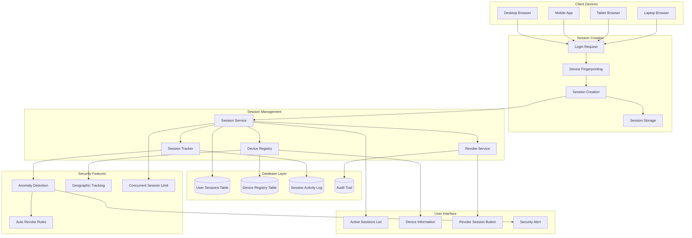
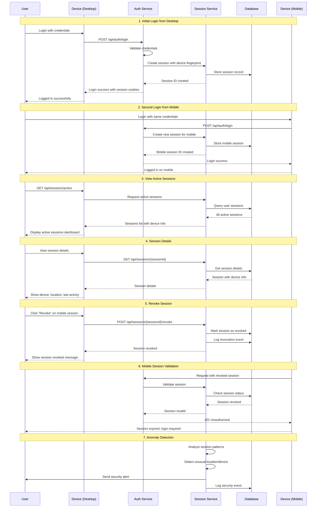

# Multi-Device Session Management

## Problem Statement

**Users cannot see or control active sessions across multiple devices.**

Without device-aware session management, users have no visibility into active sessions, cannot detect unauthorized
access, and lack the ability to remotely terminate specific sessions.

## Technical Solution

**Device fingerprinting and session inventory enables comprehensive session control.**

Multi-device session management tracks each login device, provides session visibility, and allows users to monitor and
control their active sessions.

## Multi-Device Session Architecture



## Session Management Flow



## Implementation Details

### Device Fingerprinting Service

```java
// service/DeviceFingerprintingService.java
@Service
public class DeviceFingerprintingService {

    private static final Logger logger = LoggerFactory.getLogger(DeviceFingerprintingService.class);

    public DeviceFingerprint generateFingerprint(HttpServletRequest request) {
        DeviceFingerprint fingerprint = new DeviceFingerprint();

        // User Agent analysis
        String userAgent = request.getHeader("User-Agent");
        fingerprint.setUserAgent(userAgent);
        fingerprint.setBrowser(parseBrowser(userAgent));
        fingerprint.setOperatingSystem(parseOS(userAgent));
        fingerprint.setDeviceType(detectDeviceType(userAgent));

        // IP-based information
        String clientIP = getClientIP(request);
        fingerprint.setIpAddress(clientIP);

        // Geolocation (using IP geolocation service)
        GeoLocation geoLocation = geoLocationService.getLocation(clientIP);
        fingerprint.setCountry(geoLocation.getCountry());
        fingerprint.setCity(geoLocation.getCity());
        fingerprint.setCoordinates(geoLocation.getCoordinates());

        // Hardware/software characteristics
        fingerprint.setScreenResolution(request.getHeader("Screen-Resolution"));
        fingerprint.setLanguage(request.getLocale().toString());
        fingerprint.setTimezone(request.getHeader("Timezone"));

        // Generate unique fingerprint hash
        String fingerprintHash = generateFingerprintHash(fingerprint);
        fingerprint.setFingerprintHash(fingerprintHash);

        logger.info("Generated device fingerprint: {} for IP: {}", fingerprintHash, clientIP);

        return fingerprint;
    }

    public boolean isTrustedDevice(DeviceFingerprint fingerprint, String userId) {
        // Check if this device has been used before by the user
        return deviceRegistryRepository.existsByUserIdAndFingerprintHash(userId, fingerprint.getFingerprintHash());
    }

    public void registerTrustedDevice(String userId, DeviceFingerprint fingerprint, String deviceName) {
        TrustedDevice trustedDevice = TrustedDevice.builder()
                .userId(userId)
                .fingerprintHash(fingerprint.getFingerprintHash())
                .deviceName(deviceName)
                .browser(fingerprint.getBrowser())
                .operatingSystem(fingerprint.getOperatingSystem())
                .deviceType(fingerprint.getDeviceType())
                .firstSeen(Instant.now())
                .lastSeen(Instant.now())
                .trusted(true)
                .build();

        deviceRegistryRepository.save(trustedDevice);
    }

    private String generateFingerprintHash(DeviceFingerprint fingerprint) {
        String fingerprintData = String.join("|",
                fingerprint.getUserAgent(),
                fingerprint.getScreenResolution(),
                fingerprint.getLanguage(),
                fingerprint.getTimezone()
        );

        return DigestUtils.sha256Hex(fingerprintData);
    }

    private String parseBrowser(String userAgent) {
        if (userAgent.contains("Chrome")) return "Chrome";
        if (userAgent.contains("Firefox")) return "Firefox";
        if (userAgent.contains("Safari")) return "Safari";
        if (userAgent.contains("Edge")) return "Edge";
        return "Unknown";
    }

    private String parseOS(String userAgent) {
        if (userAgent.contains("Windows")) return "Windows";
        if (userAgent.contains("Mac")) return "macOS";
        if (userAgent.contains("Linux")) return "Linux";
        if (userAgent.contains("Android")) return "Android";
        if (userAgent.contains("iOS")) return "iOS";
        return "Unknown";
    }

    private String detectDeviceType(String userAgent) {
        if (userAgent.contains("Mobile") || userAgent.contains("Android") || userAgent.contains("iPhone")) {
            return "Mobile";
        }
        if (userAgent.contains("Tablet") || userAgent.contains("iPad")) {
            return "Tablet";
        }
        return "Desktop";
    }

    private String getClientIP(HttpServletRequest request) {
        String xForwardedFor = request.getHeader("X-Forwarded-For");
        if (xForwardedFor != null && !xForwardedFor.isEmpty()) {
            return xForwardedFor.split(",")[0].trim();
        }

        String xRealIP = request.getHeader("X-Real-IP");
        if (xRealIP != null && !xRealIP.isEmpty()) {
            return xRealIP;
        }

        return request.getRemoteAddr();
    }
}
```

### Session Management Service

```java
// service/SessionManagementService.java
@Service
public class SessionManagementService {

    private static final Logger logger = LoggerFactory.getLogger(SessionManagementService.class);

    private final SessionRepository sessionRepository;
    private final DeviceFingerprintingService fingerprintService;
    private final NotificationService notificationService;
    private final AuditService auditService;

    @Value("${auth.session.max-concurrent:5}")
    private int maxConcurrentSessions;

    @Value("${auth.session.anomaly-detection:true}")
    private boolean anomalyDetectionEnabled;

    public UserSession createSession(User user, HttpServletRequest request) {
        // Generate device fingerprint
        DeviceFingerprint fingerprint = fingerprintService.generateFingerprint(request);

        // Check concurrent session limit
        long activeSessionCount = sessionRepository.countByUserIdAndRevokedAtIsNull(user.getId());
        if (activeSessionCount >= maxConcurrentSessions) {
            // Revoke oldest session
            revokeOldestSession(user.getId());
        }

        // Create session
        UserSession session = UserSession.builder()
                .id(UUID.randomUUID().toString())
                .userId(user.getId())
                .deviceFingerprint(fingerprint)
                .ipAddress(fingerprint.getIpAddress())
                .userAgent(fingerprint.getUserAgent())
                .location(fingerprint.getCountry() + ", " + fingerprint.getCity())
                .createdAt(Instant.now())
                .lastAccessedAt(Instant.now())
                .expiresAt(Instant.now().plus(30, ChronoUnit.DAYS))
                .revoked(false)
                .build();

        // Save session
        session = sessionRepository.save(session);

        // Register device if trusted
        if (fingerprintService.isTrustedDevice(fingerprint, user.getId())) {
            updateTrustedDeviceLastSeen(user.getId(), fingerprint.getFingerprintHash());
        } else {
            // Send new device notification
            notificationService.sendNewDeviceNotification(user, fingerprint);
        }

        // Detect anomalies
        if (anomalyDetectionEnabled) {
            detectSessionAnomalies(session);
        }

        // Log session creation
        auditService.logSessionEvent("SESSION_CREATED", user.getId(), session.getId(), fingerprint);

        logger.info("Created session {} for user {} from {}", session.getId(), user.getId(), fingerprint.getIpAddress());

        return session;
    }

    public List<UserSession> getActiveSessions(String userId) {
        return sessionRepository.findByUserIdAndRevokedAtIsNullOrderByLastAccessedAtDesc(userId);
    }

    public void revokeSession(String sessionId, String reason) {
        UserSession session = sessionRepository.findById(sessionId)
                .orElseThrow(() -> new SessionNotFoundException("Session not found: " + sessionId));

        session.setRevoked(true);
        session.setRevokedAt(Instant.now());
        session.setRevokedReason(reason);

        sessionRepository.save(session);

        // Log revocation
        auditService.logSessionEvent("SESSION_REVOKED", session.getUserId(), sessionId, null);

        // Send notification if not user-initiated
        if (!"USER_INITIATED".equals(reason)) {
            notificationService.sendSessionRevokedNotification(session.getUserId(), session);
        }

        logger.info("Revoked session {} for user {} - Reason: {}", sessionId, session.getUserId(), reason);
    }

    public void revokeAllOtherSessions(String currentSessionId, String userId) {
        List<UserSession> otherSessions = sessionRepository
                .findByUserIdAndIdNotAndRevokedAtIsNull(userId, currentSessionId);

        for (UserSession session : otherSessions) {
            revokeSession(session.getId(), "CONCURRENT_LOGIN");
        }

        logger.info("Revoked {} other sessions for user {}", otherSessions.size(), userId);
    }

    private void revokeOldestSession(String userId) {
        UserSession oldestSession = sessionRepository
                .findFirstByUserIdAndRevokedAtIsNullOrderByLastAccessedAtAsc(userId)
                .orElse(null);

        if (oldestSession != null) {
            revokeSession(oldestSession.getId(), "CONCURRENT_LIMIT_REACHED");
        }
    }

    private void detectSessionAnomalies(UserSession newSession) {
        List<UserSession> recentSessions = sessionRepository
                .findByUserIdAndRevokedAtIsNullAndLastAccessedAtAfter(
                        newSession.getUserId(),
                        Instant.now().minus(7, ChronoUnit.DAYS)
                );

        // Check for geographic anomalies
        for (UserSession existingSession : recentSessions) {
            double distance = calculateDistance(
                    newSession.getDeviceFingerprint().getCoordinates(),
                    existingSession.getDeviceFingerprint().getCoordinates()
            );

            // If distance > 1000km and time difference < 1 hour, flag as anomaly
            if (distance > 1000 && Duration.between(existingSession.getLastAccessedAt(), newSession.getCreatedAt()).toHours() < 1) {
                notificationService.sendGeographicAnomalyAlert(newSession.getUserId(), newSession, existingSession);
                auditService.logSecurityEvent("GEOGRAPHIC_ANOMALY", newSession.getUserId(), Map.of(
                        "newSession", newSession.getId(),
                        "existingSession", existingSession.getId(),
                        "distance", distance
                ));
            }
        }

        // Check for unusual time patterns
        int hour = newSession.getCreatedAt().atZone(ZoneId.systemDefault()).getHour();
        if (hour < 6 || hour > 22) {
            // Unusual login time
            notificationService.sendUnusualTimeAlert(newSession.getUserId(), newSession);
        }
    }

    private double calculateDistance(double[] coord1, double[] coord2) {
        // Haversine formula for calculating distance between coordinates
        double lat1 = Math.toRadians(coord1[0]);
        double lon1 = Math.toRadians(coord1[1]);
        double lat2 = Math.toRadians(coord2[0]);
        double lon2 = Math.toRadians(coord2[1]);

        double dLat = lat2 - lat1;
        double dLon = lon2 - lon1;

        double a = Math.sin(dLat / 2) * Math.sin(dLat / 2) +
                Math.cos(lat1) * Math.cos(lat2) *
                        Math.sin(dLon / 2) * Math.sin(dLon / 2);

        double c = 2 * Math.atan2(Math.sqrt(a), Math.sqrt(1 - a));

        return 6371 * c; // Earth's radius in kilometers
    }
}
```

### Session Controller

```java
// controller/SessionController.java
@RestController
@RequestMapping("/api/sessions")
public class SessionController {

    private final SessionManagementService sessionService;

    @GetMapping("/active")
    public ResponseEntity<List<SessionResponse>> getActiveSessions(@AuthenticationPrincipal UserPrincipal user) {
        List<UserSession> sessions = sessionService.getActiveSessions(user.getId());

        List<SessionResponse> sessionResponses = sessions.stream()
                .map(this::mapToSessionResponse)
                .collect(Collectors.toList());

        return ResponseEntity.ok(sessionResponses);
    }

    @GetMapping("/{sessionId}")
    public ResponseEntity<SessionDetailsResponse> getSessionDetails(
            @PathVariable String sessionId,
            @AuthenticationPrincipal UserPrincipal user) {

        UserSession session = sessionService.getSession(sessionId);

        // Verify user owns this session
        if (!session.getUserId().equals(user.getId())) {
            return ResponseEntity.status(HttpStatus.FORBIDDEN).build();
        }

        SessionDetailsResponse response = SessionDetailsResponse.builder()
                .sessionId(session.getId())
                .deviceName(session.getDeviceFingerprint().getDeviceName())
                .deviceType(session.getDeviceFingerprint().getDeviceType())
                .browser(session.getDeviceFingerprint().getBrowser())
                .operatingSystem(session.getDeviceFingerprint().getOperatingSystem())
                .ipAddress(session.getIpAddress())
                .location(session.getLocation())
                .createdAt(session.getCreatedAt())
                .lastAccessedAt(session.getLastAccessedAt())
                .expiresAt(session.getExpiresAt())
                .isCurrentSession(sessionId.equals(getCurrentSessionId()))
                .trusted(session.isTrusted())
                .build();

        return ResponseEntity.ok(response);
    }

    @PostMapping("/{sessionId}/revoke")
    public ResponseEntity<Void> revokeSession(
            @PathVariable String sessionId,
            @RequestBody RevokeSessionRequest request,
            @AuthenticationPrincipal UserPrincipal user) {

        UserSession session = sessionService.getSession(sessionId);

        // Verify user owns this session
        if (!session.getUserId().equals(user.getId())) {
            return ResponseEntity.status(HttpStatus.FORBIDDEN).build();
        }

        // Don't allow revoking current session (use logout instead)
        if (sessionId.equals(getCurrentSessionId())) {
            return ResponseEntity.badRequest().build();
        }

        sessionService.revokeSession(sessionId, request.getReason() != null ? request.getReason() : "USER_INITIATED");

        return ResponseEntity.ok().build();
    }

    @PostMapping("/revoke-all-others")
    public ResponseEntity<Void> revokeAllOtherSessions(@AuthenticationPrincipal UserPrincipal user) {
        String currentSessionId = getCurrentSessionId();
        sessionService.revokeAllOtherSessions(currentSessionId, user.getId());

        return ResponseEntity.ok().build();
    }

    @PostMapping("/trust-device")
    public ResponseEntity<Void> trustDevice(@RequestBody TrustDeviceRequest request,
                                            @AuthenticationPrincipal UserPrincipal user) {
        sessionService.trustDevice(user.getId(), request.getFingerprintHash(), request.getDeviceName());
        return ResponseEntity.ok().build();
    }

    private SessionResponse mapToSessionResponse(UserSession session) {
        return SessionResponse.builder()
                .sessionId(session.getId())
                .deviceName(session.getDeviceFingerprint().getDeviceName())
                .deviceType(session.getDeviceFingerprint().getDeviceType())
                .browser(session.getDeviceFingerprint().getBrowser())
                .ipAddress(session.getIpAddress())
                .location(session.getLocation())
                .lastAccessedAt(session.getLastAccessedAt())
                .isCurrentSession(session.getId().equals(getCurrentSessionId()))
                .trusted(session.isTrusted())
                .build();
    }

    private String getCurrentSessionId() {
        // Get current session ID from security context
        Authentication auth = SecurityContextHolder.getContext().getAuthentication();
        if (auth instanceof UsernamePasswordAuthenticationToken) {
            UserPrincipal user = (UserPrincipal) auth.getPrincipal();
            return user.getSessionId();
        }
        return null;
    }
}
```

### Database Schema

```sql
-- User Sessions Table
CREATE TABLE user_sessions
(
    id UUID PRIMARY KEY DEFAULT gen_random_uuid(),
    user_id UUID NOT NULL REFERENCES users(id) ON DELETE CASCADE,
    device_fingerprint_id UUID NOT NULL REFERENCES device_fingerprints(id),
    ip_address INET NOT NULL,
    user_agent       TEXT,
    location         VARCHAR(255),
    created_at       TIMESTAMP WITH TIME ZONE DEFAULT NOW(),
    last_accessed_at TIMESTAMP WITH TIME ZONE DEFAULT NOW(),
    expires_at       TIMESTAMP WITH TIME ZONE NOT NULL,
    revoked          BOOLEAN DEFAULT FALSE,
    revoked_at       TIMESTAMP WITH TIME ZONE,
    revoked_reason   VARCHAR(50),
    trusted          BOOLEAN DEFAULT FALSE,

    INDEX idx_user_sessions_user_id (user_id),
    INDEX idx_user_sessions_device_fingerprint (device_fingerprint_id),
    INDEX idx_user_sessions_expires_at (expires_at),
    INDEX idx_user_sessions_revoked (revoked),
    INDEX idx_user_sessions_last_accessed (last_accessed_at)
);

-- Device Fingerprints Table
CREATE TABLE device_fingerprints
(
    id UUID PRIMARY KEY DEFAULT gen_random_uuid(),
    fingerprint_hash  VARCHAR(255) UNIQUE NOT NULL,
    user_agent        TEXT,
    browser           VARCHAR(50),
    operating_system  VARCHAR(50),
    device_type       VARCHAR(20),
    screen_resolution VARCHAR(20),
    language          VARCHAR(10),
    timezone          VARCHAR(50),
    created_at        TIMESTAMP WITH TIME ZONE DEFAULT NOW(),

    INDEX idx_device_fingerprints_hash (fingerprint_hash)
);

-- Trusted Devices Table
CREATE TABLE trusted_devices
(
    id UUID PRIMARY KEY DEFAULT gen_random_uuid(),
    user_id UUID NOT NULL REFERENCES users(id) ON DELETE CASCADE,
    fingerprint_hash VARCHAR(255) NOT NULL REFERENCES device_fingerprints (fingerprint_hash),
    device_name      VARCHAR(100),
    first_seen       TIMESTAMP WITH TIME ZONE DEFAULT NOW(),
    last_seen        TIMESTAMP WITH TIME ZONE DEFAULT NOW(),
    trusted          BOOLEAN DEFAULT TRUE,

    UNIQUE (user_id, fingerprint_hash),
    INDEX idx_trusted_devices_user_id (user_id),
    INDEX idx_trusted_devices_fingerprint (fingerprint_hash)
);

-- Session Activity Log
CREATE TABLE session_activity_log
(
    id UUID PRIMARY KEY DEFAULT gen_random_uuid(),
    session_id UUID NOT NULL REFERENCES user_sessions(id) ON DELETE CASCADE,
    activity_type VARCHAR(50) NOT NULL,
    ip_address INET,
    user_agent    TEXT,
    timestamp     TIMESTAMP WITH TIME ZONE DEFAULT NOW(),
    details JSONB,

    INDEX idx_session_activity_session_id (session_id),
    INDEX idx_session_activity_timestamp (timestamp),
    INDEX idx_session_activity_type (activity_type)
);
```

## Frontend Implementation

### Session Management UI Component

```typescript
// src/components/SessionManagement.tsx
import React, {useState, useEffect} from 'react';
import {authManager} from '../services/auth';
import './SessionManagement.css';

interface Session {
    sessionId: string;
    deviceName: string;
    deviceType: string;
    browser: string;
    ipAddress: string;
    location: string;
    lastAccessedAt: string;
    isCurrentSession: boolean;
    trusted: boolean;
}

const SessionManagement: React.FC = () => {
    const [sessions, setSessions] = useState<Session[]>([]);
    const [loading, setLoading] = useState(true);
    const [error, setError] = useState<string | null>(null);

    useEffect(() => {
        loadSessions();
    }, []);

    const loadSessions = async () => {
        try {
            setLoading(true);
            const response = await authManager.apiCall('/api/sessions/active');
            const data = await response.json();
            setSessions(data);
        } catch (err) {
            setError('Failed to load sessions');
        } finally {
            setLoading(false);
        }
    };

    const revokeSession = async (sessionId: string) => {
        try {
            await authManager.apiCall(`/api/sessions/${sessionId}/revoke`, {
                method: 'POST',
                body: JSON.stringify({reason: 'USER_INITIATED'})
            });

            // Refresh sessions list
            await loadSessions();
        } catch (err) {
            setError('Failed to revoke session');
        }
    };

    const revokeAllOtherSessions = async () => {
        try {
            await authManager.apiCall('/api/sessions/revoke-all-others', {
                method: 'POST'
            });

            await loadSessions();
        } catch (err) {
            setError('Failed to revoke other sessions');
        }
    };

    const getDeviceIcon = (deviceType: string) => {
        switch (deviceType) {
            case 'Desktop':
                return '💻';
            case 'Mobile':
                return '📱';
            case 'Tablet':
                return '📱';
            default:
                return '🖥️';
        }
    };

    const formatDate = (dateString: string) => {
        return new Date(dateString).toLocaleString();
    };

    if (loading) return <div className = "loading" > Loading
    sessions
...
    </div>;
    if (error) return <div className = "error" > {error} < /div>;

    return (
        <div className = "session-management" >
            <h2>Active
    Sessions < /h2>

    < div
    className = "sessions-list" >
    {
        sessions.map((session) => (
            <div key = {session.sessionId} className = {`session-card ${session.isCurrentSession ? 'current' : ''}`
    } >
    <div className = "session-header" >
    <div className = "device-info" >
    <span className = "device-icon" > {getDeviceIcon(session.deviceType
)
}
    </span>
    < div >
    <h3>{session.deviceName || 'Unknown Device'} < /h3>
    < p
    className = "device-details" > {session.browser} • {
        session.deviceType
    }
    </p>
    < /div>
    < /div>
    {
        session.isCurrentSession && <span className = "current-badge" > Current
        Session < /span>}
        {
            session.trusted && <span className = "trusted-badge" > Trusted < /span>}
                < /div>

                < div
            className = "session-details" >
            <div className = "location-info" >
            <span className = "location" >📍 {
            session.location
        }
            </span>
            < span
            className = "ip" > IP
        :
            {
                session.ipAddress
            }
            </span>
            < /div>
            < div
            className = "time-info" >
                <span>Last
            active: {
                formatDate(session.lastAccessedAt)
            }
            </span>
            < /div>
            < /div>

            < div
            className = "session-actions" >
                {!
            session.isCurrentSession && (
                <button
                    className = "revoke-btn"
            onClick = {()
        =>
            revokeSession(session.sessionId)
        }
        >
            Revoke
            Session
            < /button>
        )
        }
            </div>
            < /div>
        ))
        }
        </div>

        < div
        className = "session-actions-global" >
        <button
            className = "revoke-all-btn"
        onClick = {revokeAllOtherSessions}
            >
            Revoke
        All
        Other
        Sessions
        < /button>
        < /div>
        < /div>
    )
        ;
    }
    ;

    export default SessionManagement;
```

## Benefits

### Security Benefits

1. **Session Visibility**: Users can see all active devices and locations
2. **Remote Revocation**: Immediate termination of suspicious sessions
3. **Anomaly Detection**: Automatic detection of unusual login patterns
4. **Device Trust**: Trusted device recognition and management

### User Experience Benefits

1. **Control**: Users have full control over their active sessions
2. **Transparency**: Clear visibility into account access
3. **Security Awareness**: Users are informed about new login activities
4. **Peace of Mind**: Ability to secure account immediately

### Operational Benefits

1. **Audit Trail**: Complete session history for compliance
2. **Security Monitoring**: Real-time session monitoring
3. **Incident Response**: Quick response to compromised sessions
4. **Compliance**: Meets security and privacy requirements

---

*Related
Features: [Cookie-Based Token Management](./cookie-token-management.md), [Security Audit Logging](./audit-logging.md), [Device-Aware Sessions](./device-sessions.md)*
