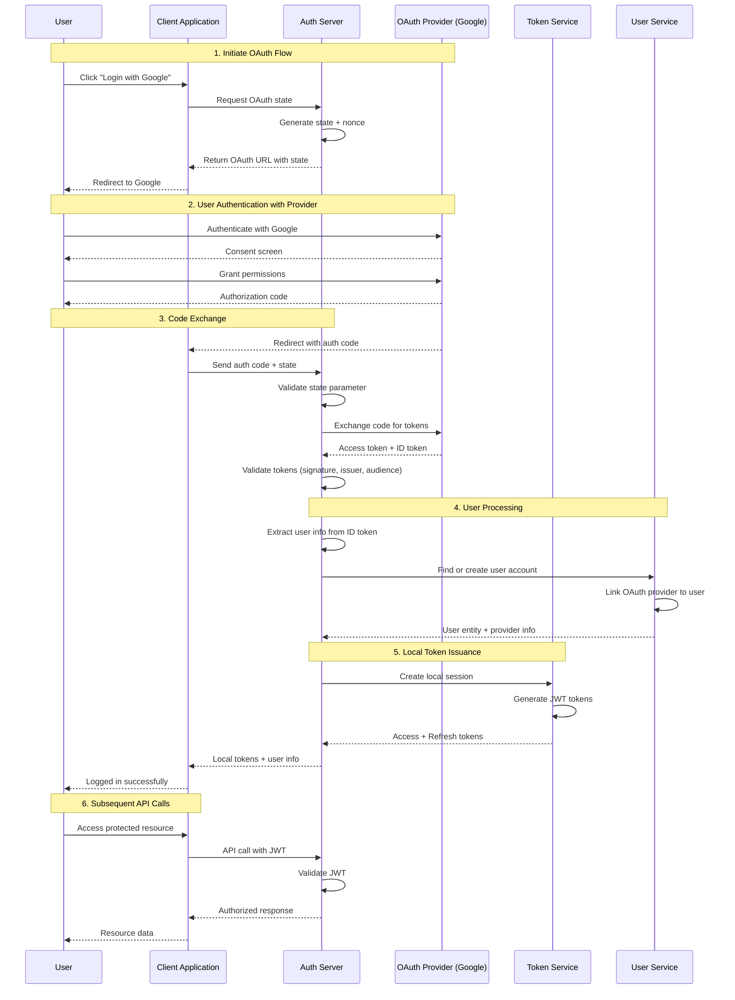

# OAuth2 Integration Flow

## Problem Statement

**Password-only login increases credential handling burden.**

Traditional username/password authentication requires users to remember and manage credentials for every service,
increasing the risk of password reuse and credential stuffing attacks.

## Technical Solution

**Federated login delegates identity proofing to trusted providers (e.g., Google).**

OAuth2 integration allows users to authenticate using existing accounts from trusted identity providers, reducing
credential management overhead while maintaining security.

## OAuth2 Authorization Code Flow



## Provider Configuration

### Supported OAuth2 Providers

```yaml
oauth2:
  providers:
    google:
      client-id: ${GOOGLE_CLIENT_ID}
      client-secret: ${GOOGLE_CLIENT_SECRET}
      scope: openid email profile
      auth-url: https://accounts.google.com/o/oauth2/v2/auth
      token-url: https://oauth2.googleapis.com/token
      user-info-url: https://www.googleapis.com/oauth2/v2/userinfo
      jwks-url: https://www.googleapis.com/oauth2/v3/certs

    github:
      client-id: ${GITHUB_CLIENT_ID}
      client-secret: ${GITHUB_CLIENT_SECRET}
      scope: user:email
      auth-url: https://github.com/login/oauth/authorize
      token-url: https://github.com/login/oauth/access_token
      user-info-url: https://api.github.com/user

    microsoft:
      client-id: ${MICROSOFT_CLIENT_ID}
      client-secret: ${MICROSOFT_CLIENT_SECRET}
      scope: openid email profile
      auth-url: https://login.microsoftonline.com/common/oauth2/v2.0/authorize
      token-url: https://login.microsoftonline.com/common/oauth2/v2.0/token
      user-info-url: https://graph.microsoft.com/v1.0/me
```

## Implementation Details

### OAuth2 Service Implementation

```java

@Service
public class OAuth2Service {

    public OAuth2CallbackResult handleCallback(String code, String state, String provider) {
        // Validate state to prevent CSRF
        OAuthState oauthState = validateState(state);

        // Exchange authorization code for tokens
        TokenResponse tokenResponse = exchangeCodeForTokens(code, provider);

        // Validate ID token and extract user info
        UserInfo userInfo = validateAndExtractUserInfo(tokenResponse, provider);

        // Find or create user account
        User user = findOrCreateUser(userInfo, provider);

        // Link OAuth provider to user
        linkProviderToUser(user, userInfo, provider);

        // Generate local tokens
        TokenPair localTokens = tokenService.generateTokenPair(user);

        // Log successful OAuth authentication
        auditService.logOAuthLogin(user, provider);

        return OAuth2CallbackResult.builder()
                .user(user)
                .tokens(localTokens)
                .provider(provider)
                .build();
    }

    private UserInfo validateAndExtractUserInfo(TokenResponse tokenResponse, String provider) {
        // Get provider's public keys for token validation
        JWKSet jwkSet = jwkSetProvider.getJWKSet(provider);

        // Validate ID token signature and claims
        JwtClaimsSet claims = jwtValidator.validate(
                tokenResponse.getIdToken(),
                jwkSet,
                provider
        );

        // Extract user information
        return UserInfo.builder()
                .providerId(claims.getSubject())
                .email(claims.getClaim("email"))
                .name(claims.getClaim("name"))
                .picture(claims.getClaim("picture"))
                .emailVerified(claims.getClaim("email_verified", false))
                .build();
    }

    private User findOrCreateUser(UserInfo userInfo, String provider) {
        // First try to find existing user by provider link
        Optional<User> existingUser = userRepository
                .findByProviderId(provider, userInfo.getProviderId());

        if (existingUser.isPresent()) {
            return existingUser.get();
        }

        // Check if user exists with same email
        Optional<User> userByEmail = userRepository
                .findByEmail(userInfo.getEmail());

        if (userByEmail.isPresent()) {
            // Link OAuth provider to existing user
            User user = userByEmail.get();
            linkProviderToUser(user, userInfo, provider);
            return user;
        }

        // Create new user account
        return createNewUser(userInfo, provider);
    }
}
```

### Security Validations

### ID Token Validation Checklist

```java
public class IdTokenValidator {

    public JwtClaimsSet validate(String idToken, JWKSet jwkSet, String provider) {
        Jwt jwt = Jwt.parse(idToken);

        // 1. Signature validation
        JWK jwk = jwkSet.getKeyByKeyId(jwt.getHeader().getKeyId());
        if (!jwt.validateSignature(jwk)) {
            throw new InvalidTokenException("Invalid signature");
        }

        // 2. Issuer validation
        String expectedIssuer = getExpectedIssuer(provider);
        if (!expectedIssuer.equals(jwt.getClaims().getIssuer())) {
            throw new InvalidTokenException("Invalid issuer");
        }

        // 3. Audience validation
        String clientId = getClientId(provider);
        if (!jwt.getClaims().getAudience().contains(clientId)) {
            throw new InvalidTokenException("Invalid audience");
        }

        // 4. Expiration validation
        if (jwt.getClaims().getExpirationTime().isBefore(Instant.now())) {
            throw new InvalidTokenException("Token expired");
        }

        // 5. Issued-at validation (prevent token replay)
        if (jwt.getClaims().getIssuedAt().isAfter(Instant.now().plus(5, ChronoUnit.MINUTES))) {
            throw new InvalidTokenException("Token issued in future");
        }

        // 6. Nonce validation (if present)
        validateNonce(jwt.getClaims());

        return jwt.getClaims();
    }
}
```

## Security Benefits

### Risk Reduction

| Risk                | Mitigation                                 |
|---------------------|--------------------------------------------|
| Password reuse      | No password storage for OAuth users        |
| Credential stuffing | Provider handles brute force protection    |
| Phishing attacks    | Provider implements advanced anti-phishing |
| Account recovery    | Provider handles secure recovery flows     |

### Compliance Advantages

1. **SOC 2**: Leverages provider's security controls
2. **GDPR**: Provider handles data processing agreements
3. **CCPA**: Reduced personal data collection
4. **NIST 800-63**: Meets digital identity guidelines

## Monitoring & Security

### OAuth2 Security Events

```yaml
security-events:
  oauth2_login_success:
    description: User successfully authenticated via OAuth2
    severity: INFO

  oauth2_login_failed:
    description: OAuth2 authentication failed
    severity: WARNING

  oauth2_state_mismatch:
    description: CSRF attempt detected
    severity: HIGH

  oauth2_token_validation_failed:
    description: Provider token validation failed
    severity: MEDIUM

  oauth2_account_linking:
    description: OAuth provider linked to local account
    severity: INFO
```

### Anomaly Detection

1. **Provider Switching**: User suddenly uses different provider
2. **Geographic Changes**: OAuth login from unusual location
3. **Token Validation Failures**: Systematic validation issues
4. **State Manipulation**: CSRF attack attempts

## Configuration Security

### Environment Variables

```bash
# OAuth2 Provider Credentials
GOOGLE_CLIENT_ID=your-google-client-id
GOOGLE_CLIENT_SECRET=your-google-client-secret

GITHUB_CLIENT_ID=your-github-client-id
GITHUB_CLIENT_SECRET=your-github-client-secret

MICROSOFT_CLIENT_ID=your-microsoft-client-id
MICROSOFT_CLIENT_SECRET=your-microsoft-client-secret

# Security Configuration
OAUTH2_STATE_EXPIRY=300
OAUTH2_NONCE_EXPIRY=600
OAUTH2_TOKEN_VALIDATION_CACHE_TTL=3600
```

### Redirect URI Validation

```java

@Component
public class RedirectUriValidator {

    private final Set<String> allowedUris;

    public boolean isValidRedirectUri(String uri, String provider) {
        // 1. Check against allowed URIs
        if (!allowedUris.contains(uri)) {
            return false;
        }

        // 2. Validate URI format
        try {
            URI parsedUri = new URI(uri);
            return parsedUri.getScheme().equals("https") ||
                    (parsedUri.getScheme().equals("http") && isLocalhost(parsedUri));
        } catch (URISyntaxException e) {
            return false;
        }
    }
}
```

## Failure Mode Handling

### Provider Outage Response

1. **Graceful Fallback**: Offer traditional login option
2. **User Communication**: Clear messaging about provider issues
3. **Retry Logic**: Exponential backoff for failed attempts
4. **Monitoring**: Alert on provider availability issues

### Token Compromise Response

1. **Token Revocation**: Immediately invalidate local tokens
2. **Provider Notification**: Report compromised tokens to provider
3. **User Notification**: Alert user to revoke provider access
4. **Security Review**: Analyze access patterns for additional compromise

---

*Related
Features: [Multi-Identifier Login](./multi-identifier-login.md), [JWT-Based Authentication](jwt-auth-flow.md), [Security Audit Logging](audit-logging.md)*
