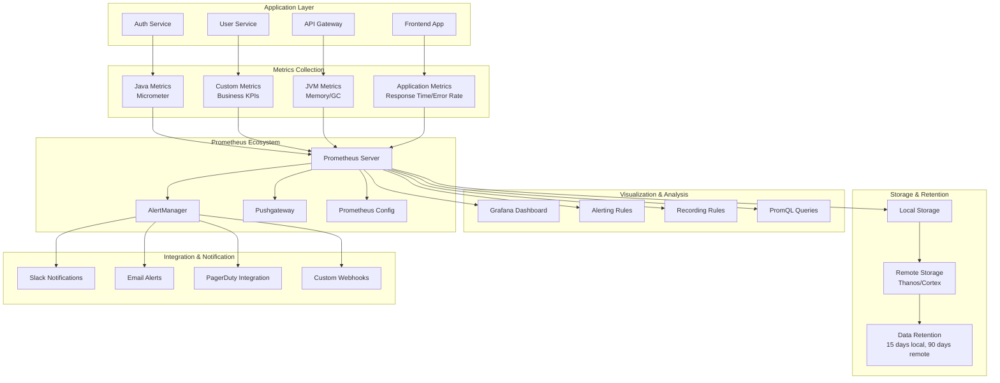

# Prometheus Monitoring Architecture

## Problem Statement

**Without comprehensive monitoring, system issues go undetected until they impact users.**

Traditional logging provides retrospective analysis but lacks real-time visibility into system health, performance
metrics, and proactive issue detection.

## Technical Solution

**Prometheus-based monitoring provides real-time metrics, alerting, and observability.**

Comprehensive monitoring stack with Prometheus, Grafana, and AlertManager enables proactive system health monitoring and
automated incident response.

## Monitoring Architecture



## Metrics Collection Implementation

### Spring Boot Metrics Configuration

```java
// config/MetricsConfiguration.java
@Configuration
public class MetricsConfiguration {
    
    @Bean
    public MeterRegistryCustomizer<MeterRegistry> metricsCommonTags() {
        return registry -> registry.config().commonTags(
            "application", "dragon-of-north",
            "version", "1.0.0",
            "environment", "${spring.profiles.active:default}"
        );
    }
    
    @Bean
    public TimedAspect timedAspect(MeterRegistry registry) {
        return new TimedAspect(registry);
    }
    
    @Bean
    public CountedAspect countedAspect(MeterRegistry registry) {
        return new CountedAspect(registry);
    }
    
    @Bean
    public PrometheusMeterRegistry prometheusMeterRegistry() {
        return new PrometheusMeterRegistry(PrometheusConfig.DEFAULT, new Clock() {
            @Override
            public long wallTime() {
                return System.currentTimeMillis();
            }
            
            @Override
            public long monotonicTime() {
                return System.nanoTime();
            }
        }, DEFAULT);
    }
}

// AuthController.java with metrics
@RestController
@RequestMapping("/api/auth")
public class AuthController {
    
    private final Counter loginAttempts;
    private final Counter loginSuccesses;
    private final Counter loginFailures;
    private final Timer loginDuration;
    private final Gauge activeUsers;
    
    public AuthController(MeterRegistry meterRegistry, UserService userService) {
        this.loginAttempts = Counter.builder("auth.login.attempts")
            .description("Total login attempts")
            .register(meterRegistry);
        
        this.loginSuccesses = Counter.builder("auth.login.successes")
            .description("Successful login attempts")
            .register(meterRegistry);
        
        this.loginFailures = Counter.builder("auth.login.failures")
            .description("Failed login attempts")
            .register(meterRegistry);
        
        this.loginDuration = Timer.builder("auth.login.duration")
            .description("Login request duration")
            .register(meterRegistry);
        
        this.activeUsers = Gauge.builder("auth.users.active")
            .description("Number of active users")
            .register(meterRegistry, userService, UserService::getActiveUserCount);
    }
    
    @PostMapping("/login")
    @Timed(name = "auth.login.request.duration", description = "Login request duration")
    @Counted(name = "auth.login.requests", description = "Login request count")
    public ResponseEntity<LoginResponse> login(@RequestBody LoginRequest request) {
        loginAttempts.increment();
        
        Timer.Sample sample = Timer.start();
        try {
            LoginResponse response = authService.login(request);
            loginSuccesses.increment();
            return ResponseEntity.ok(response);
        } catch (AuthenticationException e) {
            loginFailures.increment(Tags.of("error", e.getClass().getSimpleName()));
            throw e;
        } finally {
            sample.stop(loginDuration);
        }
    }
}
```

### Custom Business Metrics

```java
// service/AuthMetricsService.java
@Service
public class AuthMetricsService {
    
    private final MeterRegistry meterRegistry;
    private final Counter tokenIssued;
    private final Counter tokenRefreshed;
    private final Counter tokenRevoked;
    private final Gauge activeSessions;
    private final Counter oauthLogins;
    private final Timer authProcessingTime;
    
    public AuthMetricsService(MeterRegistry meterRegistry) {
        this.meterRegistry = meterRegistry;
        
        this.tokenIssued = Counter.builder("auth.tokens.issued")
            .description("Number of tokens issued")
            .tag("type", "access")
            .register(meterRegistry);
        
        this.tokenRefreshed = Counter.builder("auth.tokens.refreshed")
            .description("Number of tokens refreshed")
            .register(meterRegistry);
        
        this.tokenRevoked = Counter.builder("auth.tokens.revoked")
            .description("Number of tokens revoked")
            .tag("reason", "unknown")
            .register(meterRegistry);
        
        this.activeSessions = Gauge.builder("auth.sessions.active")
            .description("Number of active sessions")
            .register(meterRegistry, this, AuthMetricsService::getActiveSessionCount);
        
        this.oauthLogins = Counter.builder("auth.oauth.logins")
            .description("OAuth login attempts")
            .tag("provider", "unknown")
            .register(meterRegistry);
        
        this.authProcessingTime = Timer.builder("auth.processing.duration")
            .description("Authentication processing time")
            .tag("operation", "unknown")
            .register(meterRegistry);
    }
    
    public void recordTokenIssued(String tokenType) {
        tokenIssued.increment(Tags.of("type", tokenType));
    }
    
    public void recordTokenRefreshed() {
        tokenRefreshed.increment();
    }
    
    public void recordTokenRevoked(String reason) {
        tokenRevoked.increment(Tags.of("reason", reason));
    }
    
    public void recordOAuthLogin(String provider) {
        oauthLogins.increment(Tags.of("provider", provider));
    }
    
    public Timer.Sample startAuthTimer(String operation) {
        return Timer.start(meterRegistry);
    }
    
    public void stopAuthTimer(Timer.Sample sample, String operation) {
        sample.stop(Timer.builder("auth.processing.duration")
            .tag("operation", operation)
            .register(meterRegistry));
    }
    
    private double getActiveSessionCount() {
        // Implementation to get active session count
        return sessionService.getActiveSessionCount();
    }
}
```

## Prometheus Configuration

### Prometheus Configuration File

```yaml
# prometheus.yml
global:
  scrape_interval: 15s
  evaluation_interval: 15s
  external_labels:
    cluster: 'dragon-of-north'
    replica: 'prometheus-1'

rule_files:
  - "alert_rules.yml"
  - "recording_rules.yml"

alerting:
  alertmanagers:
    - static_configs:
        - targets:
          - alertmanager:9093

scrape_configs:
  # Prometheus itself
  - job_name: 'prometheus'
    static_configs:
      - targets: ['localhost:9090']

  # Auth Service
  - job_name: 'auth-service'
    metrics_path: '/actuator/prometheus'
    static_configs:
      - targets: ['auth-service:8080']
    scrape_interval: 10s
    scrape_timeout: 5s
    metrics_relabel_configs:
      - source_labels: [__name__]
        regex: 'jvm_.*'
        action: keep
      - source_labels: [__name__]
        regex: 'auth_.*'
        action: keep

  # User Service
  - job_name: 'user-service'
    metrics_path: '/actuator/prometheus'
    static_configs:
      - targets: ['user-service:8080']
    scrape_interval: 10s

  # API Gateway
  - job_name: 'api-gateway'
    metrics_path: '/actuator/prometheus'
    static_configs:
      - targets: ['api-gateway:8080']
    scrape_interval: 10s

  # Node Exporter (system metrics)
  - job_name: 'node-exporter'
    static_configs:
      - targets: ['node-exporter:9100']

  # Redis Exporter
  - job_name: 'redis-exporter'
    static_configs:
      - targets: ['redis-exporter:9121']

  # PostgreSQL Exporter
  - job_name: 'postgres-exporter'
    static_configs:
      - targets: ['postgres-exporter:9187']

  # Kubernetes Pods
  - job_name: 'kubernetes-pods'
    kubernetes_sd_configs:
      - role: pod
        namespaces:
          names:
            - production
            - staging
    relabel_configs:
      - source_labels: [__meta_kubernetes_pod_annotation_prometheus_io_scrape]
        action: keep
        regex: true
      - source_labels: [__meta_kubernetes_pod_annotation_prometheus_io_path]
        action: replace
        target_label: __metrics_path__
        regex: (.+)
      - source_labels: [__address__, __meta_kubernetes_pod_annotation_prometheus_io_port]
        action: replace
        regex: ([^:]+)(?::\d+)?;(\d+)
        replacement: $1:$2
        target_label: __address__
```

### Alert Rules Configuration

```yaml
# alert_rules.yml
groups:
  - name: auth_service_alerts
    rules:
      # High error rate
      - alert: AuthServiceHighErrorRate
        expr: rate(auth_login_failures[5m]) / rate(auth_login_attempts[5m]) > 0.1
        for: 2m
        labels:
          severity: warning
        annotations:
          summary: "High error rate in auth service"
          description: "Auth service error rate is {{ $value | humanizePercentage }} for the last 5 minutes"

      # High response time
      - alert: AuthServiceHighResponseTime
        expr: histogram_quantile(0.95, rate(auth_login_request_duration_seconds_bucket[5m])) > 1
        for: 5m
        labels:
          severity: warning
        annotations:
          summary: "High response time in auth service"
          description: "95th percentile response time is {{ $value }}s"

      # Service down
      - alert: AuthServiceDown
        expr: up{job="auth-service"} == 0
        for: 1m
        labels:
          severity: critical
        annotations:
          summary: "Auth service is down"
          description: "Auth service has been down for more than 1 minute"

      # High memory usage
      - alert: AuthServiceHighMemoryUsage
        expr: jvm_memory_used_bytes{area="heap"} / jvm_memory_max_bytes{area="heap"} > 0.8
        for: 5m
        labels:
          severity: warning
        annotations:
          summary: "High memory usage in auth service"
          description: "Memory usage is {{ $value | humanizePercentage }}"

      # Database connection pool exhaustion
      - alert: DatabaseConnectionPoolExhaustion
        expr: hikaricp_connections_active / hikaricp_connections_max > 0.9
        for: 2m
        labels:
          severity: critical
        annotations:
          summary: "Database connection pool nearly exhausted"
          description: "Connection pool usage is {{ $value | humanizePercentage }}"

  - name: business_metrics_alerts
    rules:
      # Unusual login patterns
      - alert: UnusualLoginPattern
        expr: rate(auth_login_attempts[1h]) > 1000
        for: 10m
        labels:
          severity: warning
        annotations:
          summary: "Unusual login pattern detected"
          description: "Login rate is {{ $value }} per hour, which is unusual"

      # Low active users
      - alert: LowActiveUsers
        expr: auth_users_active < 100
        for: 15m
        labels:
          severity: info
        annotations:
          summary: "Low number of active users"
          description: "Only {{ $value }} active users detected"
```

### Recording Rules Configuration

```yaml
# recording_rules.yml
groups:
  - name: auth_service_recording_rules
    interval: 30s
    rules:
      # Calculate success rate
      - record: auth_login_success_rate
        expr: rate(auth_login_successes[5m]) / rate(auth_login_attempts[5m])
      
      # Calculate requests per second
      - record: auth_login_requests_per_second
        expr: rate(auth_login_attempts[5m])
      
      # Calculate average response time
      - record: auth_login_avg_response_time
        expr: rate(auth_login_request_duration_seconds_sum[5m]) / rate(auth_login_request_duration_seconds_count[5m])
      
      # Calculate 95th percentile response time
      - record: auth_login_p95_response_time
        expr: histogram_quantile(0.95, rate(auth_login_request_duration_seconds_bucket[5m]))

  - name: jvm_recording_rules
    interval: 30s
    rules:
      # Calculate heap usage percentage
      - record: jvm_heap_usage_percentage
        expr: jvm_memory_used_bytes{area="heap"} / jvm_memory_max_bytes{area="heap"} * 100
      
      # Calculate non-heap usage percentage
      - record: jvm_non_heap_usage_percentage
        expr: jvm_memory_used_bytes{area="nonheap"} / jvm_memory_max_bytes{area="nonheap"} * 100
      
      # Calculate GC time percentage
      - record: jvm_gc_time_percentage
        expr: rate(jvm_gc_collection_seconds_sum[5m]) * 100
```

## Grafana Dashboard Configuration

### Grafana Dashboard JSON

```json
{
  "dashboard": {
    "title": "Dragon of North - Auth Service Dashboard",
    "tags": ["dragon-of-north", "auth", "spring-boot"],
    "timezone": "browser",
    "panels": [
      {
        "title": "Request Rate",
        "type": "graph",
        "targets": [
          {
            "expr": "rate(auth_login_requests[5m])",
            "legendFormat": "Login Requests/sec"
          },
          {
            "expr": "rate(auth_tokens_issued[5m])",
            "legendFormat": "Tokens Issued/sec"
          }
        ],
        "yAxes": [
          {
            "label": "Requests per second"
          }
        ]
      },
      {
        "title": "Response Time",
        "type": "graph",
        "targets": [
          {
            "expr": "auth_login_avg_response_time",
            "legendFormat": "Average"
          },
          {
            "expr": "auth_login_p95_response_time",
            "legendFormat": "95th percentile"
          }
        ],
        "yAxes": [
          {
            "label": "Seconds"
          }
        ]
      },
      {
        "title": "Success Rate",
        "type": "singlestat",
        "targets": [
          {
            "expr": "auth_login_success_rate * 100",
            "legendFormat": "Success Rate %"
          }
        ],
        "valueMaps": [
          {
            "value": "null",
            "text": "N/A"
          }
        ],
        "thresholds": "95,99"
      },
      {
        "title": "Active Users",
        "type": "singlestat",
        "targets": [
          {
            "expr": "auth_users_active",
            "legendFormat": "Active Users"
          }
        ]
      },
      {
        "title": "JVM Memory Usage",
        "type": "graph",
        "targets": [
          {
            "expr": "jvm_heap_usage_percentage",
            "legendFormat": "Heap %"
          },
          {
            "expr": "jvm_non_heap_usage_percentage",
            "legendFormat": "Non-Heap %"
          }
        ],
        "yAxes": [
          {
            "label": "Percentage",
            "max": 100
          }
        ]
      },
      {
        "title": "Database Connections",
        "type": "graph",
        "targets": [
          {
            "expr": "hikaricp_connections_active",
            "legendFormat": "Active"
          },
          {
            "expr": "hikaricp_connections_idle",
            "legendFormat": "Idle"
          },
          {
            "expr": "hikaricp_connections_max",
            "legendFormat": "Max"
          }
        ]
      }
    ],
    "time": {
      "from": "now-1h",
      "to": "now"
    },
    "refresh": "30s"
  }
}
```

## AlertManager Configuration

### AlertManager Configuration

```yaml
# alertmanager.yml
global:
  smtp_smarthost: 'localhost:587'
  smtp_from: 'alerts@dragonofnorth.com'
  slack_api_url: 'https://hooks.slack.com/services/YOUR/SLACK/WEBHOOK'

route:
  group_by: ['alertname', 'cluster', 'service']
  group_wait: 10s
  group_interval: 10s
  repeat_interval: 1h
  receiver: 'default'
  routes:
    - match:
        severity: critical
      receiver: 'critical-alerts'
    - match:
        severity: warning
      receiver: 'warning-alerts'

receivers:
  - name: 'default'
    slack_configs:
      - channel: '#alerts'
        title: 'Dragon of North Alert'
        text: '{{ range .Alerts }}{{ .Annotations.summary }}{{ end }}'

  - name: 'critical-alerts'
    slack_configs:
      - channel: '#critical-alerts'
        title: '🚨 Critical Alert'
        text: '{{ range .Alerts }}{{ .Annotations.description }}{{ end }}'
        send_resolved: true
    email_configs:
      - to: 'ops-team@dragonofnorth.com'
        subject: 'Critical Alert: {{ .GroupLabels.alertname }}'
        body: '{{ range .Alerts }}{{ .Annotations.description }}{{ end }}'
    pagerduty_configs:
      - service_key: 'YOUR_PAGERDUTY_SERVICE_KEY'
        description: '{{ .GroupLabels.alertname }}'

  - name: 'warning-alerts'
    slack_configs:
      - channel: '#warnings'
        title: '⚠️ Warning Alert'
        text: '{{ range .Alerts }}{{ .Annotations.summary }}{{ end }}'
        send_resolved: true

inhibit_rules:
  - source_match:
      severity: 'critical'
    target_match:
      severity: 'warning'
    equal: ['alertname', 'cluster', 'service']
```

## Benefits

### Operational Benefits

1. **Proactive Monitoring**: Detect issues before they impact users
2. **Performance Insights**: Understand system performance patterns
3. **Capacity Planning**: Make informed scaling decisions
4. **SLA Monitoring**: Track service level agreements

### Development Benefits

1. **Real-time Feedback**: Immediate visibility into code changes
2. **Performance Optimization**: Identify bottlenecks and optimization opportunities
3. **Debugging Support**: Rich context for troubleshooting
4. **Quality Gates**: Automated quality checks

### Business Benefits

1. **User Experience**: Maintain high-quality service
2. **Cost Optimization**: Efficient resource utilization
3. **Risk Management**: Early detection of potential issues
4. **Compliance**: Meet monitoring and reporting requirements

---

*Related
Features: [Logging Architecture](./logging-architecture.md), [CI/CD Pipeline](./cicd-pipeline.md), [Backend Testing Framework](./backend-testing-framework.md)*
