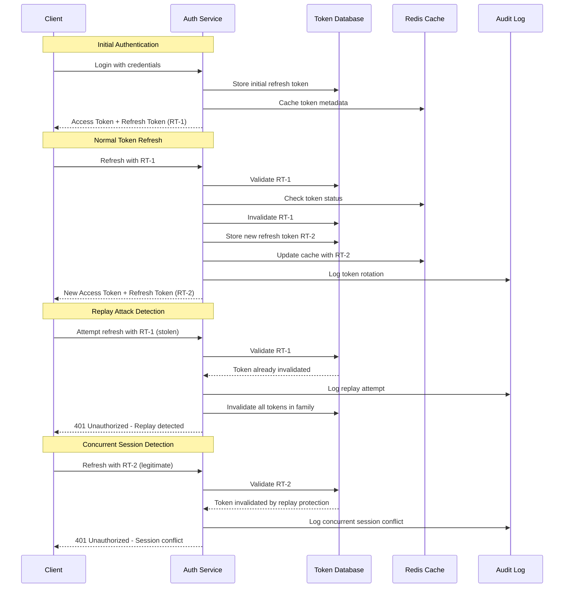

# Refresh Token Rotation Flow

## Problem Statement

**Static refresh tokens can be replayed after theft.**

Traditional refresh tokens remain valid indefinitely, creating a long-lived attack vector. If stolen, attackers can
maintain access until the token is manually revoked.

## Technical Solution

**Every refresh invalidates previous token, making replay detectable and blockable.**

Token rotation ensures each refresh operation generates a new token while invalidating the previous one, preventing
replay attacks and enabling detection of compromised tokens.

## Sequence Diagram



## Token Family Management

### Token Lifecycle

```
Initial Login
    ↓
RT-1 (Family: abc123) ───┐
    ↓ Refresh            │
RT-2 (Family: abc123) ──┼─── Replay with RT-1
    ↓ Refresh            │       ↓
RT-3 (Family: abc123) ──┼─── Invalidate Family
    ↓ Refresh            │
RT-4 (Family: abc123) ──┘
```

### Database Schema

```sql
CREATE TABLE refresh_tokens
(
    id UUID PRIMARY KEY,
    token_hash     VARCHAR(255) UNIQUE NOT NULL,
    token_family   VARCHAR(64)         NOT NULL,
    user_id UUID NOT NULL,
    device_id      VARCHAR(128),
    expires_at     TIMESTAMP           NOT NULL,
    created_at     TIMESTAMP DEFAULT NOW(),
    last_used_at   TIMESTAMP,
    revoked_at     TIMESTAMP,
    revoked_reason VARCHAR(32),
    INDEX idx_user_family (user_id, token_family),
    INDEX idx_hash (token_hash),
    INDEX idx_expires (expires_at)
);
```

## Implementation Details

### Token Generation

```java
public class RefreshTokenService {

    public TokenPair generateTokenPair(User user, String deviceId) {
        // Generate token family for new sessions
        String tokenFamily = existingToken != null ?
                existingToken.getTokenFamily() :
                UUID.randomUUID().toString();

        // Create new refresh token
        String refreshToken = generateSecureToken();
        String tokenHash = hashToken(refreshToken);

        // Store in database
        RefreshTokenEntity token = RefreshTokenEntity.builder()
                .tokenHash(tokenHash)
                .tokenFamily(tokenFamily)
                .userId(user.getId())
                .deviceId(deviceId)
                .expiresAt(Instant.now().plus(30, DAYS))
                .build();

        tokenRepository.save(token);

        return TokenPair.builder()
                .accessToken(generateAccessToken(user))
                .refreshToken(refreshToken)
                .build();
    }

    public TokenPair refreshToken(String refreshToken, String deviceId) {
        String tokenHash = hashToken(refreshToken);
        RefreshTokenEntity existingToken = tokenRepository
                .findByTokenHash(tokenHash)
                .orElseThrow(() -> new InvalidTokenException());

        // Validate token
        if (existingToken.isExpired() || existingToken.isRevoked()) {
            throw new InvalidTokenException();
        }

        // Check for replay attacks
        if (existingToken.getLastUsedAt() != null &&
                existingToken.getLastUsedAt().isAfter(Instant.now().minus(5, SECONDS))) {
            // Possible replay attack - invalidate family
            revokeTokenFamily(existingToken.getTokenFamily(), "REPLAY_DETECTED");
            throw new ReplayAttackException();
        }

        // Invalidate current token
        existingToken.setRevokedAt(Instant.now());
        existingToken.setRevokedReason("ROTATION");
        tokenRepository.save(existingToken);

        // Generate new token in same family
        return generateTokenPair(existingToken.getUser(), deviceId);
    }

    private void revokeTokenFamily(String tokenFamily, String reason) {
        List<RefreshTokenEntity> familyTokens = tokenRepository
                .findByTokenFamily(tokenFamily);

        familyTokens.forEach(token -> {
            token.setRevokedAt(Instant.now());
            token.setRevokedReason(reason);
        });

        tokenRepository.saveAll(familyTokens);

        // Log security event
        auditService.logSecurityEvent(
                SecurityEvent.TOKEN_FAMILY_REVOKED,
                Map.of("family", tokenFamily, "reason", reason)
        );
    }
}
```

## Security Benefits

### Attack Prevention

| Attack Type         | Prevention Method               |
|---------------------|---------------------------------|
| Token Replay        | Previous token invalidation     |
| Token Theft         | Family revocation on detection  |
| Concurrent Sessions | Single active token per family  |
| Long-term Access    | 30-day expiration with rotation |

### Detection Capabilities

1. **Replay Detection**: Multiple refresh attempts within seconds
2. **Geographic Anomalies**: Refresh from different locations
3. **Device Changes**: Same family used from different devices
4. **Timing Patterns**: Automated vs human refresh patterns

## Monitoring & Alerting

### Key Metrics

```yaml
metrics:
  - name: token_rotation_rate
    description: Tokens rotated per hour
    alert_threshold: > 100/hour

  - name: replay_detection_rate
    description: Replay attacks detected
    alert_threshold: > 0

  - name: token_family_revocations
    description: Token families revoked
    alert_threshold: > 5/hour

  - name: concurrent_session_conflicts
    description: Multiple devices using same family
    alert_threshold: > 10/hour
```

### Alert Scenarios

1. **High Rotation Rate**: Possible token harvesting
2. **Replay Detection**: Active attack in progress
3. **Family Revocation**: Security incident requiring investigation
4. **Geographic Anomalies**: Account takeover attempt

## Configuration Options

```yaml
refresh-token:
  rotation:
    enabled: true
    detection-window: 5s
    family-invalidation-on-replay: true

  expiration:
    max-age: 30d
    idle-timeout: 7d

  security:
    hash-algorithm: SHA-256
    token-length: 32
    secure-random: true

  monitoring:
    log-rotations: true
    log-replay-attempts: true
    alert-on-anomalies: true
```

## Failure Mode Recovery

### Token Compromise Response

1. **Immediate Detection**: Replay attempt triggers family revocation
2. **User Notification**: Alert user of suspicious activity
3. **Session Invalidation**: Force re-authentication on all devices
4. **Security Review**: Analyze access patterns for additional compromise

### Service Recovery

1. **Database Recovery**: Token state persists across restarts
2. **Cache Rebuild**: Redis repopulated from database
3. **Grace Period**: Allow ongoing refreshes during restart
4. **Monitoring**: Verify rotation continues working

---

*Related
Features: [JWT-Based Authentication](jwt-auth-flow.md), [Access Token Expiration](./token-expiration.md), [Security Audit Logging](audit-logging.md)*
