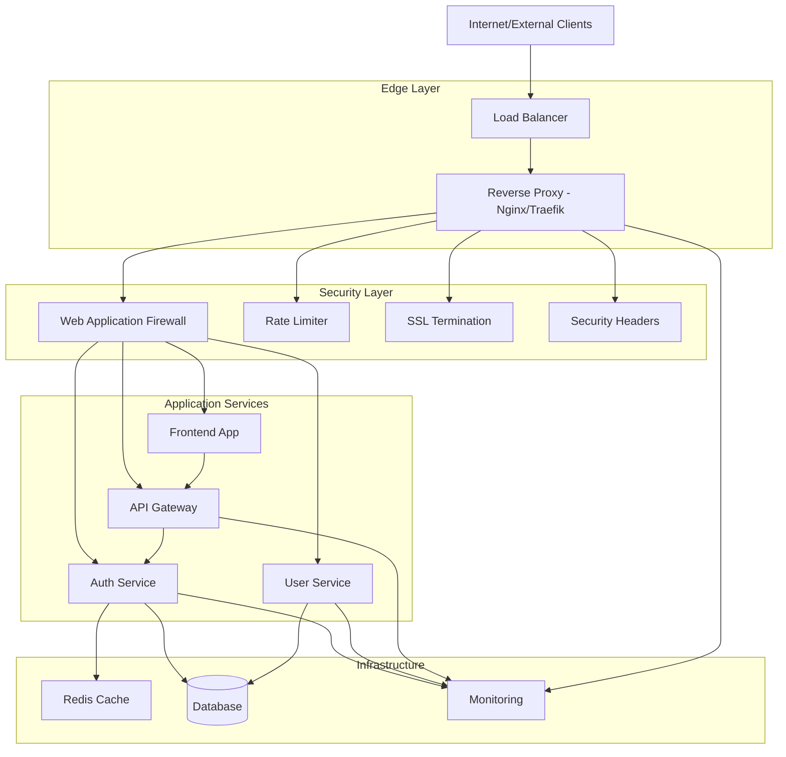
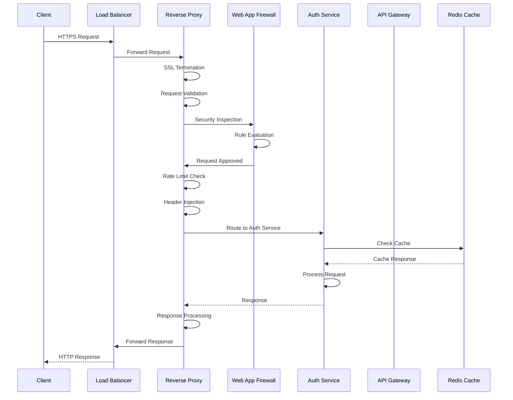
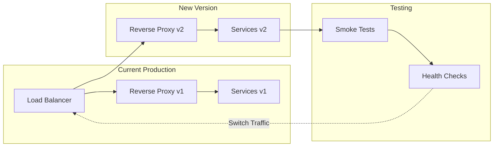

# Reverse Proxy Architecture

## Problem Statement

**Direct service exposure creates security risks and operational complexity.**

Without a reverse proxy, services must handle SSL termination, load balancing, rate limiting, and security headers
individually, leading to inconsistent security posture and difficult management.

## Technical Solution

**Centralized edge handling provides unified security, routing, and performance optimization.**

A reverse proxy acts as a single entry point, handling cross-cutting concerns like SSL termination, request routing,
security enforcement, and performance optimization.

## Architecture Diagram



## Request Flow Sequence



## Configuration Examples

### Nginx Reverse Proxy Configuration

```nginx
# /etc/nginx/sites-available/dragon-of-north
upstream auth_services {
    server auth1:8080 weight=3;
    server auth2:8080 weight=2;
    server auth3:8080 backup;
    keepalive 32;
}

upstream api_services {
    server api1:8080;
    server api2:8080;
    keepalive 16;
}

# Rate Limiting
limit_req_zone $binary_remote_addr zone=auth_limit:10m rate=10r/s;
limit_req_zone $binary_remote_addr zone=api_limit:10m rate=100r/s;

server {
    listen 443 ssl http2;
    server_name api.dragonofnorth.com;
    
    # SSL Configuration
    ssl_certificate /etc/ssl/certs/dragonofnorth.com.crt;
    ssl_certificate_key /etc/ssl/private/dragonofnorth.com.key;
    ssl_protocols TLSv1.2 TLSv1.3;
    ssl_ciphers ECDHE-RSA-AES256-GCM-SHA512:DHE-RSA-AES256-GCM-SHA512;
    ssl_prefer_server_ciphers off;
    
    # Security Headers
    add_header Strict-Transport-Security "max-age=63072000" always;
    add_header X-Frame-Options DENY;
    add_header X-Content-Type-Options nosniff;
    add_header X-XSS-Protection "1; mode=block";
    add_header Referrer-Policy "strict-origin-when-cross-origin";
    
    # Auth Service Routing
    location /api/auth/ {
        limit_req zone=auth_limit burst=20 nodelay;
        
        proxy_pass http://auth_services;
        proxy_set_header Host $host;
        proxy_set_header X-Real-IP $remote_addr;
        proxy_set_header X-Forwarded-For $proxy_add_x_forwarded_for;
        proxy_set_header X-Forwarded-Proto $scheme;
        
        # Timeouts
        proxy_connect_timeout 5s;
        proxy_send_timeout 10s;
        proxy_read_timeout 10s;
        
        # Health Check
        proxy_next_upstream error timeout invalid_header http_500 http_502 http_503;
    }
    
    # API Gateway Routing
    location /api/ {
        limit_req zone=api_limit burst=50 nodelay;
        
        proxy_pass http://api_services;
        proxy_set_header Host $host;
        proxy_set_header X-Real-IP $remote_addr;
        proxy_set_header X-Forwarded-For $proxy_add_x_forwarded_for;
        proxy_set_header X-Forwarded-Proto $scheme;
        
        # CORS Headers
        add_header Access-Control-Allow-Origin $http_origin;
        add_header Access-Control-Allow-Methods "GET, POST, PUT, DELETE, OPTIONS";
        add_header Access-Control-Allow-Credentials true;
        add_header Access-Control-Allow-Headers "Authorization, Content-Type";
        
        if ($request_method = 'OPTIONS') {
            return 204;
        }
    }
    
    # Frontend Application
    location / {
        root /var/www/dragon-of-north;
        try_files $uri $uri/ /index.html;
        
        # Cache static assets
        location ~* \.(js|css|png|jpg|jpeg|gif|ico|svg)$ {
            expires 1y;
            add_header Cache-Control "public, immutable";
        }
    }
    
    # Health Check Endpoint
    location /health {
        access_log off;
        return 200 "healthy\n";
        add_header Content-Type text/plain;
    }
}
```

### Traefik Configuration (Docker Compose)

```yaml
version: '3.8'
services:
  traefik:
    image: traefik:v2.10
    command:
      - "--api.dashboard=true"
      - "--providers.docker=true"
      - "--providers.docker.exposedbydefault=false"
      - "--entrypoints.web.address=:80"
      - "--entrypoints.websecure.address=:443"
      - "--certificatesresolvers.letsencrypt.acme.httpchallenge=true"
      - "--certificatesresolvers.letsencrypt.acme.httpchallenge.entrypoint=web"
      - "--certificatesresolvers.letsencrypt.acme.email=admin@dragonofnorth.com"
      - "--certificatesresolvers.letsencrypt.acme.storage=/letsencrypt/acme.json"
      - "--metrics.prometheus=true"
      - "--tracing.jaeger=true"
      - "--tracing.jaeger.localAgentHostPort=jaeger:6831"
    ports:
      - "80:80"
      - "443:443"
      - "8080:8080"  # Dashboard
    volumes:
      - /var/run/docker.sock:/var/run/docker.sock:ro
      - ./letsencrypt:/letsencrypt
    labels:
      - "traefik.enable=true"
      - "traefik.http.routers.traefik.rule=Host(`traefik.dragonofnorth.com`)"
      - "traefik.http.routers.traefik.entrypoints=websecure"
      - "traefik.http.routers.traefik.tls.certresolver=letsencrypt"
      - "traefik.http.routers.traefik.service=api@internal"
      - "traefik.http.routers.traefik.middlewares=auth"
      - "traefik.http.middlewares.auth.basicauth.users=admin:$$apr1$$..."

  auth-service:
    image: dragonofnorth/auth-service:latest
    labels:
      - "traefik.enable=true"
      - "traefik.http.routers.auth.rule=Host(`api.dragonofnorth.com`) && PathPrefix(`/api/auth/`)"
      - "traefik.http.routers.auth.entrypoints=websecure"
      - "traefik.http.routers.auth.tls.certresolver=letsencrypt"
      - "traefik.http.middlewares.auth-ratelimit.ratelimit.average=100"
      - "traefik.http.middlewares.auth-ratelimit.ratelimit.burst=200"
      - "traefik.http.routers.auth.middlewares=auth-ratelimit"

  api-gateway:
    image: dragonofnorth/api-gateway:latest
    labels:
      - "traefik.enable=true"
      - "traefik.http.routers.api.rule=Host(`api.dragonofnorth.com`) && PathPrefix(`/api/`)"
      - "traefik.http.routers.api.entrypoints=websecure"
      - "traefik.http.routers.api.tls.certresolver=letsencrypt"
      - "traefik.http.middlewares.api-cors.headers.accessControlAllowOrigin=*"
      - "traefik.http.routers.api.middlewares=api-cors"
```

## Security Features

### Web Application Firewall Rules

```nginx
# ModSecurity Core Rules
modsecurity on;
modsecurity_rules_file /etc/nginx/modsecurity/main.conf;

# OWASP CRS Configuration
SecRuleEngine On
SecRequestBodyAccess On
SecResponseBodyAccess On
SecRequestBodyLimit 13107200
SecRequestBodyNoFilesLimit 131072

# Common Attack Protection
SecRule ARGS "@detectSQLi" \
    "id:1001,phase:2,block,msg:'SQL Injection Attack Detected',logdata:'Matched Data: %{MATCHED_VAR} found within %{MATCHED_VAR_NAME}',tag:'application-multi',tag:'language-multi',tag:'platform-multi',tag:'attack-sqli'"

SecRule ARGS "@detectXSS" \
    "id:1002,phase:2,block,msg:'XSS Attack Detected',logdata:'Matched Data: %{MATCHED_VAR} found within %{MATCHED_VAR_NAME}',tag:'application-multi',tag:'language-multi',tag:'platform-multi',tag:'attack-xss'"

# Rate Limiting
SecRule IP:REQUEST_BURST "@gt 100" \
    "id:1003,phase:1,deny,status:429,msg:'Rate limit exceeded',tag:'application-multi'"

# HTTP Protocol Protection
SecRule REQUEST_HEADERS:User-Agent "@rx ^$" \
    "id:1004,phase:1,deny,status:400,msg:'Empty User-Agent not allowed'"

SecRule REQUEST_METHOD "!@within GET|HEAD|POST|PUT|DELETE|OPTIONS|PATCH" \
    "id:1005,phase:1,deny,status:405,msg:'Method not allowed'"
```

### Rate Limiting Strategies

```yaml
rate-limiting:
  authentication:
    - endpoint: "/api/auth/login"
      limit: 10 requests/minute
      burst: 20
      penalty: 5 minutes

    - endpoint: "/api/auth/refresh"
      limit: 30 requests/minute
      burst: 50
      penalty: 2 minutes

  api-endpoints:
    - endpoint: "/api/users/*"
      limit: 100 requests/minute
      burst: 200
      penalty: 1 minute

    - endpoint: "/api/admin/*"
      limit: 200 requests/minute
      burst: 400
      penalty: 30 seconds

  global:
    - endpoint: "*"
      limit: 1000 requests/minute
      burst: 2000
      penalty: 10 seconds
```

## Monitoring & Observability

### Prometheus Metrics Configuration

```yaml
# nginx-prometheus-exporter configuration
metrics:
  - name: nginx_http_requests_total
    type: counter
    description: Total HTTP requests

  - name: nginx_request_duration_seconds
    type: histogram
    description: HTTP request duration

  - name: nginx_upstream_response_time_seconds
    type: histogram
    description: Upstream response time

  - name: nginx_connections_total
    type: gauge
    description: Current connections

  - name: nginx_ssl_handshakes_total
    type: counter
    description: SSL handshakes
```

### Health Check Configuration

```nginx
# Health check endpoints
location /health/nginx {
    access_log off;
    return 200 "nginx healthy\n";
    add_header Content-Type text/plain;
}

location /health/upstream {
    access_log off;
    proxy_pass http://auth_services/health;
    proxy_next_upstream error timeout invalid_header http_500 http_502 http_503 http_504;
}

location /health/ssl {
    access_log off;
    return 200 "ssl certificate valid\n";
    add_header Content-Type text/plain;
}
```

## Performance Optimizations

### Caching Strategies

```nginx
# Static Asset Caching
location ~* \.(js|css|png|jpg|jpeg|gif|ico|svg|woff|woff2|ttf|eot)$ {
    expires 1y;
    add_header Cache-Control "public, immutable";
    add_header X-Cache-Status "STATIC";
}

# API Response Caching
location /api/public/ {
    proxy_cache api_cache;
    proxy_cache_valid 200 5m;
    proxy_cache_valid 404 1m;
    proxy_cache_use_stale error timeout updating http_500 http_502 http_503 http_504;
    add_header X-Cache-Status $upstream_cache_status;
}

# Cache Configuration
proxy_cache_path /var/cache/nginx/api levels=1:2 keys_zone=api_cache:10m max_size=1g inactive=60m;
```

### Connection Optimization

```nginx
# Worker Configuration
worker_processes auto;
worker_connections 4096;

# Keep-alive Settings
keepalive_timeout 65;
keepalive_requests 100;

# TCP Optimization
tcp_nopush on;
tcp_nodelay on;

# Buffer Sizes
client_body_buffer_size 128k;
client_max_body_size 10m;
client_header_buffer_size 1k;
large_client_header_buffers 4 4k;

# Gzip Compression
gzip on;
gzip_vary on;
gzip_min_length 1024;
gzip_types text/plain text/css application/json application/javascript text/xml application/xml application/xml+rss text/javascript;
```

## Deployment Strategies

### Blue-Green Deployment



### Zero-Downtime Deployment

```bash
#!/bin/bash
# deploy.sh - Zero downtime deployment script

# Build new version
docker build -t dragonofnorth/reverse-proxy:$NEW_VERSION .

# Health check function
health_check() {
    local url=$1
    local max_attempts=30
    local attempt=1
    
    while [ $attempt -le $max_attempts ]; do
        if curl -f -s $url/health > /dev/null; then
            echo "Health check passed for $url"
            return 0
        fi
        echo "Health check attempt $attempt/$max_attempts failed"
        sleep 2
        ((attempt++))
    done
    
    echo "Health check failed for $url"
    return 1
}

# Deploy new version
docker-compose -f docker-compose.new.yml up -d

# Wait for new version to be healthy
sleep 10

if health_check http://localhost:8081; then
    echo "New version healthy, switching traffic..."
    
    # Update load balancer configuration
    sed -i 's/server proxy1:80/server proxy2:80/g' /etc/nginx/nginx.conf
    nginx -s reload
    
    echo "Traffic switched to new version"
    
    # Stop old version
    docker-compose -f docker-compose.yml down
else
    echo "New version unhealthy, rolling back..."
    docker-compose -f docker-compose.new.yml down
    exit 1
fi
```

## Benefits

### Security Benefits

1. **Centralized Security**: Single point for SSL, headers, and WAF rules
2. **Attack Surface Reduction**: Internal services not directly exposed
3. **Consistent Policy**: Uniform security enforcement across all services
4. **DDoS Protection**: Built-in rate limiting and connection throttling

### Operational Benefits

1. **Simplified Management**: Single configuration point for routing
2. **Performance Optimization**: Caching, compression, connection pooling
3. **High Availability**: Load balancing and failover capabilities
4. **Observability**: Centralized logging and metrics collection

### Scalability Benefits

1. **Horizontal Scaling**: Easy addition of new service instances
2. **Service Discovery**: Dynamic routing to healthy instances
3. **Resource Optimization**: Efficient connection handling
4. **Traffic Management**: Advanced routing rules and canary deployments

---

*Related
Features: [Load Testing Strategy](./load-testing-strategy.md), [Modular Architecture](./modular-architecture.md), [CI/CD Pipeline](./cicd-pipeline.md)*
