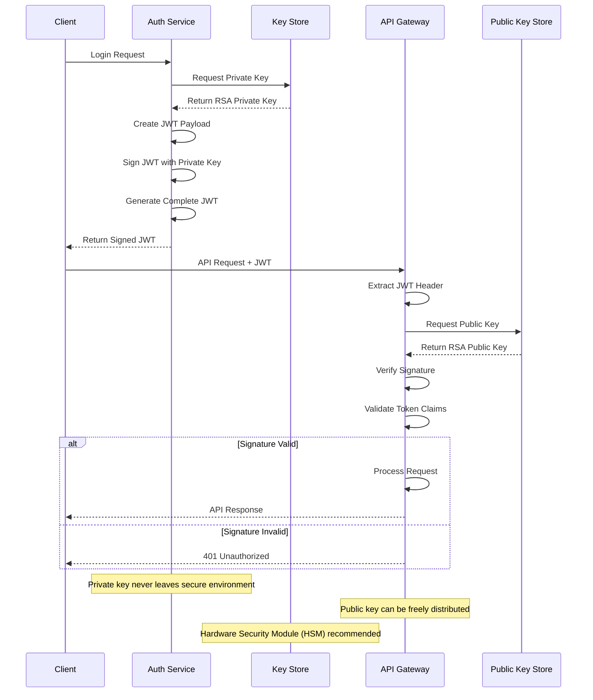

# RSA Token Signing Flow

## Problem Statement

**Symmetric secrets are risky to distribute to many services.**

When multiple services need to verify tokens, sharing symmetric keys across all services increases the attack surface.
If any service is compromised, all tokens become forgeable.

## Technical Solution

**Private key signs once; public keys verify anywhere without exposing signer secret.**

Asymmetric cryptography using RSA key pairs allows secure token signing while enabling verification by any service
holding only the public key.

## Activity Diagram



## Cryptographic Process

### 1. Key Generation

```bash
# Generate RSA 2048-bit key pair
openssl genrsa -out private_key.pem 2048
openssl rsa -in private_key.pem -pubout -out public_key.pem
```

### 2. Token Signing

```java
// Pseudocode for JWT signing
privateKey =keyStore.

getPrivateKey("jwt-signing-key");

jwtHeader =Base64Url.

encode( {
    "alg":"RS256", "typ":"JWT"
});
jwtPayload =Base64Url.

encode(userClaims);

signature =RSA.

sign(privateKey, jwtHeader +"."+jwtPayload);

jwt =jwtHeader +"."+jwtPayload +"."+Base64Url.

encode(signature);
```

### 3. Signature Verification

```java
// Pseudocode for signature verification
publicKey =publicKeyStore.

getPublicKey("jwt-signing-key");

tokenParts =jwt.

split("\\.");

signature =Base64Url.

decode(tokenParts[2]);

expectedSignature =RSA.

verify(publicKey, tokenParts[0]+"."+tokenParts[1], signature);
```

## Security Architecture

### Key Management

```
┌─────────────────┐    ┌─────────────────┐
│   Private Key   │    │   Public Key    │
│   (Signing)     │    │   (Verification)│
│                 │    │                 │
│ • HSM Protected │    │ • Distributed   │
│ • Never Exposed │    │ • Read-only     │
│ • Rotated       │    │ • Cached        │
└─────────────────┘    └─────────────────┘
         │                       │
         │                       │
    ┌────▼────┐              ┌───▼────┐
    │Auth Svc │              │API GW  │
    │Sign JWT │              │Verify  │
    └─────────┘              └────────┘
```

### Token Structure with RSA

```json
{
  "header": {
    "alg": "RS256",
    "typ": "JWT",
    "kid": "jwt-signing-key-2023-v1"
  },
  "payload": {
    "sub": "user-uuid",
    "iat": 1640995200,
    "exp": 1640996100,
    "iss": "dragon-of-north",
    "aud": [
      "api-gateway",
      "user-service"
    ]
  }
}
```

## Implementation Details

### Key Rotation Strategy

1. **Multiple Active Keys**: Support 2-3 keys simultaneously
2. **Key Identifier (`kid`)**: Specify which key was used
3. **Grace Period**: Old keys remain valid for verification only
4. **Automated Rotation**: Schedule key rotation every 90 days

### Security Controls

| Control      | Implementation                         |
|--------------|----------------------------------------|
| Key Storage  | Hardware Security Module (HSM)         |
| Key Access   | Role-based access, audit logging       |
| Key Rotation | Automated with 90-day intervals        |
| Key Size     | RSA-2048 minimum, RSA-4096 recommended |
| Algorithm    | RS256 (RSA + SHA-256)                  |

## Failure Mode Mitigation

| Attack Vector       | Protection                             |
|---------------------|----------------------------------------|
| Private key theft   | HSM protection, access logging         |
| Signature forgery   | Asymmetric cryptography                |
| Key compromise      | Immediate rotation, token invalidation |
| Algorithm downgrade | Fixed algorithm specification          |

## Performance Considerations

### Verification Optimization

- **Public Key Caching**: Cache public keys in memory
- **Key Rotation Awareness**: Pre-load new keys before rotation
- **Batch Verification**: Verify multiple tokens in parallel

### Metrics to Monitor

- Token verification latency
- Key rotation success rate
- Signature verification failures
- Public key cache hit rate

## Compliance Benefits

1. **FIPS 140-2**: HSM compliance for key protection
2. **PCI DSS**: Proper key management requirements
3. **SOC 2**: Cryptographic control documentation
4. **GDPR**: Data protection through proper key security

---

*Related Features: [JWT-Based Authentication](jwt-auth-flow.md), [Security Audit Logging](audit-logging.md)*
